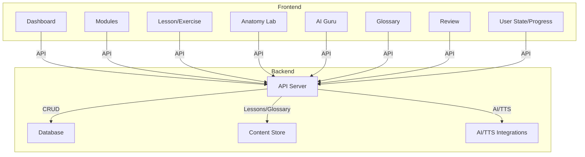

# Grammar Anatomy Interactive — System Architecture & Design

## 1. Overview
This document outlines the proposed architecture and design for the Grammar Anatomy Interactive application, based on the product specification.

---

## 2. High-Level Architecture

---

## 3. Frontend Design

- **Framework:** React (web)
- **State Management:** React Context or Redux Toolkit
- **Styling:** Tailwind CSS
- **Routing:** React Router
- **Visualization:** Chart.js or Recharts
- **AI/Voice:** Integration with TTS APIs and LLM APIs

### Component Structure
- **App Shell:** Sidebar navigation
- **Pages:**
  - Dashboard
  - Modules List
  - Module Page (lessons, exercises)
  - Lesson Page
  - Exercise Page
  - Anatomy Lab
  - AI Guru
  - Glossary
- **Reusable Components:** ProgressBar, SkillChart, AchievementBadge, Flashcard, SentenceDiagram, AudioButton, etc.

---

## 4. Backend Design

- **API Framework:** Python (FastAPI)
- **Database:** PostgreSQL or SQLite
- **Content:** Markdown/JSON files or CMS
- **Authentication:** JWT or OAuth (optional for cloud sync)
- **AI Integration:** TTS (Google, AWS, etc.), LLM (OpenAI, Gemini, etc.)
- **File Storage:** Cloud storage for audio, diagrams, etc.

### API Endpoints
- User: Register, login, progress sync, achievements
- Modules/Lessons: Get modules, lessons, exercises
- Exercises: Submit answer, get feedback, review history
- Glossary: Search terms, get definitions
- Anatomy Lab: Parse sentence, return structure/diagram
- AI Guru: Chat endpoint, context-aware Q&A
- TTS: Request audio for text

---

## 5. Development Plan

### MVP
- Dashboard, modules, lessons, exercises, progress tracking
- Static content for lessons/exercises
- Basic Anatomy Lab
- Simple glossary

### Phase 2
- AI Guru chatbot
- TTS integration
- Sentence diagramming in Anatomy Lab
- Achievements, review mode

### Phase 3
- Cloud sync, user accounts
- Admin/content management
- Advanced analytics, adaptive learning

---

## 6. Technology Summary Table

| Layer      | Tech/Tool         | Purpose                                 |
|------------|-------------------|-----------------------------------------|
| Frontend   | React             | UI, navigation, interactivity           |
| Styling    | Tailwind CSS      | Consistent, responsive design           |
| State      | Context/Redux     | User progress, app state                |
| Backend    | Python + FastAPI  | API, business logic                     |
| Database   | PostgreSQL/SQLite | User data, progress, achievements       |
| Content    | Markdown/JSON/CMS | Lessons, exercises, glossary            |
| AI         | OpenAI, TTS API   | Chatbot, read-aloud, parsing            | 