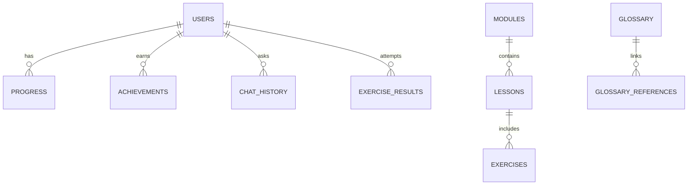

# Database Schema — Grammar Anatomy Interactive

## Entity-Relationship Diagram (ERD)

---

## Tables/Collections

### users
| Field         | Type      | Description                |
|--------------|-----------|----------------------------|
| id           | UUID      | Primary key                |
| email        | String    | Unique                     |
| passwordHash | String    | Hashed password            |
| name         | String    |                            |
| createdAt    | DateTime  |                            |

### modules
| Field      | Type   | Description     |
|------------|--------|-----------------|
| id         | UUID   | Primary key     |
| title      | String | Module title    |
| order      | Int    | Display order   |

### lessons
| Field      | Type   | Description     |
|------------|--------|-----------------|
| id         | UUID   | Primary key     |
| moduleId   | UUID   | FK to modules   |
| title      | String | Lesson title    |
| content    | Text   | Lesson content  |
| order      | Int    | Display order   |

### exercises
| Field      | Type   | Description     |
|------------|--------|-----------------|
| id         | UUID   | Primary key     |
| lessonId   | UUID   | FK to lessons   |
| type       | String | Exercise type   |
| prompt     | Text   | Exercise prompt |
| answer     | Text   | Correct answer  |
| options    | JSON   | MCQ options     |

### progress
| Field      | Type   | Description     |
|------------|--------|-----------------|
| id         | UUID   | Primary key     |
| userId     | UUID   | FK to users     |
| moduleId   | UUID   | FK to modules   |
| lessonId   | UUID   | FK to lessons   |
| status     | String | not_started/in_progress/completed |
| updatedAt  | DateTime |                |

### achievements
| Field      | Type   | Description     |
|------------|--------|-----------------|
| id         | UUID   | Primary key     |
| userId     | UUID   | FK to users     |
| type       | String | Achievement type|
| earnedAt   | DateTime |                |

### glossary
| Field      | Type   | Description     |
|------------|--------|-----------------|
| term       | String | Primary key     |
| definition | Text   |                 |

### chat_history
| Field      | Type   | Description     |
|------------|--------|-----------------|
| id         | UUID   | Primary key     |
| userId     | UUID   | FK to users     |
| question   | Text   |                 |
| answer     | Text   |                 |
| timestamp  | DateTime |                | 