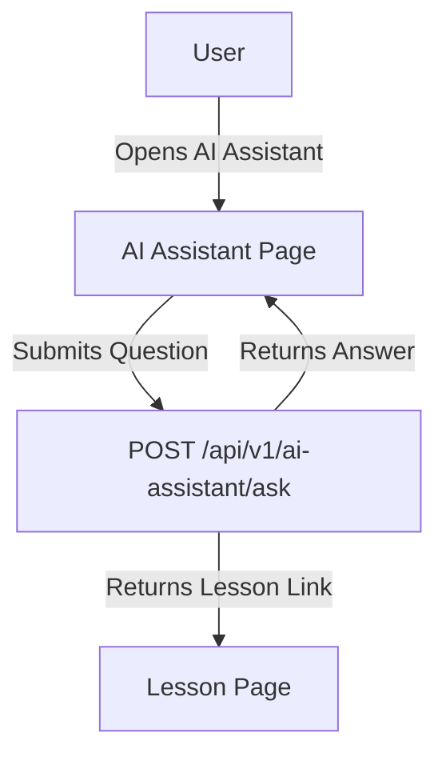

# Feature: AI Assistant (Grammar Guru)

## Description
An AI-powered chatbot that answers grammar questions, provides explanations, and links to relevant lessons.

## Actors/Roles
- Student

## User Stories / Use Cases
- As a user, I want to ask grammar questions and get clear, concise answers.
- As a user, I want to get links to lessons for more detail.
- As a user, I want to access the assistant from anywhere in the app.

## Flow Diagram

## UI Entry Points
- AI Assistant button in navigation bar or floating action button
- Contextual help links throughout the app

## API Endpoints Used
- `POST /api/v1/ai-assistant/ask`

## Acceptance Criteria
- [ ] User can ask grammar questions
- [ ] User receives clear, relevant answers
- [ ] User can follow links to lessons from answers

## E2E Test Scenarios
1. User asks a grammar question and receives an answer
2. User receives a lesson link and navigates to the lesson
3. User asks a follow-up question and gets a relevant response 