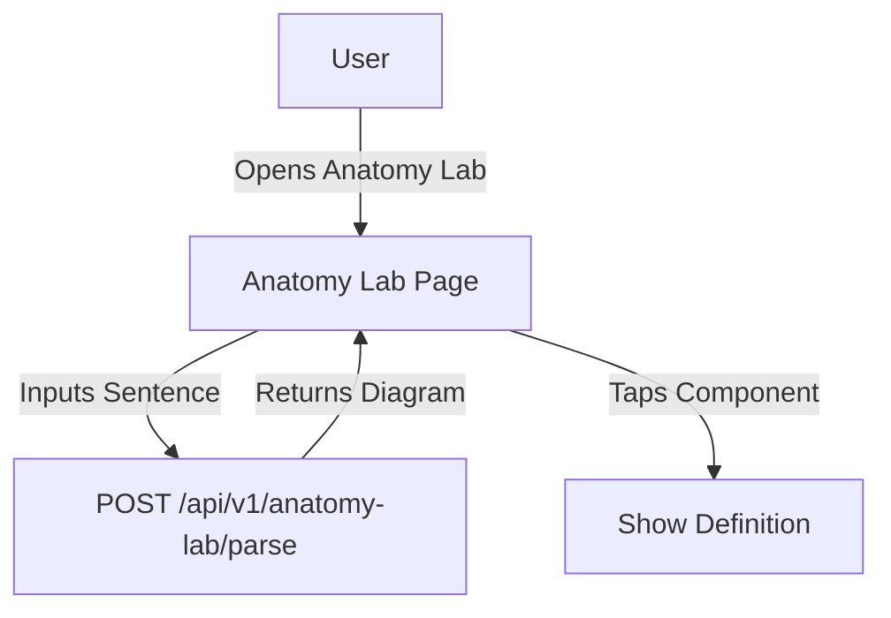

# Feature: Sentence Anatomy Lab

## Description
A tool where users can input any sentence and see a visual breakdown of its grammatical structure.

## Actors/Roles
- Student

## User Stories / Use Cases
- As a user, I want to paste or type a sentence and see its grammatical components visually.
- As a user, I want to tap on parts of the diagram to get definitions and links to lessons.

## Flow Diagram

## UI Entry Points
- Anatomy Lab tab in navigation bar
- Links from lessons or glossary

## API Endpoints Used
- `POST /api/v1/anatomy-lab/parse`

## Acceptance Criteria
- [ ] User can input any sentence
- [ ] User sees a visual diagram of sentence structure
- [ ] User can tap diagram components for definitions/links

## E2E Test Scenarios
1. User inputs a sentence and sees a correct diagram
2. User taps a diagram component and sees a definition
3. User follows a link from a diagram to a lesson 