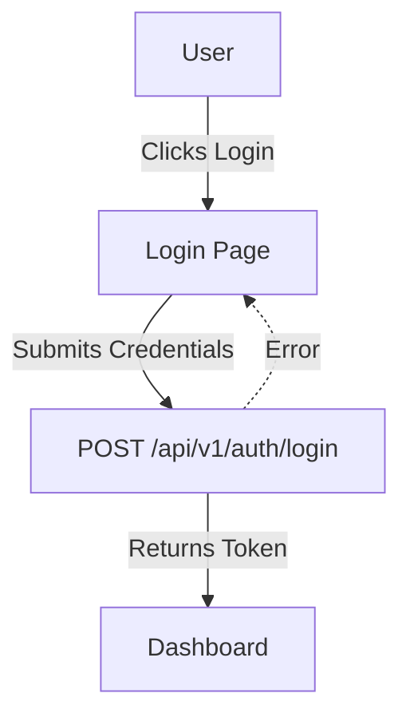

# Feature: Authentication

## Description
Handles user login, registration, and password reset to provide secure access to the app.

## Actors/Roles
- Student

## User Stories / Use Cases
- As a user, I want to log in with my email and password so I can access my account.
- As a new user, I want to register so I can start using the app.
- As a user, I want to reset my password if I forget it.

## Flow Diagram

## UI Entry Points
- Login page (first screen for unauthenticated users)
- Registration page (link from login)
- Forgot password link (on login page)

## API Endpoints Used
- `POST /api/v1/auth/login`
- `POST /api/v1/auth/register`
- `POST /api/v1/auth/forgot-password`

## Acceptance Criteria
- [ ] User can log in with valid credentials
- [ ] User sees error on invalid login
- [ ] User can register a new account
- [ ] User can request a password reset

## E2E Test Scenarios
1. User logs in with valid credentials and is redirected to dashboard
2. User enters invalid credentials and sees an error message
3. New user registers and is logged in automatically
4. User requests password reset and receives email 