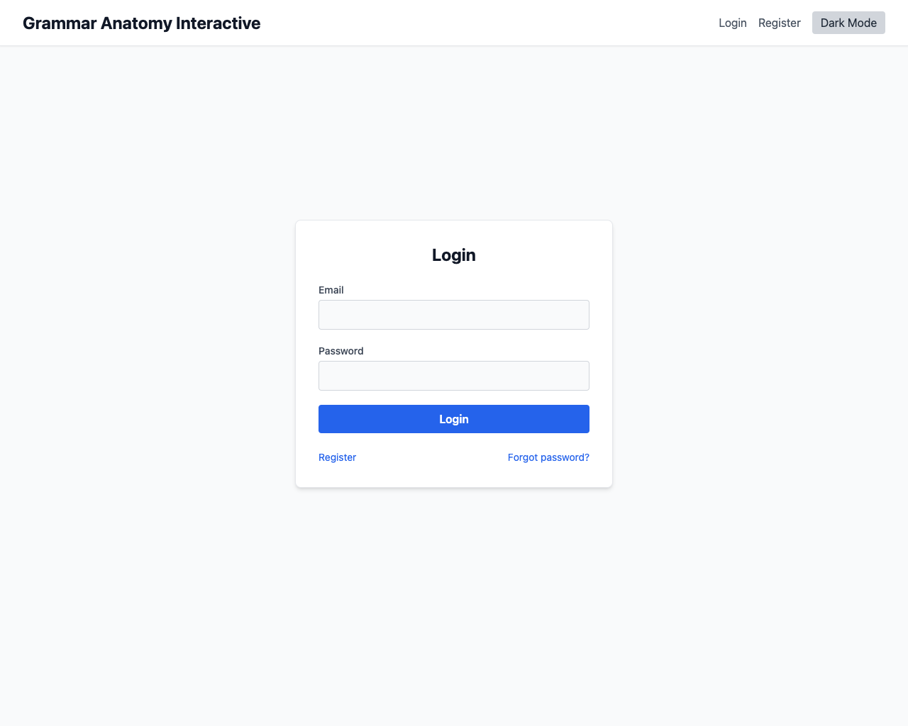
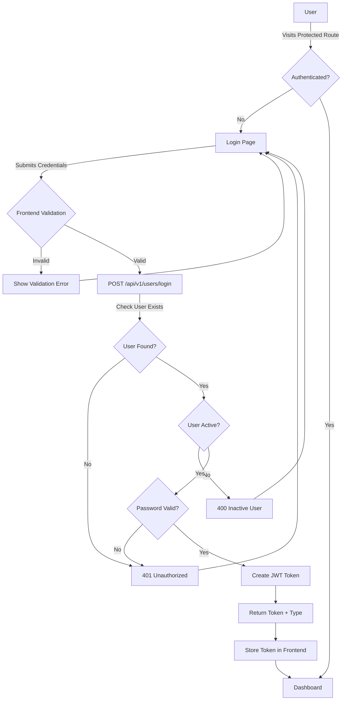

# Feature: Authentication

## Description
Handles user login and password reset to provide secure access to the app. This includes JWT-based authentication, secure password hashing, and comprehensive error handling.

## Visual Reference


*Screenshot showing the login interface with email/password form, navigation links, and dark mode toggle*

## Actors/Roles
- Student (authenticated user)
- Anonymous User (unauthenticated visitor)

## User Stories / Use Cases
- As a user, I want to log in with my email and password so I can access my account.
- As a user, I want to reset my password if I forget it.
- As a system, I want to securely authenticate users and protect sensitive operations.
- As a user, I want my session to persist across browser refreshes.

## Flow Diagram


## Technical Implementation Logic

### Backend Authentication Logic

#### Login Endpoint (`POST /api/v1/users/login`)
1. **Request Validation**
   - Validate email format and password presence
   - Return 422 for invalid request body

2. **User Lookup**
   - Query database for user by email: `db.query(User).filter(User.email == credentials.email).first()`
   - If no user found: Return 401 "Incorrect email or password"

3. **User Status Check**
   - Check `user.is_active` field
   - If inactive: Return 400 "Inactive user account"

4. **Password Verification**
   - Use bcrypt to verify: `verify_password(plain_password, user.password_hash)`
   - If invalid: Return 401 "Incorrect email or password"

5. **Token Generation**
   - Create JWT token with user email as subject: `create_access_token(data={"sub": user.email})`
   - Include expiration time (default: from settings.ACCESS_TOKEN_EXPIRE_MINUTES)
   - Use HS256 algorithm with secret key from settings

6. **Response**
   - Return: `{"access_token": token, "token_type": "bearer"}`

#### Security Implementation Details
- **Password Hashing**: BCrypt with configurable rounds
- **JWT Algorithm**: HS256 with secret key from environment
- **Token Expiration**: Configurable via ACCESS_TOKEN_EXPIRE_MINUTES
- **Error Messages**: Generic messages to prevent user enumeration
- **Headers**: WWW-Authenticate header for 401 responses

### Frontend Authentication Logic

#### Login Form Handling
1. **Form State Management**
   ```typescript
   interface LoginForm {
     email: string;
     password: string;
   }
   ```

2. **Form Validation**
   - Email format validation (HTML5 + required attribute)
   - Password presence validation
   - Real-time error display

3. **API Call Logic**
   ```typescript
   const response = await fetch('/api/v1/users/login', {
     method: 'POST',
     headers: { 'Content-Type': 'application/json' },
     body: JSON.stringify({ email, password })
   });
   ```

4. **Response Handling**
   - Success (200): Store token and redirect to dashboard
   - Client Error (4xx): Display error message to user
   - Network Error: Display "Network error" message
   - Loading states during API call

#### Session Management
- **Token Storage**: localStorage or sessionStorage (implementation pending)
- **Token Validation**: Verify token on app initialization
- **Protected Routes**: Redirect to login if no valid token
- **Token Refresh**: Automatic refresh before expiration (future enhancement)

### Password Reset Logic

#### Request Flow
1. **Frontend Form**: User enters email address
2. **API Call**: `POST /api/v1/users/forgot-password`
3. **Backend Logic**:
   - Look up user by email
   - Generate secure reset token (implementation pending)
   - Send email with reset link (implementation pending)
   - Always return success message for security

4. **Security Considerations**:
   - Don't reveal if email exists in database
   - Use secure token generation
   - Set token expiration time
   - Rate limiting on reset requests

## UI Entry Points
- **Login page** (`/login`) - Primary authentication entry point
- **Forgot password link** - On login page, navigates to `/reset-password`
- **Protected route redirects** - Automatic redirect to login for unauthenticated users
- **Navigation logout** - Clear session and redirect to login
- **Registration** is covered in the [Registration feature spec](./registration.md)

## API Endpoints Used
- `POST /api/v1/users/login` - Authenticate user and return JWT token
- `POST /api/v1/users/forgot-password` - Request password reset email
- `GET /api/v1/users/me` - Get current user information (with Bearer token)

## Authentication Middleware
- **Backend**: `get_current_user()` and `get_current_active_user()` dependencies
- **Frontend**: Route guards and authentication context
- **Token Verification**: JWT decode and signature validation
- **User Injection**: Automatic user object injection in protected endpoints

## Error Handling Matrix

| Scenario | HTTP Status | Frontend Message | Backend Response |
|----------|-------------|------------------|------------------|
| Invalid email format | 422 | "Invalid email format" | Validation error |
| User not found | 401 | "Invalid credentials" | "Incorrect email or password" |
| Wrong password | 401 | "Invalid credentials" | "Incorrect email or password" |
| Inactive user | 400 | "Account inactive" | "Inactive user account" |
| Network error | N/A | "Network error" | N/A |
| Missing token | 401 | "Please log in" | "Could not validate credentials" |
| Invalid token | 401 | "Session expired" | "Could not validate credentials" |

## Security Features
- **Password Requirements**: Minimum 8 characters (enforced in registration)
- **Rate Limiting**: Protection against brute force attacks (future enhancement)
- **HTTPS Only**: Secure token transmission
- **Secure Headers**: WWW-Authenticate, Content-Type validation
- **SQL Injection Protection**: SQLAlchemy ORM parameterized queries
- **XSS Protection**: JSON response format, no HTML injection

## Acceptance Criteria
- [x] User can log in with valid credentials and receive JWT token
- [x] User sees specific error messages for different failure scenarios
- [x] User account status (active/inactive) is properly validated
- [x] JWT tokens are properly generated and include expiration
- [x] Password verification uses secure hashing (bcrypt)
- [x] Error messages don't reveal user existence for security
- [ ] User session persists across browser refreshes
- [ ] Password reset emails are sent successfully
- [ ] Token refresh mechanism works before expiration

## E2E Test Scenarios
1. **Successful Login Flow**
   - User enters valid credentials
   - Gets redirected to dashboard
   - Can access protected resources

2. **Invalid Credentials**
   - User enters wrong email/password
   - Sees "Invalid credentials" error
   - Remains on login page

3. **Inactive User Account**
   - User with inactive account tries to login
   - Sees "Account inactive" error
   - Cannot proceed to dashboard

4. **Password Reset Request**
   - User clicks "Forgot password" link
   - Enters email address
   - Receives confirmation message
   - (Future: Receives email with reset link)

5. **Session Persistence** (Future)
   - User logs in successfully
   - Refreshes browser
   - Remains authenticated

6. **Token Expiration** (Future)
   - User stays logged in past token expiration
   - Gets prompted to re-authenticate
   - Can continue after re-login 