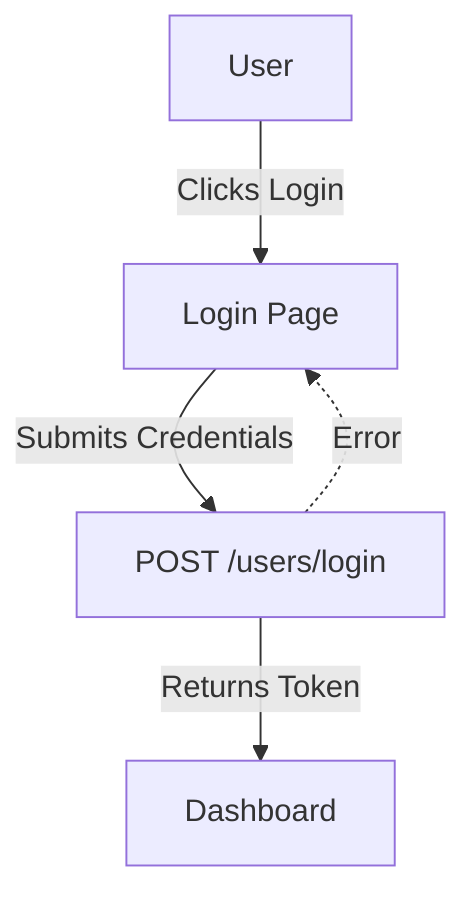

# Feature: Authentication

## Description
Handles user login and password reset to provide secure access to the app.

## Actors/Roles
- Student

## User Stories / Use Cases
- As a user, I want to log in with my email and password so I can access my account.
- As a user, I want to reset my password if I forget it.

## Flow Diagram

## UI Entry Points
- Login page (first screen for unauthenticated users)
- Forgot password link (on login page)
- Registration is covered in the [Registration feature spec](./registration.md)

## API Endpoints Used
- `POST /users/login`

## Acceptance Criteria
- [ ] User can log in with valid credentials
- [ ] User sees error on invalid login
- [ ] User can request a password reset

## E2E Test Scenarios
1. User logs in with valid credentials and is redirected to dashboard
2. User enters invalid credentials and sees an error message
3. User requests password reset and receives email 