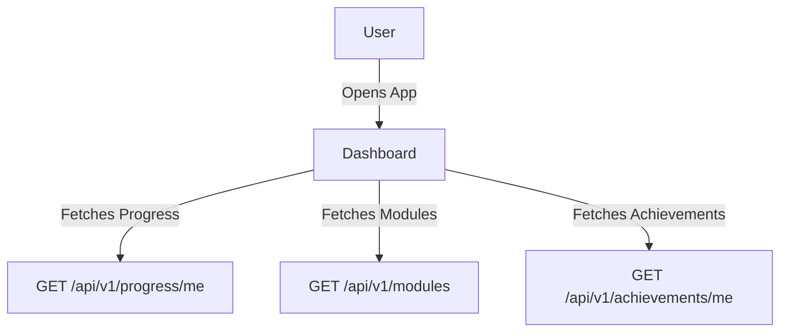

# Feature: Dashboard

## Description
The dashboard provides users with an overview of their progress, available modules, achievements, and skill summary.

## Actors/Roles
- Student

## User Stories / Use Cases
- As a user, I want to see my overall course progress so I know how much I've completed.
- As a user, I want to view a list of modules and their completion status.
- As a user, I want to see my achievements and badges.
- As a user, I want to see a summary of my grammar skills.

## Flow Diagram

## UI Entry Points
- Main screen after login
- Accessible from bottom navigation bar

## API Endpoints Used
- `GET /api/v1/progress/me`
- `GET /api/v1/modules`
- `GET /api/v1/achievements/me`

## Acceptance Criteria
- [ ] User sees a visual progress bar
- [ ] User sees a list of modules with completion status
- [ ] User sees achievements/badges
- [ ] User sees a skill summary

## E2E Test Scenarios
1. User logs in and sees their dashboard with up-to-date progress
2. User completes a module and sees the progress bar update
3. User earns a new achievement and sees it appear on the dashboard 