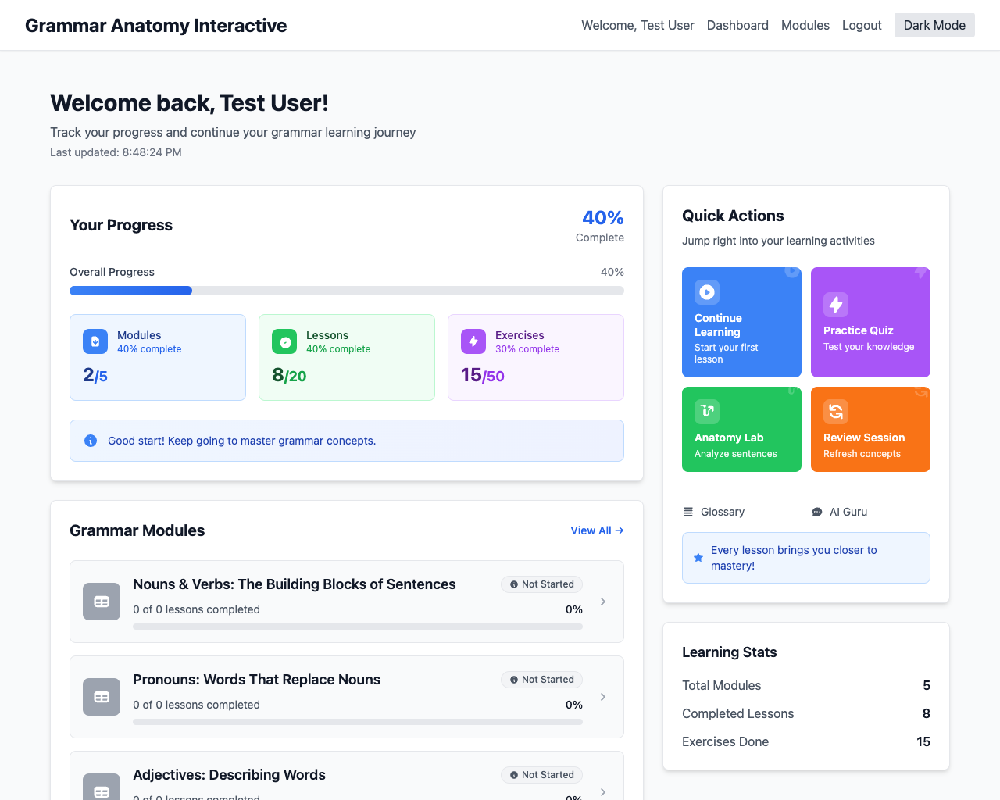

# Feature: Dashboard

## Description
The dashboard serves as the central hub for users, providing a comprehensive overview of their learning journey. It displays progress tracking, available modules, achievements, skill summaries, learning analytics, and quick actions to continue their grammar learning experience.

## Visual Reference


*Screenshot showing the user dashboard with progress overview, quick actions, and learning analytics*

## Actors/Roles
- **Student**: Primary user accessing their personal dashboard
- **Teacher**: Secondary user viewing class-wide progress (future implementation)
- **System**: Backend services providing data and analytics

## User Stories / Use Cases

### Core Progress Tracking
- As a user, I want to see my overall course progress with a visual progress bar so I know how much I've completed
- As a user, I want to view a detailed list of modules with their completion status (Not Started, In Progress, Mastered)
- As a user, I want to see my skill proficiency levels for key grammar concepts
- As a user, I want to track my learning streaks and consistency

### Learning Analytics
- As a user, I want to see my learning analytics including time spent learning daily/weekly
- As a user, I want to view my accuracy trends over time to understand my improvement
- As a user, I want to identify concepts that require review based on my performance
- As a user, I want to see my learning velocity and patterns

### Achievements & Gamification
- As a user, I want to see my achievements and badges for completing milestones
- As a user, I want to view my learning streaks (3, 7, 30 days)
- As a user, I want to see rewards for high accuracy and mastering difficult concepts

### Quick Actions
- As a user, I want quick access to continue my last lesson
- As a user, I want to start a targeted review session
- As a user, I want to take a practice quiz
- As a user, I want to access the Anatomy Lab directly

### Personalization
- As a user, I want recommendations for next steps based on my performance
- As a user, I want to see concepts flagged for additional practice
- As a user, I want personalized learning paths adapted to my progress

## Flow Diagram


## UI Entry Points
- **Primary**: Main screen after successful login/registration
- **Navigation**: Accessible from bottom navigation bar (Home icon)
- **Deep Links**: Direct access via URL routing `/dashboard`
- **Redirect**: Automatic redirect from expired sessions after re-authentication

## API Endpoints Used

### Core Data Endpoints
- **GET** `/api/users/progress`
  - **Headers**: `Authorization: Bearer <token>`
  - **Response**: `{ "modules": [...], "achievements": [...], "overallProgress": 0.34 }`
  - **Error Codes**: 401 (Unauthorized), 404 (User not found), 500 (Server error)

- **GET** `/api/modules`
  - **Response**: `[{ "id": "1", "title": "Nouns & Verbs", "status": "in_progress", "progress": 0.65 }]`
  - **Error Codes**: 500 (Server error)

### Analytics Endpoints
- **GET** `/api/users/analytics`
  - **Headers**: `Authorization: Bearer <token>`
  - **Query Parameters**: `?period=week|month|all`
  - **Response**: 
    ```json
    {
      "timeSpent": { "daily": [...], "weekly": [...] },
      "accuracyTrends": [...],
      "learningStreak": 7,
      "conceptsNeedingReview": [...],
      "skillMastery": { "nouns": 0.8, "verbs": 0.6 }
    }
    ```

### Quick Action Endpoints
- **GET** `/api/users/last-lesson`
  - **Headers**: `Authorization: Bearer <token>`
  - **Response**: `{ "lessonId": "101", "moduleId": "1", "progress": 0.3 }`

- **POST** `/api/users/review-session`
  - **Headers**: `Authorization: Bearer <token>`
  - **Body**: `{ "concepts": ["optional"], "difficulty": "adaptive" }`
  - **Response**: `{ "sessionId": "uuid", "exercises": [...] }`

## Technical Specifications

### UI Components Structure
```
Dashboard/
├── ProgressOverview/
│   ├── ProgressBar.tsx
│   ├── ProgressStats.tsx
│   └── SkillMastery.tsx
├── ModulesList/
│   ├── ModuleCard.tsx
│   └── ModuleStatus.tsx
├── LearningAnalytics/
│   ├── TimeSpentChart.tsx
│   ├── AccuracyTrends.tsx
│   └── LearningStreak.tsx
├── QuickActions/
│   ├── ActionButton.tsx
│   └── ActionPanel.tsx
├── Achievements/
│   ├── BadgeDisplay.tsx
│   └── AchievementsList.tsx
└── ErrorBoundary/
    ├── ErrorState.tsx
    └── RetryButton.tsx
```

### Data Structures
```typescript
interface DashboardData {
  user: {
    id: string;
    name: string;
    overallProgress: number;
    currentStreak: number;
  };
  modules: Module[];
  analytics: LearningAnalytics;
  achievements: Achievement[];
  quickActions: QuickAction[];
}

interface Module {
  id: string;
  title: string;
  status: 'not_started' | 'in_progress' | 'completed' | 'mastered';
  progress: number; // 0-1
  lessonsCount: number;
  completedLessons: number;
  estimatedTimeRemaining: number; // minutes
}

interface LearningAnalytics {
  timeSpent: {
    today: number;
    thisWeek: number;
    total: number;
  };
  accuracyTrends: AccuracyDataPoint[];
  conceptMastery: Record<string, number>;
  learningVelocity: number;
  conceptsNeedingReview: string[];
}

interface Achievement {
  id: string;
  title: string;
  description: string;
  iconUrl: string;
  earnedAt: Date;
  category: 'progress' | 'accuracy' | 'streak' | 'mastery';
}
```

### Error Handling
- **Network Errors**: Show cached data with "offline mode" indicator
- **Authentication Errors**: Redirect to login with return URL
- **Data Loading Errors**: Display retry button with error message
- **Partial Load Failures**: Show available data with error indicators for failed sections
- **Timeout Handling**: 30-second timeout with graceful degradation

### Performance Requirements
- **Initial Load**: < 2 seconds for dashboard data
- **Refresh Rate**: Real-time updates every 30 seconds for active sessions
- **Caching**: Cache dashboard data for 5 minutes, analytics for 1 hour
- **Lazy Loading**: Load analytics and achievements after core data
- **Image Optimization**: Lazy load achievement badges and progress charts

### Accessibility Requirements
- **ARIA Labels**: All interactive elements properly labeled
- **Keyboard Navigation**: Full keyboard accessibility with logical tab order
- **Screen Readers**: Semantic HTML with proper heading hierarchy
- **Color Contrast**: WCAG 2.1 AA compliance (4.5:1 contrast ratio)
- **Text Scaling**: Support up to 200% text scaling
- **Focus Indicators**: Clear focus states for all interactive elements

## Acceptance Criteria

### Visual Progress Display
- [ ] User sees an animated progress bar showing overall course completion (0-100%)
- [ ] Progress bar updates in real-time when new progress is made
- [ ] User sees numerical progress indicator ("34% Complete")
- [ ] User sees estimated time to completion based on current pace

### Module Overview
- [ ] User sees a grid/list of all available modules
- [ ] Each module shows title, status badge, and progress percentage
- [ ] Module status uses clear visual indicators (icons, colors, text)
- [ ] User can click on any module to navigate to module detail page
- [ ] Locked modules show clear indication of prerequisites

### Learning Analytics
- [ ] User sees daily/weekly time spent learning with visual charts
- [ ] User sees accuracy trends over time with trend line
- [ ] User sees current learning streak with celebration animations
- [ ] User sees concepts flagged for review with actionable buttons
- [ ] User sees skill mastery levels with visual progress indicators

### Quick Actions Panel
- [ ] "Continue Learning" button resumes last incomplete lesson
- [ ] "Start Review" button launches targeted review session
- [ ] "Practice Quiz" button starts adaptive practice session
- [ ] "Anatomy Lab" button opens sentence analysis tool
- [ ] All quick actions show relevant icons and descriptions

### Achievements System
- [ ] User sees earned achievements with badges and titles
- [ ] New achievements show celebration animations
- [ ] Achievement progress bars for partially completed goals
- [ ] Achievement categories clearly separated and labeled
- [ ] Clicking achievements shows detailed descriptions and requirements

### Error States & Edge Cases
- [ ] Loading states show skeleton screens for all sections
- [ ] Network errors show retry buttons with clear messaging
- [ ] Empty states show helpful guidance for new users
- [ ] Offline mode shows cached data with clear indicators
- [ ] Authentication errors redirect to login with return path

### Performance & Accessibility
- [ ] Page loads completely within 3 seconds on 3G connection
- [ ] All text has minimum 4.5:1 contrast ratio
- [ ] Page works with keyboard navigation only
- [ ] Screen readers announce all dynamic content changes
- [ ] Page supports up to 200% text scaling without horizontal scrolling

## E2E Test Scenarios

### Authentication & Initial Load
1. **Successful Dashboard Load**
   - User logs in with valid credentials
   - Dashboard loads within 3 seconds
   - All sections display correct data
   - Progress matches actual user completion

2. **Authentication Failure Recovery**
   - User session expires during dashboard use
   - User is redirected to login screen
   - After re-authentication, user returns to dashboard
   - No data is lost, dashboard reflects current state

### Progress Tracking
3. **Real-time Progress Updates**
   - User completes a lesson in another tab
   - Dashboard updates progress without page refresh
   - Progress bar animates to new value
   - Module status updates appropriately

4. **Module Completion Flow**
   - User completes final lesson in a module
   - Module status changes to "Completed"
   - Overall progress bar updates
   - Completion achievement is awarded
   - Achievement notification appears

### Quick Actions Functionality
5. **Continue Learning Action**
   - User clicks "Continue Learning" button
   - System navigates to last incomplete lesson
   - Lesson loads with correct progress state
   - User can resume from exact stopping point

6. **Review Session Launch**
   - User clicks "Start Review" button
   - System generates review session based on weak concepts
   - Review interface loads with personalized content
   - Progress tracking continues during review

7. **Practice Quiz Access**
   - User clicks "Practice Quiz" button
   - Quiz launches with adaptive difficulty
   - Results are recorded and analytics updated
   - Dashboard reflects new performance data

### Error Handling & Edge Cases
8. **Network Connectivity Issues**
   - User loses internet connection
   - Dashboard switches to offline mode
   - Cached data remains accessible
   - Online indicator shows connection status
   - Data syncs when connection restored

9. **Partial Data Load Failures**
   - Analytics service is temporarily unavailable
   - Core dashboard data loads successfully
   - Analytics section shows error state with retry option
   - User can still access all other features
   - Retry successfully loads missing data

10. **New User Experience**
    - Brand new user logs in for first time
    - Dashboard shows welcome state with tutorial
    - Empty states guide user to start first lesson
    - Progress tracking begins immediately
    - Achievement system is properly initialized

### Accessibility Testing
11. **Keyboard Navigation**
    - User navigates entire dashboard using only keyboard
    - All interactive elements are reachable via Tab key
    - Focus indicators are clearly visible
    - Enter/Space keys activate buttons appropriately
    - Tab order follows logical visual flow

12. **Screen Reader Compatibility**
    - Screen reader announces all dashboard sections
    - Progress values are spoken clearly
    - Interactive elements have appropriate labels
    - Status changes are announced to screen reader
    - Achievement notifications are accessible

### Performance Testing
13. **Large Data Set Handling**
    - User with 50+ completed modules accesses dashboard
    - Page loads within performance requirements
    - Scrolling remains smooth with large lists
    - Search/filter functionality works efficiently
    - Memory usage stays within acceptable limits

14. **Concurrent User Simulation**
    - Multiple users access dashboard simultaneously
    - Each user sees their own correct data
    - No data leakage between user sessions
    - Server response times remain acceptable
    - Database queries are optimized

### Mobile Responsiveness
15. **Mobile Device Testing**
    - Dashboard adapts properly to mobile screen sizes
    - Touch targets are minimum 44px for easy tapping
    - Horizontal scrolling is not required
    - All features remain accessible on mobile
    - Loading performance is acceptable on mobile networks 