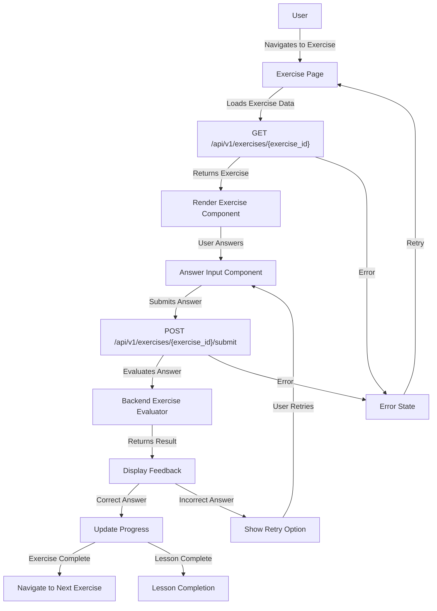

# Feature: Exercise Interaction

## Description
Comprehensive interactive grammar exercise system that supports multiple exercise types, provides immediate feedback, tracks performance, and integrates seamlessly with the learning progress system. This is the core learning functionality that enables users to practice and master grammar concepts through engaging interactive exercises.

## Actors/Roles
- **Student**: Primary user completing exercises and receiving feedback
- **System**: Backend services evaluating answers and tracking progress
- **Teacher**: Secondary user (future) reviewing student performance

## User Stories / Use Cases

### Core Exercise Completion
- As a user, I want to complete different types of exercises (multiple choice, fill-in-the-blank, identification, sentence construction) so I can practice grammar concepts
- As a user, I want to receive immediate visual and textual feedback on my answers so I understand my mistakes
- As a user, I want to retry exercises I got wrong so I can learn from my mistakes
- As a user, I want to see my progress within an exercise session so I know how much I've completed

### Learning Experience
- As a user, I want exercises to be presented in a clear, accessible format so I can focus on learning
- As a user, I want to track my accuracy and improvement over time so I can see my progress
- As a user, I want exercises to be responsive and work on mobile devices so I can learn anywhere
- As a user, I want to navigate between exercises within a lesson efficiently

### Accessibility & Performance
- As a user with disabilities, I want exercises to be fully accessible via keyboard navigation and screen readers
- As a user on slower connections, I want exercises to load quickly and work offline when possible
- As a user, I want my exercise progress to be automatically saved so I don't lose my work

## Flow Diagram


## Technical Implementation

### Frontend Architecture

#### Component Hierarchy
```
ExercisePage/
├── ExerciseContainer.tsx          # Main exercise wrapper
├── ExerciseHeader.tsx             # Title, progress, navigation
├── ExerciseTypes/
│   ├── MultipleChoiceExercise.tsx # Radio button selections
│   ├── FillInBlankExercise.tsx    # Text input with validation
│   ├── IdentificationExercise.tsx # Click-to-identify elements
│   └── SentenceConstructionExercise.tsx # Drag-and-drop sentence building
├── ExerciseFeedback.tsx           # Immediate feedback display
├── ExerciseProgress.tsx           # Progress tracking within session
├── ExerciseNavigation.tsx         # Previous/Next exercise controls
├── ExerciseTimer.tsx              # Optional timing functionality
└── ExerciseErrorBoundary.tsx      # Error handling and recovery
```

#### TypeScript Interfaces
```typescript
interface Exercise {
  id: string;
  lesson_id: string;
  title: string;
  type: 'multiple_choice' | 'fill_in_blank' | 'identification' | 'sentence_construction';
  prompt: string;
  content: ExerciseContent;
  order: number;
  created_at: string;
}

interface ExerciseContent {
  // Multiple Choice
  options?: string[];
  correct_answer?: string | number;
  
  // Fill in Blank
  text?: string;
  blanks?: Array<{
    id: string;
    position: number;
    correct_answers: string[];
    case_sensitive?: boolean;
  }>;
  
  // Identification
  target_text?: string;
  target_elements?: Array<{
    id: string;
    text: string;
    type: string;
    explanation: string;
  }>;
  
  // Sentence Construction
  words?: string[];
  correct_sentence?: string;
  alternative_correct?: string[];
}

interface ExerciseSubmission {
  answer: ExerciseAnswer;
  time_spent?: number;
}

interface ExerciseAnswer {
  // Multiple Choice
  selected_option?: string | number;
  
  // Fill in Blank
  blank_answers?: Record<string, string>;
  
  // Identification
  identified_elements?: string[];
  
  // Sentence Construction
  constructed_sentence?: string;
}

interface ExerciseResult {
  exercise_id: string;
  user_id: string;
  answer: ExerciseAnswer;
  is_correct: boolean;
  score: number; // 0-1
  feedback: ExerciseFeedback;
  time_spent?: number;
  submitted_at: string;
}

interface ExerciseFeedback {
  message: string;
  explanation?: string;
  correct_answer?: ExerciseAnswer;
  hints?: string[];
  next_steps?: {
    action: 'retry' | 'continue' | 'review';
    message: string;
  };
}

interface ExerciseState {
  current_exercise: Exercise | null;
  user_answer: ExerciseAnswer | null;
  result: ExerciseResult | null;
  is_loading: boolean;
  error: string | null;
  time_started: Date | null;
  attempts: number;
}
```

### Exercise Type Specifications

#### 1. Multiple Choice Exercise
- **UI**: Radio buttons with clear visual selection
- **Interaction**: Single selection, submit button
- **Validation**: Ensures one option is selected
- **Feedback**: Highlights correct/incorrect choice with explanation

#### 2. Fill-in-the-Blank Exercise
- **UI**: Text with highlighted blank spaces
- **Interaction**: Text input fields within context
- **Validation**: Real-time input validation, case-insensitive matching
- **Feedback**: Shows correct answers for each blank with explanations

#### 3. Identification Exercise
- **UI**: Interactive text with clickable elements
- **Interaction**: Click to highlight grammatical components
- **Validation**: Checks selected elements against targets
- **Feedback**: Visual highlighting of correct/incorrect selections

#### 4. Sentence Construction Exercise
- **UI**: Drag-and-drop word bank and construction area
- **Interaction**: Drag words to build sentences
- **Validation**: Checks word order and sentence structure
- **Feedback**: Shows correct sentence with explanation of grammar rules

## UI Entry Points
- **Primary**: From lesson detail page → exercise list → individual exercise
- **Secondary**: From dashboard "Continue Learning" → resume last exercise
- **Tertiary**: From review mode → targeted exercise practice
- **Direct**: URL routing `/exercises/{exercise_id}` for deep linking

## API Endpoints Used

### Core Exercise Endpoints
- **GET** `/api/v1/exercises/{exercise_id}`
  - **Headers**: `Authorization: Bearer <token>`
  - **Response**: Exercise object with complete content structure
  - **Error Codes**: 401 (Unauthorized), 404 (Exercise not found), 500 (Server error)

- **POST** `/api/v1/exercises/{exercise_id}/submit`
  - **Headers**: `Authorization: Bearer <token>`, `Content-Type: application/json`
  - **Body**: `ExerciseSubmission` object
  - **Response**: `ExerciseResult` with feedback and scoring
  - **Error Codes**: 400 (Invalid submission), 401 (Unauthorized), 404 (Exercise not found)

### Supporting Endpoints
- **GET** `/api/v1/exercises/` (with `lesson_id` parameter)
  - Get all exercises for a lesson in order
- **GET** `/api/v1/lessons/{lesson_id}/exercises`
  - Alternative endpoint for lesson-specific exercises

## Error Handling Matrix

| Scenario | HTTP Status | Frontend Behavior | User Message |
|----------|-------------|-------------------|--------------|
| Exercise not found | 404 | Redirect to lesson | "Exercise not available" |
| Invalid exercise ID | 400 | Show error state | "Invalid exercise" |
| Submission validation error | 400 | Highlight invalid inputs | "Please check your answer" |
| Network timeout | N/A | Show retry option | "Connection timeout. Try again?" |
| Server error | 500 | Show error boundary | "Something went wrong. Please retry." |
| Authentication expired | 401 | Redirect to login | "Please log in again" |
| Missing answer | Client-side | Prevent submission | "Please provide an answer" |
| Exercise already completed | 200 | Show completion state | "Exercise already completed" |

## Performance Requirements
- **Initial Load**: Exercise content loads within 1.5 seconds
- **Answer Submission**: Feedback appears within 500ms of submission
- **Navigation**: Moving between exercises takes < 300ms
- **Offline Support**: Cache exercise content for offline completion
- **Image Loading**: Lazy load any exercise images or media
- **Bundle Size**: Exercise components should not exceed 100KB compressed

## Accessibility Requirements (WCAG 2.1 AA)
- **Keyboard Navigation**: All exercise interactions accessible via keyboard
- **Screen Readers**: Proper ARIA labels and semantic HTML structure
- **Focus Management**: Clear focus indicators and logical tab order
- **Color Contrast**: Minimum 4.5:1 contrast ratio for all text and interactive elements
- **Text Scaling**: Support up to 200% text scaling without horizontal scrolling
- **Alternative Text**: Descriptive alt text for any images or visual content
- **Error Announcements**: Screen readers announce validation errors and feedback

## Progress Integration
- **Exercise Completion**: Updates user progress in real-time
- **Score Tracking**: Records accuracy and completion time for analytics
- **Lesson Progress**: Contributes to overall lesson completion percentage
- **Module Progress**: Affects module-level progress calculations
- **Dashboard Updates**: Progress changes reflect immediately on dashboard
- **Streak Tracking**: Contributes to learning streak calculations

## Acceptance Criteria

### Exercise Rendering & Interaction
- [ ] User can view exercises with clear, readable formatting
- [ ] All four exercise types render correctly on desktop and mobile
- [ ] User can interact with exercises using mouse, touch, and keyboard
- [ ] Exercise content loads within performance requirements
- [ ] User can navigate between exercises within a lesson

### Answer Submission & Feedback
- [ ] User can submit answers for all exercise types
- [ ] System provides immediate feedback within 500ms
- [ ] Feedback includes correct answers and explanations
- [ ] User can retry incorrect exercises with fresh attempts
- [ ] Exercise completion updates progress tracking

### Accessibility & Usability
- [ ] All exercises are fully accessible via keyboard navigation
- [ ] Screen readers can navigate and complete all exercise types
- [ ] Color contrast meets WCAG 2.1 AA standards
- [ ] Exercises work correctly at 200% text scaling
- [ ] Error messages are clear and actionable

### Technical Requirements
- [ ] Exercise state is automatically saved during completion
- [ ] Network errors are handled gracefully with retry options
- [ ] Exercise content is cached for offline access
- [ ] Bundle size stays within performance budgets
- [ ] Cross-browser compatibility (Chrome, Firefox, Safari, Edge)

### Integration Requirements
- [ ] Exercise completion integrates with progress tracking system
- [ ] Dashboard reflects exercise progress in real-time
- [ ] Exercise navigation integrates with lesson flow
- [ ] Exercise results contribute to learning analytics

## E2E Test Scenarios

### 1. Multiple Choice Exercise Completion
**Setup**: User navigates to a multiple choice exercise from lesson page
**Steps**:
1. User sees exercise with clear question and radio button options
2. User selects an answer option
3. User clicks "Submit Answer" button
4. System shows immediate feedback with correct/incorrect indication
5. If correct: User sees congratulations and "Next Exercise" button
6. If incorrect: User sees explanation and "Try Again" button
**Expected**: Exercise completion updates lesson progress

### 2. Fill-in-the-Blank Exercise Flow
**Setup**: User accesses fill-in-blank exercise
**Steps**:
1. User sees text with clearly marked blank spaces
2. User types answers into blank input fields
3. System provides real-time validation hints
4. User submits completed exercise
5. System evaluates each blank individually
6. User sees feedback for each blank with correct answers
**Expected**: Partial credit awarded for partially correct answers

### 3. Identification Exercise Interaction
**Setup**: User opens identification exercise
**Steps**:
1. User sees text with highlighting instructions
2. User clicks on words/phrases to identify grammatical elements
3. Selected elements are visually highlighted
4. User can deselect incorrect choices
5. User submits identification choices
6. System highlights correct vs incorrect selections
**Expected**: Visual feedback shows which elements were correctly identified

### 4. Sentence Construction Exercise
**Setup**: User accesses sentence construction exercise
**Steps**:
1. User sees word bank and empty construction area
2. User drags words from bank to construction area
3. Words snap into position to form sentence
4. User can reorder words by dragging
5. User submits constructed sentence
6. System evaluates sentence structure and grammar
**Expected**: Feedback explains grammar rules and shows correct sentence

### 5. Exercise Navigation Flow
**Setup**: User is in lesson with multiple exercises
**Steps**:
1. User completes first exercise successfully
2. User clicks "Next Exercise" button
3. System loads next exercise in sequence
4. User can navigate back to previous exercise
5. User sees progress indicator showing position in lesson
**Expected**: Progress bar updates to show exercise completion

### 6. Exercise Retry Mechanism
**Setup**: User answers exercise incorrectly
**Steps**:
1. User receives feedback for incorrect answer
2. User clicks "Try Again" button
3. Exercise resets to initial state
4. User can attempt exercise again with fresh start
5. System tracks number of attempts
**Expected**: User can retry unlimited times with attempt tracking

### 7. Network Error Recovery
**Setup**: User submits exercise during network interruption
**Steps**:
1. User completes exercise and clicks submit
2. Network error occurs during submission
3. System shows "Network error" message with retry button
4. User clicks retry button
5. System attempts resubmission with cached answer
**Expected**: Exercise submission succeeds when network recovers

### 8. Exercise Progress Auto-Save
**Setup**: User starts exercise and navigates away
**Steps**:
1. User begins answering exercise but doesn't submit
2. User navigates to different page
3. User returns to exercise page
4. System restores previous answer state
**Expected**: User's partial progress is preserved

### 9. Accessibility Keyboard Navigation
**Setup**: User accesses exercise using only keyboard
**Steps**:
1. User tabs through exercise elements in logical order
2. User selects answers using keyboard (Enter/Space)
3. User submits exercise using keyboard
4. User navigates to next exercise using keyboard
5. Focus indicators are clearly visible throughout
**Expected**: Complete exercise interaction possible without mouse

### 10. Mobile Touch Interaction
**Setup**: User accesses exercises on mobile device
**Steps**:
1. Exercise renders correctly on mobile screen
2. Touch targets are appropriately sized (minimum 44px)
3. User can interact with all exercise elements via touch
4. Drag-and-drop works smoothly on touch devices
5. Text input shows mobile-optimized keyboard
**Expected**: Full exercise functionality available on mobile

### 11. Exercise Performance Under Load
**Setup**: User accesses exercise with large content/media
**Steps**:
1. Exercise loads within 1.5 second requirement
2. User interactions remain responsive during loading
3. Answer submission provides feedback within 500ms
4. Navigation between exercises is smooth
**Expected**: Performance requirements met even with complex content

### 12. Progress Integration Verification
**Setup**: User completes exercises in lesson
**Steps**:
1. User completes first exercise in lesson
2. Dashboard progress bar updates immediately
3. User completes additional exercises
4. Lesson progress percentage increases appropriately
5. Module progress reflects lesson completion
**Expected**: Real-time progress updates across all views

### 13. Exercise Content Validation
**Setup**: System loads exercise with invalid/missing content
**Steps**:
1. Exercise page attempts to load malformed exercise
2. System detects content validation errors
3. Error boundary displays helpful error message
4. User can navigate back to lesson or retry loading
**Expected**: Graceful error handling without app crash

### 14. Multi-Exercise Session Flow
**Setup**: User completes sequence of exercises in lesson
**Steps**:
1. User completes exercises in order from lesson
2. Progress indicator shows position in exercise sequence
3. User can navigate forward and backward between completed exercises
4. Exercise results are retained throughout session
5. Lesson completion triggers celebration and progress update
**Expected**: Seamless flow through complete exercise sequence

### 15. Exercise Analytics Data Collection
**Setup**: User completes various exercises with different performance
**Steps**:
1. User completes exercises with varying accuracy and time
2. System records completion time, attempts, and scores
3. User views dashboard analytics showing exercise performance
4. Analytics reflect accurate completion rates and improvement trends
**Expected**: Comprehensive learning analytics captured and displayed