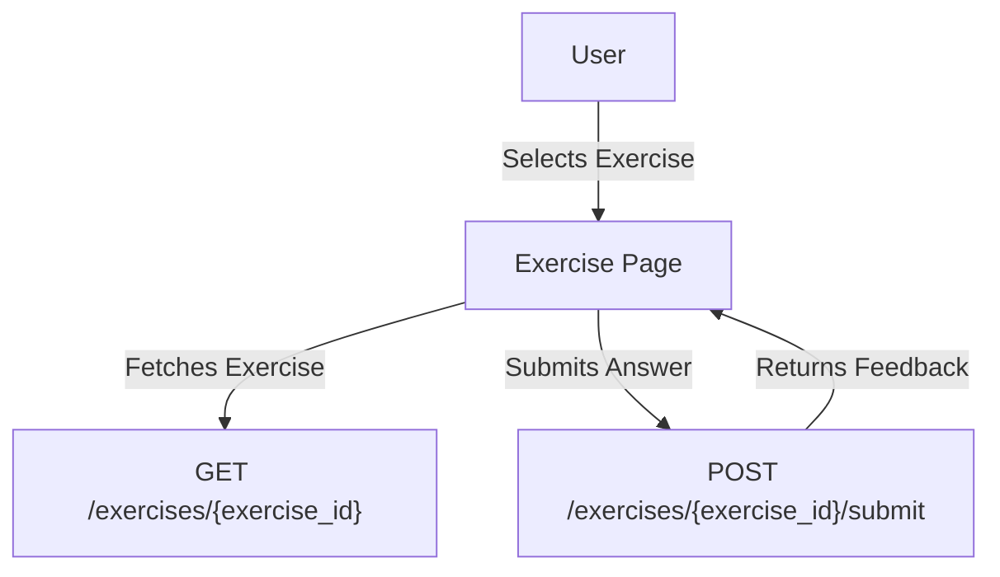

# Feature: Exercise Interaction

## Description
Allows users to complete interactive grammar exercises, receive feedback, and track their performance.

## Actors/Roles
- Student

## User Stories / Use Cases
- As a user, I want to answer different types of exercises (multiple choice, fill-in-the-blank, drag-and-drop, etc.).
- As a user, I want to receive immediate feedback on my answers.
- As a user, I want to retry exercises I got wrong.

## Flow Diagram

## UI Entry Points
- From lesson or module detail page
- From dashboard (review mode)

## API Endpoints Used
- `GET /exercises/{exercise_id}`
- `POST /exercises/{exercise_id}/submit`

## Acceptance Criteria
- [ ] User can complete various exercise types
- [ ] User receives immediate feedback
- [ ] User can retry incorrect exercises

## E2E Test Scenarios
1. User completes a multiple choice exercise and receives feedback
2. User submits a fill-in-the-blank exercise and sees if it's correct
3. User retries an incorrect exercise and gets it right 