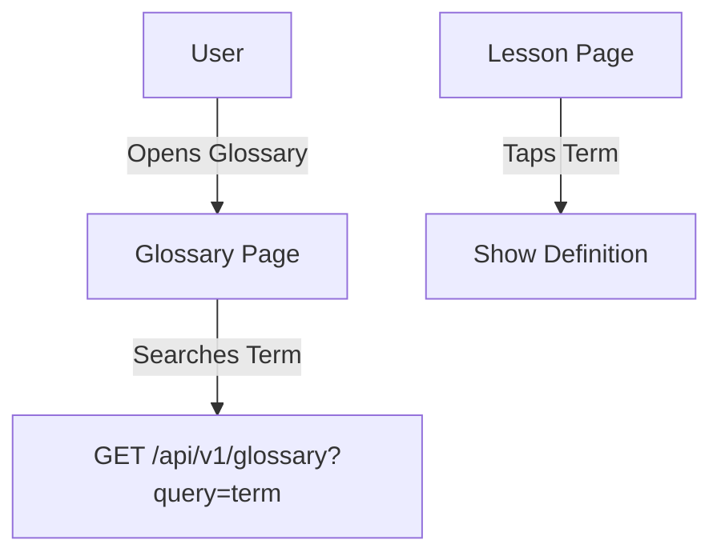

# Feature: Glossary

## Description
Allows users to search and view definitions of grammar terms, with links to relevant lessons.

## Actors/Roles
- Student

## User Stories / Use Cases
- As a user, I want to search for grammar terms so I can quickly find definitions.
- As a user, I want to tap a term in a lesson to see its definition.
- As a user, I want to see links from glossary terms to related lessons.

## Flow Diagram

## UI Entry Points
- Glossary tab in navigation bar
- Tapping a term in lesson content

## API Endpoints Used
- `GET /api/v1/glossary`

## Acceptance Criteria
- [ ] User can search for terms
- [ ] User can view definitions
- [ ] User can navigate to related lessons from glossary

## E2E Test Scenarios
1. User searches for a term and sees the correct definition
2. User taps a term in a lesson and sees a popup with the definition
3. User follows a link from a glossary term to a related lesson 