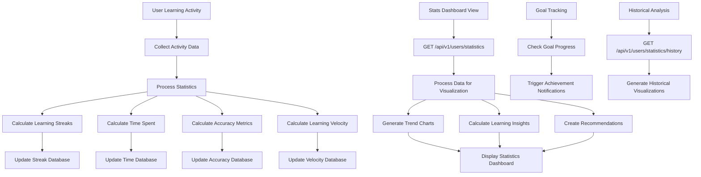

# Feature: Learning Statistics Dashboard

## Description
The Learning Statistics Dashboard provides comprehensive analytics and insights into user learning patterns, performance metrics, and achievement tracking. It displays data such as learning streaks, time spent studying, accuracy trends, skill mastery levels, and comparative performance metrics. The dashboard helps users understand their learning progress and identify areas for improvement through visual data representations and actionable insights.

## Actors/Roles
- **Student**: Primary user viewing personal learning statistics and insights
- **Analytics Engine**: Backend system processing learning data and generating insights
- **System**: Data collection and aggregation services
- **Teacher**: Secondary user accessing student analytics (future implementation)

## User Stories / Use Cases

### Learning Activity Tracking
- As a user, I want to see my current learning streak and celebrate consistency milestones
- As a user, I want to track total time spent learning with daily, weekly, and monthly breakdowns
- As a user, I want to see my learning session frequency and optimal study times
- As a user, I want to monitor my learning velocity (lessons per week, exercises per day)
- As a user, I want to view my longest learning streak as motivation to maintain consistency

### Performance Analytics
- As a user, I want to see my overall accuracy trends across different grammar topics
- As a user, I want to identify my strongest grammar concepts with visual indicators
- As a user, I want to recognize weak areas that need additional practice
- As a user, I want to track improvement over time with trend lines and charts
- As a user, I want to see how my performance compares to typical learning patterns

### Skill Mastery Tracking
- As a user, I want to see mastery levels for different grammar concepts (nouns, verbs, adjectives, etc.)
- As a user, I want visual indicators showing which skills I've mastered vs. need work
- As a user, I want to track skill progression from beginner to advanced levels
- As a user, I want recommendations for skills to focus on next based on my progress
- As a user, I want to see prerequisite relationships between grammar concepts

### Goal Setting & Achievement
- As a user, I want to set daily and weekly learning goals and track progress toward them
- As a user, I want to see projected completion dates for my current learning path
- As a user, I want achievement badges for reaching milestones (streaks, accuracy, completion)
- As a user, I want to adjust goals based on my actual performance and available time
- As a user, I want celebration animations when I achieve significant milestones

### Historical Analysis
- As a user, I want to view my learning history over different time periods (week, month, year)
- As a user, I want to see patterns in my learning behavior and optimal study times
- As a user, I want to track seasonal variations in my learning consistency
- As a user, I want to export my learning data for personal analysis or sharing
- As a user, I want to compare my current performance to my historical averages

## Flow Diagram


## UI Entry Points
- **Dashboard Statistics Panel**: Learning stats widget on main dashboard
- **Dedicated Statistics Page**: Comprehensive analytics dashboard (`/statistics`)
- **Profile Settings**: Personal learning analytics and goal management
- **Module Progress**: Context-specific statistics within modules
- **Achievement Center**: Gamification and milestone tracking interface

## API Endpoints Used

### Core Statistics
- **GET** `/api/v1/users/statistics`
  - **Headers**: `Authorization: Bearer <token>`
  - **Query Parameters**:
    - `period`: String ("day", "week", "month", "all")
    - `include_trends`: Boolean
    - `include_goals`: Boolean
  - **Response**:
    ```json
    {
      "learning_streaks": {
        "current_streak": 7,
        "longest_streak": 15,
        "streak_goal": 14,
        "last_activity": "2024-01-01T14:30:00Z"
      },
      "time_spent": {
        "today": 25,
        "this_week": 180,
        "this_month": 720,
        "total": 3600,
        "average_session": 22,
        "goal_daily": 30
      },
      "accuracy_metrics": {
        "overall_accuracy": 0.82,
        "trend": "improving",
        "strongest_topics": [
          { "topic": "nouns", "accuracy": 0.95 },
          { "topic": "basic_verbs", "accuracy": 0.88 }
        ],
        "weakest_topics": [
          { "topic": "pronouns", "accuracy": 0.65 },
          { "topic": "complex_sentences", "accuracy": 0.58 }
        ]
      },
      "learning_velocity": {
        "lessons_per_week": 3.2,
        "exercises_per_day": 2.8,
        "completion_rate": 0.85,
        "velocity_trend": "stable"
      }
    }
    ```

### Historical Statistics
- **GET** `/api/v1/users/statistics/history`
  - **Headers**: `Authorization: Bearer <token>`
  - **Query Parameters**:
    - `start_date`: ISO date string
    - `end_date`: ISO date string
    - `granularity`: String ("day", "week", "month")
  - **Response**:
    ```json
    {
      "data_points": [
        {
          "date": "2024-01-01",
          "time_spent": 30,
          "lessons_completed": 1,
          "exercises_completed": 3,
          "average_accuracy": 0.85,
          "streak_active": true
        }
      ],
      "summary": {
        "total_days": 30,
        "active_days": 22,
        "total_time": 660,
        "total_lessons": 15,
        "total_exercises": 45
      }
    }
    ```

### Goal Management
- **GET** `/api/v1/users/goals`
  - **Headers**: `Authorization: Bearer <token>`
  - **Response**:
    ```json
    {
      "daily_goals": {
        "time_minutes": 30,
        "lessons": 1,
        "exercises": 3,
        "accuracy_target": 0.80
      },
      "weekly_goals": {
        "time_minutes": 210,
        "lessons": 5,
        "streak_days": 5
      },
      "progress_toward_goals": {
        "daily_progress": {
          "time_progress": 0.83,
          "lessons_progress": 1.0,
          "exercises_progress": 0.67
        },
        "weekly_progress": {
          "time_progress": 0.76,
          "lessons_progress": 0.80,
          "streak_progress": 1.0
        }
      }
    }
    ```

- **PUT** `/api/v1/users/goals`
  - **Headers**: `Authorization: Bearer <token>`
  - **Body**:
    ```json
    {
      "daily_time_minutes": 30,
      "daily_lessons": 1,
      "daily_exercises": 3,
      "weekly_streak_goal": 5,
      "accuracy_target": 0.85
    }
    ```

## Technical Specifications

### Data Structures
```typescript
interface LearningStatistics {
  learning_streaks: {
    current_streak: number;
    longest_streak: number;
    streak_goal: number;
    last_activity: string;
  };
  time_spent: {
    today: number; // minutes
    this_week: number;
    this_month: number;
    total: number;
    average_session: number;
    goal_daily: number;
  };
  accuracy_metrics: {
    overall_accuracy: number; // 0-1
    trend: 'improving' | 'stable' | 'declining';
    strongest_topics: TopicAccuracy[];
    weakest_topics: TopicAccuracy[];
  };
  learning_velocity: {
    lessons_per_week: number;
    exercises_per_day: number;
    completion_rate: number; // 0-1
    velocity_trend: 'increasing' | 'stable' | 'decreasing';
  };
}

interface TopicAccuracy {
  topic: string;
  accuracy: number; // 0-1
  attempts: number;
  last_practiced: string;
}

interface LearningGoals {
  daily_goals: {
    time_minutes: number;
    lessons: number;
    exercises: number;
    accuracy_target: number;
  };
  weekly_goals: {
    time_minutes: number;
    lessons: number;
    streak_days: number;
  };
  progress_toward_goals: {
    daily_progress: GoalProgress;
    weekly_progress: GoalProgress;
  };
}

interface GoalProgress {
  time_progress: number; // 0-1
  lessons_progress: number; // 0-1
  exercises_progress: number; // 0-1
  streak_progress?: number; // 0-1
}
```

### Statistics Calculation Engine
```typescript
class StatisticsCalculator {
  static calculateLearningStreak(activities: Activity[]): number {
    const today = new Date();
    let currentStreak = 0;
    let checkDate = new Date(today);
    
    // Check backwards from today to find consecutive days
    while (checkDate >= activities[0]?.date) {
      const dayActivities = activities.filter(
        activity => this.isSameDay(activity.date, checkDate)
      );
      
      if (dayActivities.length > 0) {
        currentStreak++;
        checkDate.setDate(checkDate.getDate() - 1);
      } else {
        break;
      }
    }
    
    return currentStreak;
  }
  
  static calculateAccuracyTrend(
    accuracyHistory: AccuracyPoint[],
    windowSize: number = 7
  ): 'improving' | 'stable' | 'declining' {
    if (accuracyHistory.length < windowSize) return 'stable';
    
    const recent = accuracyHistory.slice(-windowSize);
    const older = accuracyHistory.slice(-windowSize * 2, -windowSize);
    
    const recentAvg = recent.reduce((sum, point) => sum + point.accuracy, 0) / recent.length;
    const olderAvg = older.reduce((sum, point) => sum + point.accuracy, 0) / older.length;
    
    const improvement = (recentAvg - olderAvg) / olderAvg;
    
    if (improvement > 0.05) return 'improving';
    if (improvement < -0.05) return 'declining';
    return 'stable';
  }
  
  static calculateLearningVelocity(activities: Activity[], days: number = 7): number {
    const cutoffDate = new Date();
    cutoffDate.setDate(cutoffDate.getDate() - days);
    
    const recentActivities = activities.filter(
      activity => activity.date >= cutoffDate
    );
    
    const completedLessons = recentActivities.filter(
      activity => activity.type === 'lesson_completed'
    ).length;
    
    return completedLessons / days;
  }
}
```

### Component Architecture
```typescript
const LearningStatsPanel: React.FC = () => {
  const [stats, setStats] = useState<LearningStatistics | null>(null);
  const [isLoading, setIsLoading] = useState(true);
  const [selectedPeriod, setSelectedPeriod] = useState<'day' | 'week' | 'month'>('week');
  
  return (
    <div className="learning-stats-panel">
      <StatsHeader period={selectedPeriod} onPeriodChange={setSelectedPeriod} />
      {isLoading ? (
        <StatsLoadingSkeleton />
      ) : (
        <>
          <StreakDisplay streak={stats.learning_streaks} />
          <TimeSpentChart timeData={stats.time_spent} />
          <AccuracyMetrics accuracy={stats.accuracy_metrics} />
          <VelocityIndicators velocity={stats.learning_velocity} />
          <GoalProgress goals={stats.goals} />
        </>
      )}
    </div>
  );
};

const StreakDisplay: React.FC<{ streak: LearningStreaks }> = ({ streak }) => {
  return (
    <div className="streak-display">
      <div className="streak-flame">
        <span className="streak-number">{streak.current_streak}</span>
        <span className="streak-label">Day Streak</span>
      </div>
      <div className="streak-progress">
        <div className="streak-target">Goal: {streak.streak_goal} days</div>
        <ProgressBar 
          progress={streak.current_streak / streak.streak_goal} 
          color="orange" 
        />
      </div>
    </div>
  );
};
```

## UI/UX Specifications

### Statistics Card Design
```css
/* Statistics Panel Layout */
.learning-stats-panel {
  background: var(--bg-primary);
  border-radius: 0.75rem;
  border: 1px solid var(--border-color);
  padding: 1.5rem;
  margin-bottom: 2rem;
}

.stats-header {
  display: flex;
  justify-content: between;
  align-items: center;
  margin-bottom: 2rem;
}

.stats-period-selector {
  display: flex;
  gap: 0.5rem;
  background: var(--bg-secondary);
  padding: 0.25rem;
  border-radius: 0.5rem;
}

.period-button {
  padding: 0.5rem 1rem;
  border: none;
  background: transparent;
  border-radius: 0.375rem;
  cursor: pointer;
  transition: all 0.2s;
}

.period-button--active {
  background: var(--primary-color);
  color: white;
}

/* Streak Display */
.streak-display {
  display: flex;
  align-items: center;
  gap: 2rem;
  padding: 1.5rem;
  background: linear-gradient(135deg, #F59E0B, #D97706);
  border-radius: 0.75rem;
  color: white;
  margin-bottom: 1.5rem;
}

.streak-flame {
  text-align: center;
}

.streak-number {
  display: block;
  font-size: 2.5rem;
  font-weight: 700;
  line-height: 1;
}

.streak-label {
  font-size: 0.875rem;
  opacity: 0.9;
  text-transform: uppercase;
  letter-spacing: 0.05em;
}

.streak-progress {
  flex: 1;
}

.streak-target {
  font-size: 0.875rem;
  margin-bottom: 0.5rem;
  opacity: 0.9;
}

/* Statistics Grid */
.stats-grid {
  display: grid;
  grid-template-columns: repeat(auto-fit, minmax(250px, 1fr));
  gap: 1.5rem;
  margin-bottom: 2rem;
}

.stat-card {
  background: var(--bg-secondary);
  border-radius: 0.5rem;
  padding: 1.5rem;
  border: 1px solid var(--border-color);
  text-align: center;
}

.stat-icon {
  width: 3rem;
  height: 3rem;
  margin: 0 auto 1rem;
  border-radius: 50%;
  display: flex;
  align-items: center;
  justify-content: center;
  font-size: 1.25rem;
}

.stat-icon--time { background: #3B82F6; color: white; }
.stat-icon--accuracy { background: #10B981; color: white; }
.stat-icon--velocity { background: #8B5CF6; color: white; }

.stat-value {
  font-size: 2rem;
  font-weight: 700;
  color: var(--text-primary);
  margin-bottom: 0.5rem;
}

.stat-label {
  font-size: 0.875rem;
  color: var(--text-secondary);
  margin-bottom: 0.75rem;
}

.stat-trend {
  display: inline-flex;
  align-items: center;
  gap: 0.25rem;
  font-size: 0.75rem;
  padding: 0.25rem 0.5rem;
  border-radius: 0.25rem;
}

.stat-trend--improving {
  background: #DCFCE7;
  color: #166534;
}

.stat-trend--declining {
  background: #FEF2F2;
  color: #991B1B;
}

.stat-trend--stable {
  background: #F3F4F6;
  color: #374151;
}
```

### Responsive Design
```css
/* Mobile Layout */
@media (max-width: 640px) {
  .learning-stats-panel {
    padding: 1rem;
  }
  
  .streak-display {
    flex-direction: column;
    text-align: center;
    gap: 1rem;
  }
  
  .stats-grid {
    grid-template-columns: 1fr;
    gap: 1rem;
  }
  
  .stat-card {
    padding: 1rem;
  }
  
  .stat-value {
    font-size: 1.5rem;
  }
}

/* Tablet Layout */
@media (min-width: 641px) and (max-width: 1024px) {
  .stats-grid {
    grid-template-columns: repeat(2, 1fr);
  }
}
```

### Chart Visualizations
```css
/* Chart Container */
.stats-chart {
  background: var(--bg-primary);
  border-radius: 0.5rem;
  padding: 1.5rem;
  border: 1px solid var(--border-color);
  margin-bottom: 1.5rem;
}

.chart-header {
  display: flex;
  justify-content: between;
  align-items: center;
  margin-bottom: 1rem;
}

.chart-title {
  font-size: 1.125rem;
  font-weight: 600;
  color: var(--text-primary);
}

.chart-subtitle {
  font-size: 0.875rem;
  color: var(--text-secondary);
}

/* Topic Strength/Weakness Display */
.topic-analysis {
  display: grid;
  grid-template-columns: 1fr 1fr;
  gap: 2rem;
  margin-top: 2rem;
}

.topic-category {
  background: var(--bg-secondary);
  border-radius: 0.5rem;
  padding: 1.5rem;
}

.topic-category-title {
  font-weight: 600;
  margin-bottom: 1rem;
  display: flex;
  align-items: center;
  gap: 0.5rem;
}

.topic-list {
  space-y: 1rem;
}

.topic-item {
  display: flex;
  justify-content: between;
  align-items: center;
  padding: 0.75rem;
  background: var(--bg-primary);
  border-radius: 0.375rem;
}

.topic-name {
  font-weight: 500;
  text-transform: capitalize;
}

.topic-accuracy {
  font-weight: 600;
  padding: 0.25rem 0.5rem;
  border-radius: 0.25rem;
  font-size: 0.875rem;
}

.topic-accuracy--strong {
  background: #DCFCE7;
  color: #166534;
}

.topic-accuracy--weak {
  background: #FEF2F2;
  color: #991B1B;
}
```

## Acceptance Criteria

### Core Statistics Display
- [ ] **Learning Streak**: Displays current and longest streak with visual flame indicator
- [ ] **Time Tracking**: Shows time spent today, this week, this month, and total
- [ ] **Accuracy Metrics**: Displays overall accuracy with trend indicators
- [ ] **Learning Velocity**: Shows lessons per week and exercises per day
- [ ] **Goal Progress**: Visual progress toward daily and weekly learning goals

### Data Accuracy & Real-time Updates
- [ ] **Accurate Calculations**: All statistics calculated correctly based on user activity
- [ ] **Real-time Updates**: Statistics update immediately when activities are completed
- [ ] **Historical Consistency**: Past statistics remain consistent and verifiable
- [ ] **Cross-device Sync**: Statistics consistent across all user devices
- [ ] **Timezone Handling**: Correctly handles user timezone for daily calculations

### Visual Design & Usability
- [ ] **Intuitive Layout**: Clear visual hierarchy with logical information grouping
- [ ] **Color Coding**: Consistent color scheme for different metric types
- [ ] **Responsive Design**: Adapts appropriately to all screen sizes
- [ ] **Loading States**: Skeleton screens while statistics data loads
- [ ] **Animation Effects**: Smooth transitions when switching time periods

### Goal Tracking & Gamification
- [ ] **Goal Setting**: Users can set and modify daily/weekly learning goals
- [ ] **Progress Visualization**: Clear visual progress toward goals
- [ ] **Achievement Recognition**: Celebrates when goals are reached
- [ ] **Streak Motivation**: Engaging streak display encourages consistency
- [ ] **Milestone Alerts**: Notifications for significant achievements

### Performance & Accessibility
- [ ] **Load Performance**: Statistics dashboard loads within 2 seconds
- [ ] **Chart Performance**: All visualizations render smoothly without lag
- [ ] **Screen Reader Support**: All statistics accessible to assistive technologies
- [ ] **Keyboard Navigation**: Full keyboard accessibility for all interactive elements
- [ ] **Color Contrast**: All text meets WCAG 2.1 AA contrast requirements

### Analytics & Insights
- [ ] **Trend Analysis**: Identifies improving/declining performance patterns
- [ ] **Topic Insights**: Accurately identifies strongest and weakest grammar topics
- [ ] **Learning Patterns**: Recognizes optimal study times and frequency
- [ ] **Comparative Analytics**: Shows progress relative to typical learning patterns
- [ ] **Actionable Recommendations**: Provides specific suggestions for improvement

## E2E Test Scenarios

### Statistics Accuracy & Calculation
1. **Streak Calculation Verification**
   - User studies for 5 consecutive days
   - Learning streak displays "5 Day Streak"
   - User skips a day, then resumes studying
   - Streak resets to 1 and counts up again
   - **Expected Result**: Accurate streak tracking with proper reset behavior

2. **Time Tracking Accuracy**
   - User completes 30-minute study session
   - Time statistics update to reflect 30 minutes today
   - Weekly and monthly totals accumulate correctly
   - Average session time recalculates appropriately
   - **Expected Result**: Precise time tracking across all periods

### Goal Tracking & Progress
3. **Daily Goal Achievement**
   - User sets goal of 30 minutes and 2 lessons daily
   - User completes 30 minutes and 2 lessons
   - Goal progress shows 100% completion
   - Achievement celebration animation triggers
   - **Expected Result**: Accurate goal tracking with proper celebration

4. **Weekly Goal Progression**
   - User sets weekly goal of 5 study days
   - User studies 3 days in current week
   - Weekly progress shows 60% completion (3/5)
   - Progress updates in real-time as user studies
   - **Expected Result**: Accurate weekly goal tracking

### Analytics & Insights
5. **Accuracy Trend Analysis**
   - User shows improving performance over time
   - Accuracy metrics display "improving" trend
   - Strongest topics list reflects high-accuracy areas
   - Weakest topics identify areas needing work
   - **Expected Result**: Accurate trend analysis and topic identification

6. **Learning Velocity Calculation**
   - User completes 3 lessons in current week
   - Velocity displays "3.0 lessons per week"
   - User's pace increases to 4 lessons next week
   - Velocity updates to reflect new pace
   - **Expected Result**: Accurate velocity tracking and updates

### Data Persistence & Synchronization
7. **Cross-device Statistics Sync**
   - User studies on mobile device for 20 minutes
   - User opens desktop application
   - Statistics show updated time and activity
   - All metrics reflect mobile activity
   - **Expected Result**: Seamless cross-device data synchronization

8. **Historical Data Preservation**
   - User has 30 days of learning history
   - Historical statistics page loads correctly
   - All past daily statistics are accurate
   - Charts display proper trend lines
   - **Expected Result**: Reliable historical data preservation

### Error Handling & Edge Cases
9. **Network Connectivity Issues**
   - User loses internet connection
   - Cached statistics remain visible
   - Clear indication of offline status
   - Statistics sync when connection restored
   - **Expected Result**: Graceful offline handling with data recovery

10. **Large Dataset Performance**
    - User with extensive learning history (1+ year)
    - Statistics dashboard loads within performance targets
    - All calculations complete accurately
    - Charts render smoothly with large datasets
    - **Expected Result**: Scalable performance with historical data

This comprehensive learning statistics system provides users with meaningful insights into their learning journey while maintaining accuracy, performance, and accessibility standards.