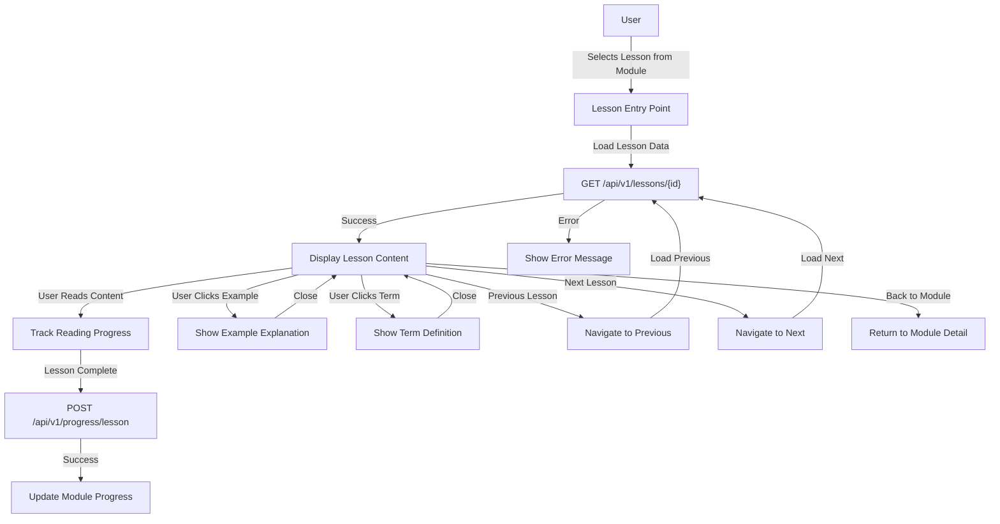

# Feature: Lesson View

## Description
The lesson view provides users with an immersive, interactive learning experience for grammar concepts. It displays lesson content with rich markdown formatting, interactive examples, progress tracking, and seamless navigation between lessons within a module. The interface supports both educational content consumption and progress tracking, ensuring users can learn effectively while monitoring their advancement.

## Actors/Roles
- **Student**: Primary user consuming lesson content and tracking progress
- **System**: Backend services providing lesson data, progress tracking, and content delivery

## User Stories / Use Cases

### Core Content Viewing
- As a user, I want to view lesson content in a clear, readable format so I can learn grammar concepts effectively
- As a user, I want to see the lesson title, module context, and my progress so I understand where I am in my learning journey
- As a user, I want responsive design that works on both desktop and mobile devices
- As a user, I want proper typography and spacing that makes reading comfortable

### Interactive Learning Features
- As a user, I want to click on grammar examples to see detailed explanations so I can understand concepts better
- As a user, I want to see highlighted grammatical elements in examples so I can identify key components
- As a user, I want tooltips for technical grammar terms so I can understand terminology
- As a user, I want expandable sections for additional details so I can dive deeper when needed

### Navigation and Progress
- As a user, I want to navigate to the previous/next lesson within a module so I can progress through content sequentially
- As a user, I want to see breadcrumb navigation so I can understand my location and navigate back to the module
- As a user, I want to track my reading progress within the lesson so I know how much content remains
- As a user, I want to mark lessons as complete and see this reflected in my overall progress

### Learning Enhancement
- As a user, I want to see estimated reading time so I can plan my study sessions
- As a user, I want to bookmark interesting sections for later review
- As a user, I want to see related lessons and suggestions for continued learning
- As a user, I want to track time spent in lessons for self-monitoring

## Flow Diagram


## Technical Implementation Logic

### Frontend Component Architecture
```typescript
LessonPage/
├── LessonHeader (breadcrumb, title, progress indicator)
├── LessonContent (markdown renderer with interactive features)
├── LessonNavigation (prev/next controls, module link)
├── LessonProgress (completion tracking, time spent)
└── LessonFooter (related lessons, additional resources)
```

### State Management
```typescript
interface LessonState {
  lesson: Lesson | null;
  isLoading: boolean;
  error: string | null;
  readingProgress: number; // 0-100%
  timeSpent: number; // minutes
  isCompleted: boolean;
  navigationInfo: {
    previousLessonId: string | null;
    nextLessonId: string | null;
    moduleId: string;
    moduleTitle: string;
  };
}
```

### API Integration
1. **Lesson Data Loading**
   - Fetch lesson content and metadata
   - Load navigation information (prev/next lessons)
   - Handle loading states and error scenarios

2. **Progress Tracking**
   - Track reading time and scroll progress
   - Update completion status
   - Sync with backend progress API

3. **Navigation Logic**
   - Determine available prev/next lessons within module
   - Handle edge cases (first/last lesson)
   - Maintain navigation state during transitions

### Interactive Features Implementation
1. **Example Tooltips**
   - Parse markdown for example blocks
   - Add click handlers for interactive explanations
   - Implement overlay/modal for detailed explanations

2. **Grammar Term Highlights**
   - Identify grammar terms in content
   - Add hover/click interactions
   - Display definitions from glossary API

3. **Progress Indicators**
   - Reading progress bar based on scroll position
   - Lesson completion tracking
   - Time spent monitoring

## UI Entry Points
- **Module Detail Page**: Primary entry point via lesson selection from LessonsList component
- **Dashboard**: Continue learning from last accessed lesson
- **Direct URL Access**: Direct navigation to `/lessons/{lesson_id}`
- **Navigation**: Prev/next lesson navigation within lesson view
- **Search Results**: Future enhancement for lesson search

## API Endpoints Used
- `GET /api/v1/lessons/{lesson_id}` - Fetch lesson content and metadata
- `GET /api/v1/lessons?module_id={module_id}` - Get all lessons in module for navigation
- `POST /api/v1/progress/lesson/{lesson_id}` - Update lesson completion status
- `GET /api/v1/progress/lesson/{lesson_id}` - Get lesson progress data
- `GET /api/v1/modules/{module_id}` - Get module context for breadcrumb

## Error Handling Matrix

| Scenario | HTTP Status | Frontend Behavior | User Message |
|----------|-------------|------------------|--------------|
| Lesson not found | 404 | Show error state with retry | "Lesson not found. Please try again." |
| Network error | N/A | Show error state with retry | "Unable to load lesson. Check your connection." |
| Unauthorized access | 401 | Redirect to login | "Please log in to access lessons." |
| Server error | 500 | Show error state with retry | "Something went wrong. Please try again later." |
| Invalid lesson ID | 400 | Show error state, suggest module | "Invalid lesson. Return to module overview." |

## Interactive Features Specification

### 1. Example Explanations
- **Trigger**: Click on example sentences or grammar constructs
- **Behavior**: Show overlay with detailed explanation
- **Content**: Breakdown of grammatical elements, rules applied
- **Dismissal**: Click outside, ESC key, or close button

### 2. Term Definitions
- **Trigger**: Hover over or click grammar terms
- **Behavior**: Show tooltip with definition
- **Content**: Definition from glossary, related lessons
- **Enhancement**: Link to glossary page for full details

### 3. Reading Progress
- **Visual**: Progress bar at top of lesson
- **Calculation**: Based on scroll position and content length
- **Persistence**: Save progress to backend periodically
- **Completion**: Auto-mark complete when 90%+ read and time threshold met

### 4. Navigation Enhancement
- **Keyboard Support**: Arrow keys for prev/next navigation
- **Touch Support**: Swipe gestures on mobile devices
- **Context Preservation**: Maintain reading position when navigating
- **Smart Suggestions**: Recommend next lesson based on completion status

## Acceptance Criteria

### Core Functionality
- [x] User can access lesson from module detail page navigation
- [x] Lesson content displays with proper markdown formatting
- [x] Breadcrumb navigation shows module context
- [x] Loading states display during content fetch
- [x] Error states handle network and content issues gracefully

### Interactive Features
- [ ] User can click on examples to see detailed explanations
- [ ] Grammar terms show definitions on hover/click
- [ ] Reading progress updates as user scrolls through content
- [ ] Interactive elements work on both desktop and mobile

### Navigation
- [ ] User can navigate to previous lesson (if available)
- [ ] User can navigate to next lesson (if available)
- [ ] User can return to module detail page
- [ ] Navigation preserves reading progress and completion status

### Progress Tracking
- [ ] Lesson completion status updates when user finishes reading
- [ ] Time spent in lesson is tracked and saved
- [ ] Module progress reflects lesson completion
- [ ] Progress persists across browser sessions

### Responsive Design
- [ ] Lesson content is readable on mobile devices
- [ ] Interactive features work on touch devices
- [ ] Navigation is accessible on all screen sizes
- [ ] Typography scales appropriately for different devices

## E2E Test Scenarios

### 1. Complete Lesson Reading Flow
- User navigates from module detail to first lesson
- User reads through lesson content with proper formatting
- User interacts with example explanations
- User completes lesson and sees progress updated
- User navigates to next lesson seamlessly

### 2. Lesson Navigation Flow
- User opens lesson from middle of module
- User navigates to previous lesson successfully
- User navigates to next lesson successfully
- User returns to module detail page with progress preserved

### 3. Interactive Features Flow
- User clicks on grammar examples and sees explanations
- User hovers over technical terms and sees definitions
- User uses keyboard navigation for accessibility
- Interactive features work consistently across devices

### 4. Progress Tracking Flow
- User starts reading lesson and progress indicator updates
- User completes lesson and completion status is saved
- User returns to module and sees updated progress
- Progress persists after browser refresh

### 5. Error Handling Flow
- User tries to access non-existent lesson and sees appropriate error
- User experiences network issue and can retry successfully
- User accesses lesson without authentication and is redirected
- Error states provide clear guidance for resolution

### 6. Mobile Responsiveness Flow
- User accesses lesson on mobile device
- Content is readable and properly formatted
- Touch interactions work for examples and navigation
- Lesson navigation is accessible on small screens

## Performance Requirements
- **Initial Load**: Lesson content loads within 2 seconds
- **Navigation**: Prev/next lesson transitions complete within 1 second
- **Interactivity**: Example tooltips and overlays respond within 200ms
- **Progress Sync**: Progress updates save to backend within 5 seconds
- **Offline Support**: Cache recently viewed lessons for offline reading (future enhancement) 