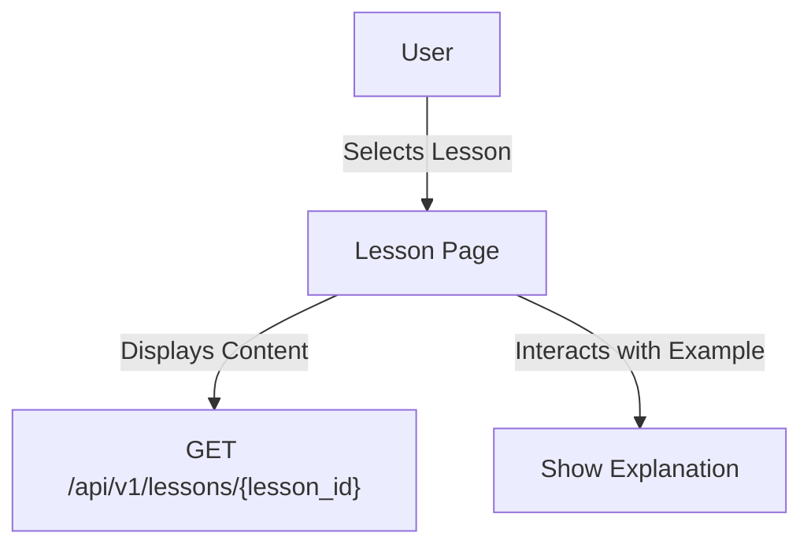

# Feature: Lesson View

## Description
Allows users to view and interact with lesson content, including text, examples, and interactive elements.

## Actors/Roles
- Student

## User Stories / Use Cases
- As a user, I want to read lesson content in a clear, mobile-friendly format.
- As a user, I want to interact with examples (e.g., tap to reveal explanations).
- As a user, I want to navigate between lesson sections easily.

## Flow Diagram

## UI Entry Points
- From module detail page
- From dashboard (continue lesson)

## API Endpoints Used
- `GET /api/v1/lessons/{lesson_id}`

## Acceptance Criteria
- [ ] User can view lesson content
- [ ] User can interact with examples
- [ ] User can navigate between lesson sections

## E2E Test Scenarios
1. User opens a lesson and sees formatted content
2. User taps an example and sees an explanation
3. User navigates to the next/previous lesson section 