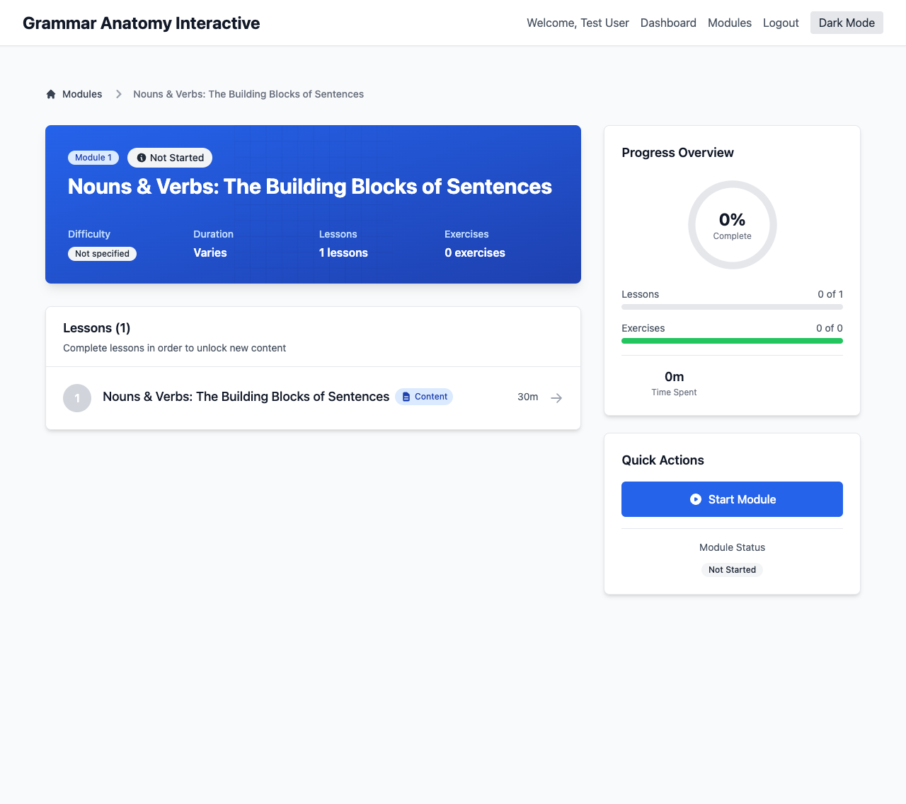

# Feature: Module Detail View

## Description
The module detail view provides users with comprehensive information about a specific grammar module, including lessons overview, progress tracking, learning objectives, and navigation to individual lessons and exercises. It serves as the central hub for users to understand module content, track their progress, and access specific learning materials.

## Visual Reference


*Screenshot showing the module detail view with lessons list, progress overview, and quick actions*

## Actors/Roles
- **Student**: Primary user viewing module details and accessing lessons
- **Teacher**: Secondary user reviewing module content and student progress (future)
- **System**: Backend providing module data, lessons, and progress information

## User Stories / Use Cases

### Core Module Information Display
- As a user, I want to see detailed information about a module including title, description, difficulty level, and estimated completion time
- As a user, I want to see my current progress in the module with visual indicators
- As a user, I want to see the complete list of lessons within the module
- As a user, I want to see learning objectives and what I'll accomplish by completing this module
- As a user, I want to see prerequisites and recommended prior knowledge

### Progress and Status Tracking
- As a user, I want to see my completion percentage for the entire module
- As a user, I want to see which lessons I've completed, started, or haven't accessed yet
- As a user, I want to see my performance metrics for completed exercises
- As a user, I want to continue from where I left off with a prominent "Continue" button
- As a user, I want to see time spent in this module and estimated time remaining

### Lesson Navigation and Access
- As a user, I want to start the first lesson if I haven't begun the module
- As a user, I want to jump to any previously completed lesson for review
- As a user, I want to access the next available lesson based on my progress
- As a user, I want to see which lessons are locked due to prerequisites
- As a user, I want to preview lesson content without starting the lesson

### Learning Path Integration
- As a user, I want to see how this module fits into my overall learning path
- As a user, I want to see related modules and recommended next steps
- As a user, I want to bookmark this module for easy access later
- As a user, I want to share my progress or achievements from this module
- As a user, I want to see community insights like completion rates and difficulty ratings

## Flow Diagram


## UI Entry Points
- **Module List**: Click/tap on any module card navigates to module detail
- **Dashboard**: "Continue Learning" button for last accessed module
- **Search Results**: Direct navigation from search results
- **Deep Links**: Direct URL access `/modules/{module_id}`
- **Breadcrumb Navigation**: From lesson pages back to module overview
- **Related Modules**: Cross-navigation from other module detail pages

## API Endpoints Used

### Module Detail Data
- **GET** `/api/v1/modules/{module_id}`
  - **Headers**: `Authorization: Bearer <token>`
  - **Path Parameters**: `module_id` (UUID)
  - **Response**:
    ```json
    {
      "id": "uuid",
      "title": "Nouns & Verbs",
      "description": "Master the fundamental building blocks of English grammar",
      "order": 1,
      "difficulty": "beginner",
      "estimated_duration": 180,
      "lesson_count": 8,
      "exercise_count": 24,
      "learning_objectives": [
        "Identify different types of nouns",
        "Distinguish between action and linking verbs",
        "Apply noun-verb agreement rules"
      ],
      "prerequisites": [
        "Basic reading comprehension",
        "Familiarity with English alphabet"
      ],
      "lessons": [
        {
          "id": "uuid",
          "title": "Introduction to Nouns",
          "order": 1,
          "duration": 15,
          "lesson_type": "content",
          "is_locked": false,
          "description": "Learn what nouns are and how to identify them"
        }
      ],
      "created_at": "2024-01-01T00:00:00Z",
      "updated_at": "2024-01-01T00:00:00Z"
    }
    ```

### Module Progress Data
- **GET** `/api/v1/progress/module/{module_id}`
  - **Headers**: `Authorization: Bearer <token>`
  - **Path Parameters**: `module_id` (UUID)
  - **Response**:
    ```json
    {
      "module_id": "uuid",
      "user_id": "uuid",
      "overall_progress": 0.625,
      "status": "in_progress",
      "lessons_completed": 5,
      "total_lessons": 8,
      "exercises_completed": 15,
      "total_exercises": 24,
      "time_spent": 135,
      "estimated_time_remaining": 45,
      "last_accessed_lesson": {
        "lesson_id": "uuid",
        "lesson_title": "Action Verbs",
        "position": 6
      },
      "lesson_progress": [
        {
          "lesson_id": "uuid",
          "status": "completed",
          "completion_date": "2024-01-01T12:00:00Z",
          "time_spent": 18,
          "score": 0.85
        }
      ],
      "achievements": [
        {
          "id": "first_lesson_complete",
          "title": "Getting Started",
          "description": "Completed your first lesson",
          "earned_date": "2024-01-01T10:30:00Z"
        }
      ],
      "created_at": "2024-01-01T09:00:00Z",
      "updated_at": "2024-01-01T15:30:00Z"
    }
    ```

### Related Modules
- **GET** `/api/v1/modules/{module_id}/related`
  - **Headers**: `Authorization: Bearer <token>`
  - **Response**:
    ```json
    {
      "prerequisites": [
        {
          "id": "uuid",
          "title": "Basic Grammar Foundations",
          "is_completed": true
        }
      ],
      "recommended_next": [
        {
          "id": "uuid", 
          "title": "Adjectives & Adverbs",
          "difficulty": "beginner",
          "estimated_duration": 120
        }
      ],
      "related_topics": [
        {
          "id": "uuid",
          "title": "Sentence Structure Basics",
          "similarity_score": 0.8
        }
      ]
    }
    ```

## Technical Specifications

### Data Structures
```typescript
interface ModuleDetail {
  id: string;
  title: string;
  description: string;
  order: number;
  difficulty: 'beginner' | 'intermediate' | 'advanced';
  estimated_duration: number; // minutes
  lesson_count: number;
  exercise_count: number;
  learning_objectives: string[];
  prerequisites: string[];
  lessons: LessonSummary[];
  created_at: string;
  updated_at: string;
}

interface LessonSummary {
  id: string;
  title: string;
  order: number;
  duration: number; // minutes
  lesson_type: 'content' | 'exercise' | 'quiz' | 'practice';
  is_locked: boolean;
  description: string;
}

interface ModuleProgress {
  module_id: string;
  user_id: string;
  overall_progress: number; // 0-1
  status: 'not_started' | 'in_progress' | 'completed' | 'mastered';
  lessons_completed: number;
  total_lessons: number;
  exercises_completed: number;
  total_exercises: number;
  time_spent: number; // minutes
  estimated_time_remaining: number; // minutes
  last_accessed_lesson?: {
    lesson_id: string;
    lesson_title: string;
    position: number;
  };
  lesson_progress: LessonProgress[];
  achievements: Achievement[];
  created_at: string;
  updated_at: string;
}

interface LessonProgress {
  lesson_id: string;
  status: 'not_started' | 'in_progress' | 'completed';
  completion_date?: string;
  time_spent: number;
  score?: number; // 0-1 for exercises
}

interface Achievement {
  id: string;
  title: string;
  description: string;
  earned_date: string;
}

interface ModuleDetailState {
  module: ModuleDetail | null;
  progress: ModuleProgress | null;
  relatedModules: RelatedModules | null;
  isLoading: boolean;
  error: string | null;
  isNavigating: boolean;
}
```

### Component Architecture
```
ModuleDetailPage/
├── ModuleDetailContainer.tsx     # Data fetching and state management
├── ModuleHeader.tsx              # Title, difficulty, basic info
├── ModuleProgress.tsx            # Progress visualization and stats
├── ModuleLearningObjectives.tsx  # Expandable objectives section
├── ModulePrerequisites.tsx       # Prerequisites and recommended knowledge
├── LessonsList.tsx               # Lessons overview and navigation
├── LessonCard.tsx                # Individual lesson display
├── ModuleActions.tsx             # Start/Continue/Bookmark buttons
├── RelatedModules.tsx            # Related content recommendations
├── ModuleAchievements.tsx        # Earned achievements display
├── LoadingStates.tsx             # Skeleton loading components
└── ErrorBoundary.tsx             # Error handling component
```

## UI/UX Specifications

### Layout Structure
```css
/* Module Detail Page Layout */
.module-detail-page {
  max-width: 1200px;
  margin: 0 auto;
  padding: 1rem;
  display: grid;
  grid-template-columns: 1fr;
  gap: 2rem;
}

/* Desktop Layout */
@media (min-width: 1024px) {
  .module-detail-page {
    grid-template-columns: 2fr 1fr;
    grid-template-areas:
      "header sidebar"
      "content sidebar"
      "lessons sidebar";
  }
  
  .module-header { grid-area: header; }
  .module-content { grid-area: content; }
  .lessons-list { grid-area: lessons; }
  .module-sidebar { grid-area: sidebar; }
}
```

### Visual Design Elements

#### Module Header Design
```css
.module-header {
  background: linear-gradient(135deg, var(--primary-color) 0%, var(--primary-dark) 100%);
  color: white;
  padding: 2rem;
  border-radius: 0.75rem;
  position: relative;
  overflow: hidden;
}

.module-header::before {
  content: '';
  position: absolute;
  top: 0;
  right: 0;
  width: 200px;
  height: 200px;
  background: url('/icons/grammar-pattern.svg') no-repeat;
  opacity: 0.1;
  transform: rotate(15deg);
}

.module-title {
  font-size: 2rem;
  font-weight: 700;
  margin-bottom: 0.5rem;
  line-height: 1.2;
}

.module-meta {
  display: flex;
  gap: 1rem;
  flex-wrap: wrap;
  margin-top: 1rem;
}

.meta-item {
  display: flex;
  align-items: center;
  gap: 0.25rem;
  font-size: 0.875rem;
  opacity: 0.9;
}
```

#### Progress Visualization
```css
.progress-section {
  background: var(--card-background);
  border: 1px solid var(--border-color);
  border-radius: 0.5rem;
  padding: 1.5rem;
  margin-bottom: 1.5rem;
}

.progress-ring {
  width: 120px;
  height: 120px;
  margin: 0 auto 1rem;
  position: relative;
}

.progress-ring svg {
  transform: rotate(-90deg);
  width: 100%;
  height: 100%;
}

.progress-ring-background {
  fill: none;
  stroke: var(--gray-200);
  stroke-width: 8;
}

.progress-ring-fill {
  fill: none;
  stroke: var(--primary-color);
  stroke-width: 8;
  stroke-linecap: round;
  transition: stroke-dasharray 0.5s ease-in-out;
}

.progress-percentage {
  position: absolute;
  top: 50%;
  left: 50%;
  transform: translate(-50%, -50%);
  font-size: 1.5rem;
  font-weight: 700;
  color: var(--text-primary);
}
```

#### Lesson Card Design
```css
.lesson-card {
  display: flex;
  align-items: center;
  padding: 1rem;
  border: 1px solid var(--border-color);
  border-radius: 0.5rem;
  margin-bottom: 0.75rem;
  background: var(--card-background);
  transition: all 0.2s ease-in-out;
  cursor: pointer;
}

.lesson-card:hover:not(.lesson-locked) {
  border-color: var(--primary-color);
  box-shadow: 0 2px 8px rgba(0, 0, 0, 0.1);
}

.lesson-card.lesson-completed {
  border-color: var(--success-color);
  background: var(--success-light);
}

.lesson-card.lesson-current {
  border-color: var(--primary-color);
  background: var(--primary-light);
}

.lesson-card.lesson-locked {
  opacity: 0.6;
  cursor: not-allowed;
  background: var(--gray-50);
}

.lesson-icon {
  width: 2.5rem;
  height: 2.5rem;
  margin-right: 1rem;
  border-radius: 50%;
  display: flex;
  align-items: center;
  justify-content: center;
  font-weight: 600;
  color: white;
}

.lesson-icon.completed {
  background: var(--success-color);
}

.lesson-icon.current {
  background: var(--primary-color);
}

.lesson-icon.locked {
  background: var(--gray-400);
}

.lesson-icon.not-started {
  background: var(--gray-300);
  color: var(--gray-600);
}
```

#### Action Buttons
```css
.module-actions {
  display: flex;
  gap: 1rem;
  margin-top: 2rem;
  flex-wrap: wrap;
}

.action-button {
  padding: 0.875rem 2rem;
  border-radius: 0.5rem;
  font-weight: 600;
  text-decoration: none;
  display: inline-flex;
  align-items: center;
  gap: 0.5rem;
  transition: all 0.2s ease-in-out;
  border: none;
  cursor: pointer;
  font-size: 1rem;
  min-width: 140px;
  justify-content: center;
}

.action-button.primary {
  background: var(--primary-color);
  color: white;
}

.action-button.primary:hover {
  background: var(--primary-dark);
  transform: translateY(-1px);
  box-shadow: 0 4px 12px rgba(0, 0, 0, 0.15);
}

.action-button.secondary {
  background: var(--card-background);
  color: var(--text-primary);
  border: 1px solid var(--border-color);
}

.action-button.secondary:hover {
  border-color: var(--primary-color);
  color: var(--primary-color);
}
```

### Responsive Design Breakpoints
```css
/* Mobile: Stack all elements vertically */
@media (max-width: 767px) {
  .module-detail-page {
    padding: 1rem 0.5rem;
    gap: 1rem;
  }
  
  .module-header {
    padding: 1.5rem 1rem;
  }
  
  .module-title {
    font-size: 1.5rem;
  }
  
  .module-meta {
    gap: 0.5rem;
  }
  
  .action-button {
    min-width: 120px;
    padding: 0.75rem 1.5rem;
  }
  
  .lesson-card {
    padding: 0.75rem;
  }
}

/* Tablet: Optimize for touch */
@media (min-width: 768px) and (max-width: 1023px) {
  .module-detail-page {
    padding: 1.5rem 1rem;
  }
  
  .lesson-card {
    padding: 1.25rem;
    margin-bottom: 1rem;
  }
  
  .action-button {
    padding: 1rem 2rem;
  }
}
```

## Acceptance Criteria

### Module Information Display
- [ ] **Complete Module Details**: Module title, description, difficulty, estimated duration, and lesson count display accurately
- [ ] **Learning Objectives**: Learning objectives are clearly presented and expandable for detailed view
- [ ] **Prerequisites**: Prerequisites are listed with completion status indicators
- [ ] **Visual Hierarchy**: Information is organized with clear visual hierarchy and scannable layout
- [ ] **Mobile Responsive**: All content displays properly on mobile, tablet, and desktop devices

### Progress Tracking & Visualization
- [ ] **Progress Ring**: Circular progress indicator shows accurate completion percentage with smooth animation
- [ ] **Progress Statistics**: Detailed stats show lessons completed, exercises completed, time spent, and estimated remaining time
- [ ] **Status Indicators**: Clear visual indication of module status (not started, in progress, completed)
- [ ] **Real-time Updates**: Progress updates immediately when lessons or exercises are completed
- [ ] **Achievement Display**: Earned achievements are prominently displayed with dates

### Lesson Navigation
- [ ] **Lessons Overview**: Complete list of lessons with status indicators (completed, current, locked, not started)
- [ ] **Lesson Access Control**: Users can access completed lessons and next available lesson only
- [ ] **Continue Functionality**: "Continue" button takes user to the correct next lesson or exercise
- [ ] **Lesson Preview**: Hovering/tapping lesson shows preview information without navigating
- [ ] **Prerequisites Messaging**: Locked lessons clearly communicate what needs to be completed first

### User Actions & Navigation
- [ ] **Start Module**: New users can start the module with clear call-to-action
- [ ] **Continue Learning**: Returning users see prominent continue button to resume progress
- [ ] **Bookmark Module**: Users can bookmark module for quick access from dashboard
- [ ] **Navigation Flow**: Smooth navigation to lessons, back to module list, and between related modules
- [ ] **Loading States**: All actions show appropriate loading states with skeleton content

### Error Handling & Performance
- [ ] **Error Recovery**: Network errors display user-friendly messages with retry options
- [ ] **Loading Performance**: Page loads within 2 seconds on standard connections
- [ ] **Offline Graceful Degradation**: Cached data displays when offline with appropriate messaging
- [ ] **Invalid Module Handling**: Non-existent module IDs show 404 page with navigation options
- [ ] **Authentication Errors**: Session timeouts redirect to login with return navigation

## E2E Test Scenarios

### Module Detail Loading & Display
1. **Successful Module Detail Load**
   - User navigates from module list to specific module detail
   - Module information loads completely within 3 seconds
   - All sections display correctly (header, progress, lessons, related modules)
   - Progress data matches user's actual completion status
   - **Expected Result**: Complete module detail view with accurate data

2. **Module Detail with No Progress**
   - New user accesses module detail for the first time
   - Module displays with 0% progress and "Start Module" button
   - All lessons show as "not started" with first lesson available
   - Learning objectives and prerequisites are clearly visible
   - **Expected Result**: Clean initial state encouraging user to start learning

3. **Module Detail with Partial Progress**
   - User with 60% completion accesses module detail
   - Progress ring shows 60% with appropriate statistics
   - Completed lessons show green checkmarks
   - "Continue" button highlights next available lesson
   - **Expected Result**: Clear progress state with obvious next step

### Progress Tracking & Updates
4. **Real-time Progress Updates**
   - User has module detail open in browser tab
   - User completes lesson in different tab
   - Module detail updates progress automatically without refresh
   - Progress ring animates to new percentage
   - **Expected Result**: Live progress updates across browser tabs

5. **Module Completion Achievement**
   - User completes final lesson of module while on module detail page
   - Progress updates to 100% with completion animation
   - Achievement notification appears
   - Module status changes to "Completed" with appropriate styling
   - **Expected Result**: Satisfying completion experience with clear achievement

### Lesson Navigation & Access
6. **Lesson Navigation Flow**
   - User clicks "Continue" button on partially completed module
   - Navigation to correct next lesson occurs within 1 second
   - Lesson page loads with module context preserved
   - Return navigation shows updated progress
   - **Expected Result**: Seamless lesson navigation with context preservation

7. **Locked Lesson Access Attempt**
   - User tries to access lesson that requires prerequisites
   - Clear messaging explains what needs to be completed first
   - Links to required lessons are provided
   - User can navigate to prerequisite content easily
   - **Expected Result**: Helpful guidance for prerequisite requirements

8. **Lesson Review Access**
   - User clicks on previously completed lesson
   - Access granted immediately to review content
   - Lesson opens in review mode with completion status visible
   - Return navigation preserves module detail state
   - **Expected Result**: Easy review access for completed content

### Mobile & Touch Interactions
9. **Mobile Touch Navigation**
   - User on mobile device navigates module detail page
   - All buttons and lessons are easily tappable (44px+ touch targets)
   - Swipe gestures work for scrolling through lessons
   - Progress ring and statistics display properly on small screens
   - **Expected Result**: Optimized mobile experience with touch-friendly interface

10. **Tablet Orientation Changes**
    - User rotates tablet between portrait and landscape
    - Layout adapts smoothly to new orientation
    - All content remains accessible and readable
    - No horizontal scrolling required in either orientation
    - **Expected Result**: Responsive design adapts to orientation changes

### Error Handling & Recovery
11. **Network Connectivity Issues**
    - User loses internet connection while viewing module detail
    - Cached module data remains visible with offline indicator
    - User regains connection and data syncs automatically
    - Progress updates sync when connection restored
    - **Expected Result**: Graceful offline handling with data persistence

12. **Invalid Module ID Access**
    - User navigates to non-existent module ID
    - Clear 404 error page displays with helpful messaging
    - Navigation options to return to module list provided
    - Search functionality available to find intended module
    - **Expected Result**: User-friendly 404 handling with recovery options

13. **API Error Recovery**
    - Mock API returns error for module detail request
    - Error state displays with retry functionality
    - User clicks retry and module loads successfully
    - Progress data syncs correctly after recovery
    - **Expected Result**: Resilient error handling with easy recovery

### Performance & Accessibility
14. **Large Module Performance**
    - Access module with 20+ lessons and extensive content
    - Page loads within performance targets (< 3 seconds)
    - Scrolling through lessons remains smooth
    - All interactions respond within 100ms
    - **Expected Result**: Consistent performance with large datasets

15. **Keyboard Navigation Testing**
    - User navigates entire module detail using only keyboard
    - Tab order follows logical visual flow
    - All interactive elements are keyboard accessible
    - Screen reader announces content appropriately
    - **Expected Result**: Complete keyboard accessibility compliance

16. **Screen Reader Compatibility**
    - Screen reader user accesses module detail page
    - Module information is announced clearly and logically
    - Progress data is communicated with appropriate context
    - Lesson statuses and navigation options are clear
    - **Expected Result**: Full screen reader accessibility

## Advanced Features

### Interactive Elements
- **Progress Visualization**: Interactive progress ring with hover details
- **Lesson Timeline**: Visual timeline showing learning journey through module
- **Quick Navigation**: Jump-to-lesson functionality with keyboard shortcuts
- **Content Preview**: Expandable lesson previews without full navigation

### Social Features
- **Progress Sharing**: Share module completion with study groups or social media
- **Community Insights**: See completion rates and difficulty ratings from other learners
- **Study Groups**: Create or join study groups focused on specific modules
- **Discussion Forums**: Module-specific discussion areas for questions and tips

### Personalization
- **Custom Learning Paths**: Ability to reorder lessons based on learning preferences
- **Difficulty Adaptation**: Module difficulty adjusts based on performance patterns
- **Learning Style Optimization**: Content presentation adapts to visual/auditory preferences
- **Goal Setting**: Set completion targets and track progress toward goals

This comprehensive module detail view transforms the basic module display into a sophisticated learning hub that provides users with complete visibility into their learning journey while maintaining intuitive navigation and engaging visual design.