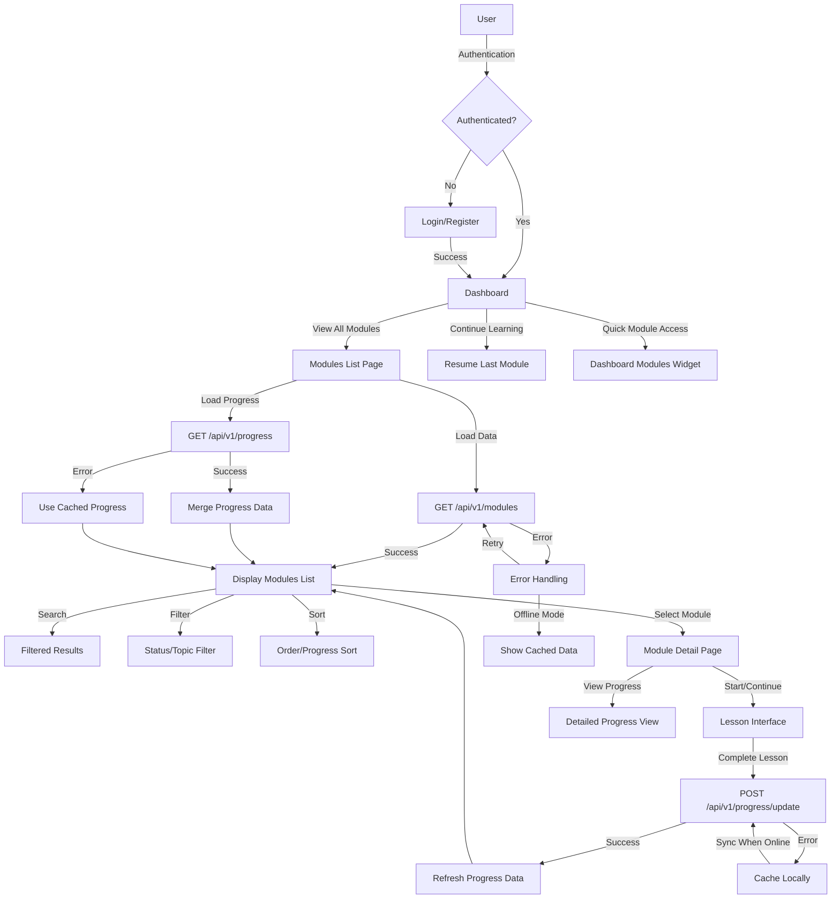

# Feature: Module Navigation & Listing

## Description
The module navigation system provides a comprehensive interface for users to browse, filter, and access all available grammar learning modules. It includes visual progress tracking, intuitive navigation patterns, search capabilities, and responsive design optimized for all devices. The system integrates real-time progress data, user preferences, and adaptive learning recommendations to create a personalized learning experience.

## Actors/Roles
- **Student**: Primary user browsing and accessing modules for learning
- **Teacher**: Secondary user monitoring student progress and assigning modules (future implementation)
- **Admin**: Content manager creating, updating, and organizing modules
- **System**: Backend services providing data and progress analytics

## User Stories / Use Cases

### Core Module Browsing
- As a user, I want to see all available modules in a visually organized list so I can understand the learning path
- As a user, I want to see my progress percentage for each module so I can track my advancement
- As a user, I want to see module status (Not Started, In Progress, Completed) with clear visual indicators
- As a user, I want to see the number of lessons completed vs. total lessons in each module
- As a user, I want to access module details including description, difficulty level, and estimated completion time

### Progress & Status Tracking
- As a user, I want to see my overall completion percentage across all modules
- As a user, I want to see recently accessed modules prominently displayed
- As a user, I want to see which modules are recommended for my current skill level
- As a user, I want to see prerequisite relationships between modules
- As a user, I want to continue from where I left off in any module with a single click

### Navigation & Discovery
- As a user, I want to search for specific modules by title or topic
- As a user, I want to filter modules by completion status, difficulty, or topic
- As a user, I want to sort modules by order, progress, or last accessed date
- As a user, I want to preview module content before starting
- As a user, I want to bookmark favorite modules for quick access

### Learning Path Management
- As a user, I want to see my personalized learning path with recommended next modules
- As a user, I want to see estimated time to complete each module based on my learning pace
- As a user, I want to set learning goals and track progress toward them
- As a user, I want to receive notifications about modules ready for review

### Accessibility & Responsive Design
- As a user, I want the module list to work seamlessly on mobile, tablet, and desktop devices
- As a user with accessibility needs, I want full keyboard navigation and screen reader support
- As a user, I want high contrast mode and scalable text for better visibility
- As a user, I want consistent touch targets that are easy to tap on mobile devices

### Integration Features
- As a user, I want to share my progress with teachers or study partners
- As a user, I want to sync my progress across all my devices
- As a user, I want to export my learning history and certificates
- As a user, I want to receive intelligent recommendations based on my learning patterns

## Flow Diagram


## UI Entry Points
- **Primary Navigation**: Bottom navigation bar "Modules" tab with grammar icon
- **Dashboard Widget**: "Grammar Modules" section with "View All →" link
- **Quick Actions**: "Continue Learning" button navigating to last accessed module
- **Search**: Global search including module titles and descriptions
- **Deep Links**: Direct URLs for module access (`/modules`, `/modules/{id}`)
- **Breadcrumb Navigation**: Course → Modules → Specific Module pathway

## API Endpoints Used

### Core Module Data
- **GET** `/api/v1/modules/`
  - **Headers**: `Authorization: Bearer <token>`
  - **Query Parameters**: 
    - `skip`: Number (pagination offset, default: 0)
    - `limit`: Number (page size, default: 100)
    - `search`: String (search modules by title)
    - `status`: Enum (filter by user progress status)
  - **Response**: 
    ```json
    {
      "data": [
        {
          "id": "uuid",
          "title": "Nouns & Verbs",
          "order": 1,
          "lesson_count": 8,
          "created_at": "2024-01-01T00:00:00Z"
        }
      ],
      "total": 6,
      "skip": 0,
      "limit": 100
    }
    ```
  - **Error Codes**: 401 (Unauthorized), 500 (Server Error)

- **GET** `/api/v1/modules/{module_id}`
  - **Headers**: `Authorization: Bearer <token>`
  - **Path Parameters**: `module_id` (UUID)
  - **Response**:
    ```json
    {
      "id": "uuid",
      "title": "Nouns & Verbs", 
      "order": 1,
      "lesson_count": 8,
      "lessons": [
        {
          "id": "uuid",
          "title": "Action Verbs",
          "order": 1,
          "content": "markdown content",
          "exercises": [...]
        }
      ],
      "created_at": "2024-01-01T00:00:00Z"
    }
    ```
  - **Error Codes**: 401 (Unauthorized), 404 (Module Not Found), 422 (Invalid UUID)

### Progress Integration
- **GET** `/api/v1/progress/`
  - **Headers**: `Authorization: Bearer <token>`
  - **Query Parameters**:
    - `module_id`: UUID (filter by specific module)
    - `status`: Enum (NOT_STARTED, IN_PROGRESS, COMPLETED)
  - **Response**:
    ```json
    {
      "data": [
        {
          "id": "uuid",
          "user_id": "uuid",
          "module_id": "uuid",
          "lesson_id": "uuid",
          "status": "IN_PROGRESS",
          "completed_exercises": 5,
          "total_exercises": 10,
          "created_at": "2024-01-01T00:00:00Z",
          "updated_at": "2024-01-01T12:00:00Z"
        }
      ]
    }
    ```

- **GET** `/api/v1/progress/summary`
  - **Headers**: `Authorization: Bearer <token>`
  - **Response**:
    ```json
    {
      "overall_progress": 0.34,
      "modules_completed": 2,
      "total_modules": 6,
      "modules_progress": [
        {
          "module_id": "uuid",
          "total_lessons": 8,
          "completed_lessons": 5,
          "progress_percentage": 62.5,
          "status": "IN_PROGRESS",
          "last_accessed": "2024-01-01T12:00:00Z"
        }
      ],
      "learning_streak": 7,
      "total_time_spent": 1800
    }
    ```

### Content Management (Admin)
- **POST** `/api/v1/modules/` (Admin only)
- **PUT** `/api/v1/modules/{module_id}` (Admin only)
- **DELETE** `/api/v1/modules/{module_id}` (Admin only)

## Technical Specifications

### Data Structures
```typescript
interface Module {
  id: string;
  title: string;
  order: number;
  lesson_count: number;
  created_at: string;
}

interface ModuleProgressDetail {
  module_id: string;
  total_lessons: number;
  completed_lessons: number;
  progress_percentage: number;
  status: 'not_started' | 'in_progress' | 'completed';
  last_accessed?: string;
  estimated_completion_time?: number;
}

interface ModuleWithProgress extends Module {
  progress: ModuleProgressDetail;
}

interface ModulesListState {
  modules: Module[];
  moduleProgress: ModuleProgressDetail[];
  searchQuery: string;
  statusFilter: 'all' | 'not_started' | 'in_progress' | 'completed';
  sortBy: 'order' | 'title' | 'progress' | 'last_accessed';
  sortDirection: 'asc' | 'desc';
  isLoading: boolean;
  error: string | null;
}
```

### Component Architecture
```
ModulesPage/
├── ModulesListContainer.tsx     # Data fetching and state management
├── ModulesListHeader.tsx        # Search, filters, and controls
├── ModulesList.tsx              # Main list rendering
├── ModuleCard.tsx               # Individual module display
├── ModuleProgress.tsx           # Progress visualization
├── ModuleFilters.tsx            # Filter and sort controls
├── ModuleSearch.tsx             # Search functionality
├── LoadingStates.tsx            # Skeleton loading states
└── ErrorBoundary.tsx            # Error handling component
```

### State Management
- **Context**: ModulesContext for global module data and user progress
- **Local State**: Component-level state for UI interactions (search, filters)
- **Cache**: React Query for API data caching and synchronization
- **Persistence**: LocalStorage for user preferences (filters, sort order)

### Performance Optimizations
- **Virtualization**: React Window for large module lists (100+ modules)
- **Memoization**: React.memo for ModuleCard components
- **Lazy Loading**: Intersection Observer for below-the-fold content
- **Image Optimization**: Lazy loading for module thumbnails and icons
- **Debounced Search**: 300ms delay for search input to reduce API calls

## UI/UX Specifications

### Responsive Design Breakpoints
```css
/* Mobile First Approach */
mobile: 320px - 767px    /* Single column, thumb navigation */
tablet: 768px - 1023px   /* Two column grid, touch-friendly */
desktop: 1024px+         /* Multi-column, hover states */

/* Specific Module List Layouts */
mobile: 1 module per row, full width cards
tablet: 2 modules per row, grid layout
desktop: 3-4 modules per row, list or grid view toggle
```

### Visual Design System

#### Color Palette
```css
/* Module Status Colors */
--module-not-started: #6B7280    /* Gray */
--module-in-progress: #3B82F6    /* Blue */
--module-completed: #10B981      /* Green */
--module-mastered: #8B5CF6       /* Purple */

/* Interactive Elements */
--primary-action: #2563EB        /* Blue-600 */
--hover-state: #1D4ED8           /* Blue-700 */
--focus-outline: #93C5FD         /* Blue-300 */

/* Background & Text */
--bg-primary: #FFFFFF            /* Light mode */
--bg-secondary: #F9FAFB          /* Light gray */
--text-primary: #111827          /* Dark gray */
--text-secondary: #6B7280        /* Medium gray */

/* Dark Mode */
--bg-primary-dark: #1F2937       /* Dark gray */
--bg-secondary-dark: #111827     /* Darker gray */
--text-primary-dark: #F9FAFB     /* Light gray */
--text-secondary-dark: #9CA3AF   /* Medium gray */
```

#### Typography Scale
```css
/* Module Titles */
h2: 1.5rem (24px), font-weight: 700, line-height: 1.2
h3: 1.25rem (20px), font-weight: 600, line-height: 1.3

/* Body Text */
body: 1rem (16px), font-weight: 400, line-height: 1.5
small: 0.875rem (14px), font-weight: 400, line-height: 1.4
caption: 0.75rem (12px), font-weight: 500, line-height: 1.3
```

#### Module Card Design
```css
/* Card Container */
.module-card {
  padding: 1rem (16px) mobile, 1.5rem (24px) desktop;
  border-radius: 0.5rem (8px);
  border: 1px solid var(--border-color);
  box-shadow: 0 1px 3px rgba(0, 0, 0, 0.1);
  transition: all 0.2s ease-in-out;
  min-height: 120px mobile, 140px desktop;
}

/* Hover States (Desktop) */
.module-card:hover {
  box-shadow: 0 4px 12px rgba(0, 0, 0, 0.15);
  border-color: var(--primary-action);
  transform: translateY(-2px);
}

/* Touch States (Mobile/Tablet) */
.module-card:active {
  transform: scale(0.98);
  box-shadow: 0 2px 8px rgba(0, 0, 0, 0.1);
}
```

### Interactive Elements

#### Module Status Indicators
```css
/* Status Badge Design */
.status-badge {
  padding: 0.25rem 0.75rem;
  border-radius: 9999px;
  font-size: 0.75rem;
  font-weight: 500;
  display: inline-flex;
  align-items: center;
  gap: 0.25rem;
}

/* Icon sizes within badges */
.status-icon {
  width: 0.75rem;
  height: 0.75rem;
}
```

#### Progress Visualization
```css
/* Progress Bar Container */
.progress-bar-container {
  width: 100%;
  height: 0.5rem (8px);
  background-color: var(--bg-secondary);
  border-radius: 0.25rem;
  overflow: hidden;
}

/* Progress Bar Fill */
.progress-bar-fill {
  height: 100%;
  border-radius: inherit;
  transition: width 0.3s ease-in-out;
  background: linear-gradient(90deg, var(--module-status-color) 0%, var(--module-status-color-light) 100%);
}

/* Progress Animation */
@keyframes progressUpdate {
  0% { transform: scaleX(0); }
  100% { transform: scaleX(1); }
}
```

### Accessibility Requirements

#### WCAG 2.1 AA Compliance
- **Contrast Ratios**: Minimum 4.5:1 for normal text, 3:1 for large text
- **Focus Indicators**: 2px solid outline with 4.5:1 contrast ratio
- **Touch Targets**: Minimum 44px x 44px for all interactive elements
- **Text Scaling**: Support up to 200% zoom without horizontal scrolling

#### Keyboard Navigation
```css
/* Focus Management */
.module-card:focus-visible {
  outline: 2px solid var(--focus-outline);
  outline-offset: 2px;
  border-color: var(--primary-action);
}

/* Skip Link for Screen Readers */
.skip-to-content {
  position: absolute;
  top: -40px;
  left: 6px;
  background: var(--bg-primary);
  color: var(--text-primary);
  padding: 8px;
  text-decoration: none;
  border-radius: 4px;
  z-index: 1000;
}

.skip-to-content:focus {
  top: 6px;
}
```

#### Screen Reader Support
```html
<!-- Semantic HTML Structure -->
<main role="main" aria-label="Grammar Modules">
  <section aria-labelledby="modules-heading">
    <h2 id="modules-heading">Available Grammar Modules</h2>
    
    <div role="search" aria-label="Module search">
      <input aria-label="Search modules by title" />
    </div>
    
    <div role="region" aria-label="Module filters">
      <fieldset aria-labelledby="filter-legend">
        <legend id="filter-legend">Filter modules</legend>
      </fieldset>
    </div>
    
    <ul role="list" aria-label="Modules list">
      <li role="listitem">
        <article aria-labelledby="module-title-1">
          <h3 id="module-title-1">Nouns & Verbs</h3>
          <div role="progressbar" 
               aria-valuenow="65" 
               aria-valuemin="0" 
               aria-valuemax="100"
               aria-label="Module progress: 65% complete">
          </div>
        </article>
      </li>
    </ul>
  </section>
</main>
```

#### Reduced Motion Support
```css
/* Respect user motion preferences */
@media (prefers-reduced-motion: reduce) {
  .module-card,
  .progress-bar-fill,
  .status-badge {
    transition: none;
    animation: none;
  }
  
  .module-card:hover {
    transform: none;
  }
}
```

### Mobile-Specific Enhancements

#### Touch Interactions
```css
/* Increased touch targets */
.mobile-touch-target {
  min-height: 44px;
  min-width: 44px;
  padding: 12px;
}

/* Swipe gestures for navigation */
.modules-container {
  overscroll-behavior-x: contain;
  scroll-snap-type: x mandatory;
}

.module-card {
  scroll-snap-align: start;
}
```

#### Mobile Navigation Patterns
- **Bottom Sheet**: Module filters slide up from bottom
- **Pull-to-Refresh**: Refresh module progress data
- **Infinite Scroll**: Load more modules on scroll (if paginated)
- **Swipe Actions**: Quick actions on module cards (bookmark, share)

### Error States & Empty States

#### Visual Error Handling
```css
/* Error State Container */
.error-state {
  text-align: center;
  padding: 3rem 1rem;
  background: var(--bg-secondary);
  border-radius: 0.5rem;
  border: 1px dashed var(--border-color);
}

/* Error Icon */
.error-icon {
  width: 3rem;
  height: 3rem;
  color: #EF4444; /* Red-500 */
  margin: 0 auto 1rem;
}

/* Retry Button */
.retry-button {
  background: var(--primary-action);
  color: white;
  padding: 0.75rem 1.5rem;
  border-radius: 0.375rem;
  border: none;
  font-weight: 500;
  cursor: pointer;
  transition: background-color 0.2s;
}
```

#### Loading States
```css
/* Skeleton Loading Animation */
@keyframes skeleton-loading {
  0% { background-position: -200px 0; }
  100% { background-position: calc(200px + 100%) 0; }
}

.skeleton {
  background: linear-gradient(90deg, #f0f0f0 25%, #e0e0e0 50%, #f0f0f0 75%);
  background-size: 200px 100%;
  animation: skeleton-loading 1.5s infinite;
  border-radius: 4px;
}

/* Module Card Skeleton */
.module-skeleton {
  height: 120px;
  margin-bottom: 1rem;
}
```

### Performance Considerations

#### Critical Rendering Path
- **Above-the-fold**: Load first 6 modules immediately
- **Lazy Loading**: Defer images and non-critical content
- **Code Splitting**: Separate module list components from other pages
- **Preloading**: Prefetch likely next modules based on user progress

#### Animation Performance
- **GPU Acceleration**: Use transform and opacity for animations
- **Will-change**: Apply sparingly to elements that will animate
- **RequestAnimationFrame**: For complex scroll-based animations
- **Intersection Observer**: Trigger animations when elements are visible

## Acceptance Criteria

### Core Module Display
- [ ] **Module List Loading**: User sees skeleton loading state while modules data loads (max 3 seconds)
- [ ] **Module Grid Layout**: Modules display in responsive grid (1 column mobile, 2 tablet, 3-4 desktop)
- [ ] **Module Information**: Each module shows title, progress percentage, status badge, lesson count
- [ ] **Visual Status Indicators**: Clear color-coded status (gray=not started, blue=in progress, green=completed)
- [ ] **Progress Bars**: Animated progress bars accurately reflect completion percentage
- [ ] **Module Ordering**: Modules display in correct pedagogical order (1, 2, 3, etc.)

### Progress Integration
- [ ] **Real-time Progress**: Progress updates immediately when lessons/exercises are completed
- [ ] **Progress Persistence**: Progress data persists across browser sessions and devices
- [ ] **Multiple Progress Types**: Shows both lesson completion and exercise completion progress
- [ ] **Status Calculation**: Module status automatically updates based on progress thresholds
- [ ] **Last Accessed Tracking**: Recently accessed modules show "last accessed" timestamps

### User Interaction
- [ ] **Module Navigation**: Clicking module navigates to module detail page
- [ ] **Hover Effects**: Desktop users see hover effects (elevation, border color change)
- [ ] **Touch Feedback**: Mobile users get immediate visual feedback on tap
- [ ] **Loading States**: Interactive elements show loading state during navigation
- [ ] **Error Handling**: Failed navigation shows error message with retry option

### Search & Filtering
- [ ] **Search Functionality**: Real-time search filters modules by title with 300ms debounce
- [ ] **Status Filtering**: Filter modules by completion status (all, not started, in progress, completed)
- [ ] **Sort Options**: Sort by order, title, progress percentage, or last accessed date
- [ ] **Filter Persistence**: Search and filter preferences persist across sessions
- [ ] **Clear Filters**: Easy way to reset all filters and return to default view

### Responsive Design
- [ ] **Mobile Layout**: Single column layout with thumb-friendly touch targets (44px minimum)
- [ ] **Tablet Layout**: Two column grid with optimized touch interactions
- [ ] **Desktop Layout**: Multi-column grid with hover states and mouse interactions
- [ ] **Orientation Changes**: Layout adapts smoothly to device orientation changes
- [ ] **Text Scaling**: Content remains readable and functional up to 200% text scaling

### Accessibility Compliance
- [ ] **Keyboard Navigation**: Full keyboard accessibility with logical tab order
- [ ] **Screen Reader Support**: All content accessible to screen readers with proper ARIA labels
- [ ] **Color Contrast**: All text meets WCAG 2.1 AA contrast requirements (4.5:1)
- [ ] **Focus Indicators**: Clear focus states visible on all interactive elements
- [ ] **Semantic HTML**: Proper heading hierarchy and semantic markup structure

### Performance Requirements
- [ ] **Initial Load Time**: Modules list loads and displays within 2 seconds on 3G connection
- [ ] **Smooth Animations**: All animations run at 60fps without frame drops
- [ ] **Memory Usage**: Component efficiently manages memory with proper cleanup
- [ ] **Image Loading**: Module icons/thumbnails load progressively without blocking UI
- [ ] **API Efficiency**: Minimal API calls with intelligent caching and data reuse

### Error States & Edge Cases
- [ ] **Network Errors**: Graceful handling of network connectivity issues
- [ ] **Empty States**: Helpful messaging when no modules are available
- [ ] **Partial Data**: Handles missing progress data or incomplete module information
- [ ] **Authentication Errors**: Proper redirect to login when session expires
- [ ] **Offline Support**: Basic functionality available when offline using cached data

## E2E Test Scenarios

### Authentication & Initial Load
1. **Successful Module List Load**
   - User logs in with valid credentials
   - Navigate to modules page
   - Modules list loads within 3 seconds
   - All modules display with correct information
   - Progress data matches user's actual completion status
   - **Expected Result**: Complete modules list with accurate progress data

2. **Authentication Required Access**
   - Unauthenticated user navigates to /modules
   - System redirects to login page
   - After successful login, user returns to modules page
   - Modules list loads with personalized progress data
   - **Expected Result**: Seamless authentication flow with progress data

3. **Cached Data Loading**
   - User with previous session data visits modules page
   - Cached module data displays immediately
   - Fresh data loads in background and updates display
   - No flash of empty content during load
   - **Expected Result**: Fast perceived loading with data consistency

### Module Interaction & Navigation
4. **Module Selection and Navigation**
   - User clicks on "Nouns & Verbs" module
   - Loading state appears immediately
   - Navigation to module detail page occurs within 1 second
   - Module detail page loads with lessons and exercises
   - Breadcrumb shows current location
   - **Expected Result**: Smooth navigation with proper loading feedback

5. **Progress-Based Module Access**
   - User clicks on completed module
   - Access granted immediately to all content
   - User clicks on locked/prerequisite module
   - System shows prerequisite requirements message
   - **Expected Result**: Appropriate access control based on progress

6. **Mobile Touch Interactions**
   - User on mobile device taps module card
   - Visual feedback appears immediately (card press state)
   - Navigation occurs within 500ms of tap
   - Touch targets are easily tappable (44px+)
   - **Expected Result**: Responsive mobile interaction

### Search & Filtering Functionality
7. **Real-time Search Testing**
   - User types "verbs" in search box
   - Results filter in real-time with 300ms debounce
   - Only modules containing "verbs" in title are shown
   - Clear search button appears and functions correctly
   - **Expected Result**: Fast, accurate search with good UX

8. **Status Filter Combinations**
   - User selects "In Progress" filter
   - Only in-progress modules display
   - User searches "noun" while filter is active
   - Results show only in-progress modules containing "noun"
   - User clears filters and all modules return
   - **Expected Result**: Filters work independently and in combination

9. **Sort Functionality Testing**
   - User sorts by "Progress" ascending
   - Modules reorder from lowest to highest progress
   - User sorts by "Last Accessed" descending
   - Most recently accessed modules appear first
   - Sort preference persists across page reloads
   - **Expected Result**: Accurate sorting with persistence

### Progress Tracking & Updates
10. **Real-time Progress Updates**
    - User has modules page open in browser tab
    - User completes lesson in different tab
    - Module progress updates automatically without page refresh
    - Progress bar animates to new value
    - Module status updates if threshold reached
    - **Expected Result**: Live progress updates across tabs

11. **Cross-device Progress Sync**
    - User completes module on mobile device
    - User opens modules page on desktop
    - Desktop shows updated progress immediately
    - All progress indicators reflect latest state
    - **Expected Result**: Consistent progress across devices

12. **Progress Persistence Testing**
    - User completes exercises in a module
    - User closes browser and reopens application
    - Progress data persists and displays correctly
    - No loss of completion data
    - **Expected Result**: Reliable progress persistence

### Error Handling & Edge Cases
13. **Network Connectivity Issues**
    - User loses internet connection
    - Modules page switches to offline mode
    - Cached module data remains accessible
    - User regains connection
    - Data syncs automatically and updates display
    - **Expected Result**: Graceful offline/online transitions

14. **API Error Recovery**
    - Mock API returns 500 error for modules endpoint
    - Error state displays with helpful message
    - Retry button appears and functions
    - User clicks retry and modules load successfully
    - **Expected Result**: User-friendly error handling with recovery

15. **Empty State Handling**
    - New user with no module progress
    - Empty state displays with encouraging message
    - Call-to-action button directs to first module
    - Getting started tutorial is accessible
    - **Expected Result**: Helpful onboarding for new users

### Accessibility Testing
16. **Keyboard Navigation Flow**
    - User navigates entire modules page using only keyboard
    - Tab order follows logical visual flow
    - All interactive elements receive focus
    - Enter/Space keys activate buttons correctly
    - Screen reader announces all content appropriately
    - **Expected Result**: Complete keyboard accessibility

17. **Screen Reader Compatibility**
    - Screen reader user navigates modules page
    - Module titles, progress, and status are announced clearly
    - Search and filter controls are properly labeled
    - Progress bars announce current values
    - Navigation landmarks work correctly
    - **Expected Result**: Full screen reader compatibility

18. **High Contrast Mode Testing**
    - User enables high contrast mode
    - All text remains readable with sufficient contrast
    - Focus indicators are clearly visible
    - Color-coding still conveys information
    - **Expected Result**: Functional high contrast support

### Performance & Load Testing
19. **Large Dataset Performance**
    - Test with 100+ modules in database
    - Modules page loads within performance targets
    - Scrolling remains smooth with large dataset
    - Search and filter operations stay responsive
    - Memory usage remains within acceptable limits
    - **Expected Result**: Scalable performance with large datasets

20. **Concurrent User Load**
    - Multiple users access modules simultaneously
    - Each user sees their own personalized progress
    - No data leakage between user sessions
    - Server response times remain acceptable
    - **Expected Result**: Proper multi-user isolation and performance

### Mobile & Cross-browser Testing
21. **Mobile Device Testing**
    - Test on iOS Safari, Android Chrome
    - Touch interactions work correctly
    - Layout adapts to different screen sizes
    - Text remains readable without horizontal scrolling
    - Performance acceptable on mobile networks
    - **Expected Result**: Consistent mobile experience

22. **Cross-browser Compatibility**
    - Test on Chrome, Firefox, Safari, Edge (latest versions)
    - All functionality works identically
    - Visual appearance consistent across browsers
    - No browser-specific bugs or issues
    - **Expected Result**: Universal browser compatibility

## Advanced Features

### Search & Discovery
#### Intelligent Search
- **Full-text Search**: Search across module titles, descriptions, and learning objectives
- **Search Suggestions**: Auto-complete suggestions based on module content and user behavior
- **Search History**: Recent searches saved locally for quick re-access
- **Search Analytics**: Track popular search terms to improve content discoverability

#### Content Discovery
- **Related Modules**: Show modules related to currently viewed content
- **Learning Path Recommendations**: AI-driven suggestions for next modules based on progress
- **Popular Modules**: Highlight most accessed modules by other learners
- **Recently Added**: Feature new modules and content updates

### Filtering & Sorting
#### Advanced Filter Options
```typescript
interface ModuleFilters {
  status: 'all' | 'not_started' | 'in_progress' | 'completed' | 'mastered';
  difficulty: 'beginner' | 'intermediate' | 'advanced';
  duration: 'short' | 'medium' | 'long'; // < 30min, 30-60min, > 60min
  topics: string[]; // Grammar topics/tags
  lastAccessed: 'today' | 'week' | 'month' | 'ever';
  completionRate: { min: number; max: number }; // 0-100%
}
```

#### Smart Sorting
- **Adaptive Sorting**: Default sort changes based on user behavior patterns
- **Multi-level Sorting**: Primary and secondary sort criteria
- **Custom Sort Orders**: User-defined module ordering for personalized learning paths
- **Recommendation Sorting**: AI-driven optimal learning sequence

### Progress Analytics & Insights
#### Personal Learning Analytics
```typescript
interface LearningAnalytics {
  learningVelocity: {
    avgTimePerModule: number; // minutes
    completionTrend: 'improving' | 'stable' | 'declining';
    sessionsPerWeek: number;
    optimalLearningTime: string; // "morning" | "afternoon" | "evening"
  };
  
  strengthsAndWeaknesses: {
    strongTopics: string[];
    improvementAreas: string[];
    masteredConcepts: number;
    strugglingConcepts: string[];
  };
  
  achievementProgress: {
    currentStreak: number;
    longestStreak: number;
    totalTimeSpent: number;
    modulesCompleted: number;
    accuracyTrend: number[]; // Last 10 sessions
  };
}
```

#### Visual Progress Representation
- **Heat Map Calendar**: GitHub-style activity calendar showing daily learning activity
- **Skills Radar Chart**: Visual representation of grammar skill mastery levels
- **Progress Timeline**: Chronological view of learning journey with milestones
- **Comparative Analytics**: Compare progress with anonymized peer data

### Personalization Features
#### Adaptive Learning Paths
- **Skill Assessment**: Initial assessment to determine starting point
- **Dynamic Prerequisites**: Modules unlock based on demonstrated mastery
- **Learning Style Adaptation**: Content presentation adapts to visual/auditory/kinesthetic preferences
- **Difficulty Adjustment**: Module complexity adjusts based on performance patterns

#### User Preferences
```typescript
interface UserPreferences {
  displaySettings: {
    theme: 'light' | 'dark' | 'auto';
    gridLayout: 'compact' | 'comfortable' | 'spacious';
    cardStyle: 'minimal' | 'detailed' | 'visual';
    animationsEnabled: boolean;
  };
  
  learningPreferences: {
    dailyGoal: number; // minutes per day
    reminderTime: string; // "09:00"
    preferredDifficulty: 'adaptive' | 'challenging' | 'comfortable';
    studySchedule: {
      monday: boolean;
      tuesday: boolean;
      // ... other days
    };
  };
  
  accessibilitySettings: {
    fontSize: 'small' | 'medium' | 'large' | 'extra-large';
    contrast: 'normal' | 'high';
    motionReduced: boolean;
    screenReaderOptimized: boolean;
  };
}
```

### Social & Collaborative Features
#### Study Groups & Sharing
- **Progress Sharing**: Share achievements and milestones with friends or study groups
- **Study Challenges**: Create or join learning challenges with peers
- **Module Recommendations**: Recommend modules to other learners
- **Discussion Forums**: Module-specific discussion areas for questions and tips

#### Teacher/Administrator Features
- **Class Management**: Teachers can create class groups and assign modules
- **Progress Monitoring**: Detailed analytics for individual students and class performance
- **Custom Learning Paths**: Create specialized module sequences for different learning objectives
- **Assessment Creation**: Build custom quizzes and assessments for modules

### Integration & Export
#### Data Export & Import
- **Progress Export**: Download learning history in CSV/JSON format
- **Certificate Generation**: Automated certificates for module completion
- **Portfolio Creation**: Generate learning portfolio with completed modules and achievements
- **LMS Integration**: Import/export data to Learning Management Systems

#### Third-party Integrations
- **Calendar Integration**: Add study sessions to Google Calendar/Outlook
- **Note-taking Apps**: Integration with Notion, Obsidian, or similar tools
- **Productivity Apps**: Connect with habit-tracking and goal-setting applications
- **Social Media**: Share achievements on LinkedIn, Twitter, etc.

### Advanced Interaction Patterns
#### Gesture & Voice Control
- **Swipe Navigation**: Swipe between modules on mobile devices
- **Voice Search**: Voice-activated module search and navigation
- **Gesture Shortcuts**: Custom gestures for power users
- **Voice Progress Updates**: Audio announcements of progress milestones

#### Smart Notifications
```typescript
interface NotificationSettings {
  studyReminders: {
    enabled: boolean;
    frequency: 'daily' | 'weekly' | 'custom';
    time: string;
    message: string;
  };
  
  progressUpdates: {
    milestoneNotifications: boolean;
    weeklyReports: boolean;
    achievementAlerts: boolean;
    streakReminders: boolean;
  };
  
  recommendationAlerts: {
    newModules: boolean;
    reviewReminders: boolean;
    challengeInvitations: boolean;
    communityUpdates: boolean;
  };
}
```

### Offline & Synchronization
#### Offline Capabilities
- **Offline Module Access**: Download modules for offline study
- **Progress Caching**: Local storage of progress data with background sync
- **Conflict Resolution**: Handle data conflicts when multiple devices are used
- **Sync Status Indicators**: Clear indication of sync status and conflicts

#### Performance Optimizations
- **Progressive Loading**: Load critical content first, non-essential content later
- **Image Optimization**: WebP format with fallbacks, lazy loading
- **Caching Strategy**: Intelligent caching of static content and user data
- **Background Sync**: Automatic synchronization when network becomes available

### Future Enhancements
#### AI-Powered Features
- **Learning Assistant**: AI chatbot for personalized learning guidance
- **Content Generation**: AI-generated practice exercises based on weak areas
- **Predictive Analytics**: Predict learning outcomes and suggest interventions
- **Natural Language Processing**: Enhanced search with semantic understanding

#### Gamification Elements
- **Achievement System**: Comprehensive badges and milestone rewards
- **Leaderboards**: Optional competitive elements with privacy controls
- **Learning Streaks**: Extended streak tracking with bonus rewards
- **Virtual Rewards**: Points, levels, and unlockable content

#### Advanced Analytics
- **Learning Pattern Analysis**: Deep insights into individual learning patterns
- **Predictive Modeling**: Forecast completion times and success probabilities
- **Comparative Analytics**: Anonymous benchmarking against similar learners
- **Intervention Triggers**: Automated alerts for learners who may need additional support

This comprehensive feature set transforms the basic module navigation into a sophisticated learning management and discovery system that adapts to individual user needs while maintaining simplicity and accessibility. 