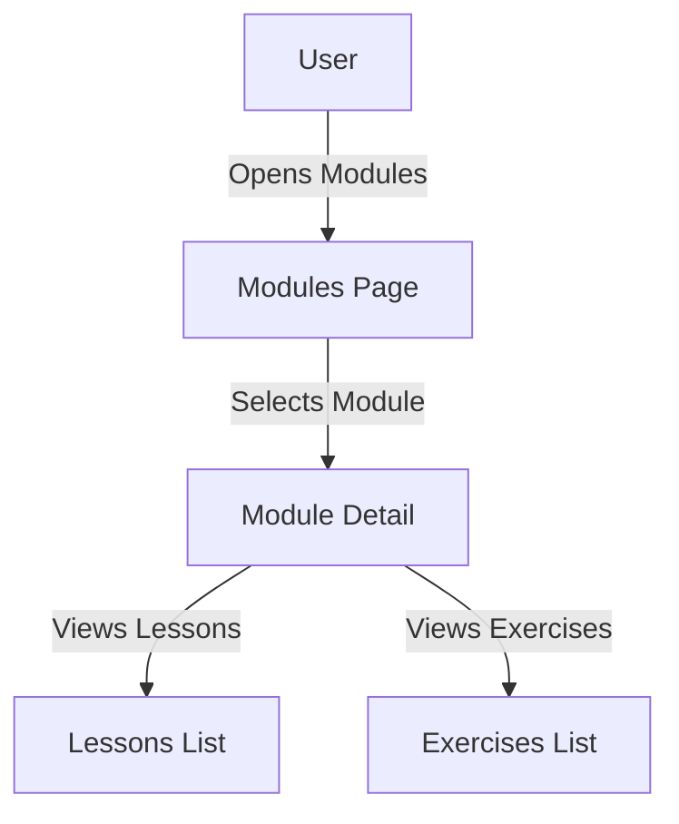

# Feature: Module Navigation

## Description
Allows users to browse and select modules, view lessons and exercises within each module, and track their progress.

## Actors/Roles
- Student

## User Stories / Use Cases
- As a user, I want to browse all available modules so I can choose what to study next.
- As a user, I want to see which modules are in progress or completed.
- As a user, I want to access lessons and exercises within a module.

## Flow Diagram

## UI Entry Points
- Modules tab in navigation bar
- Links from dashboard

## API Endpoints Used
- `GET /modules`
- `GET /modules/{module_id}`
- `GET /lessons/{lesson_id}`
- `GET /exercises/{exercise_id}`

## Acceptance Criteria
- [ ] User can see a list of all modules
- [ ] User can see progress/completion status for each module
- [ ] User can navigate to lessons and exercises within a module

## E2E Test Scenarios
1. User opens modules tab and sees all modules with status
2. User selects a module and views its lessons and exercises
3. User navigates back and forth between modules, lessons, and exercises 