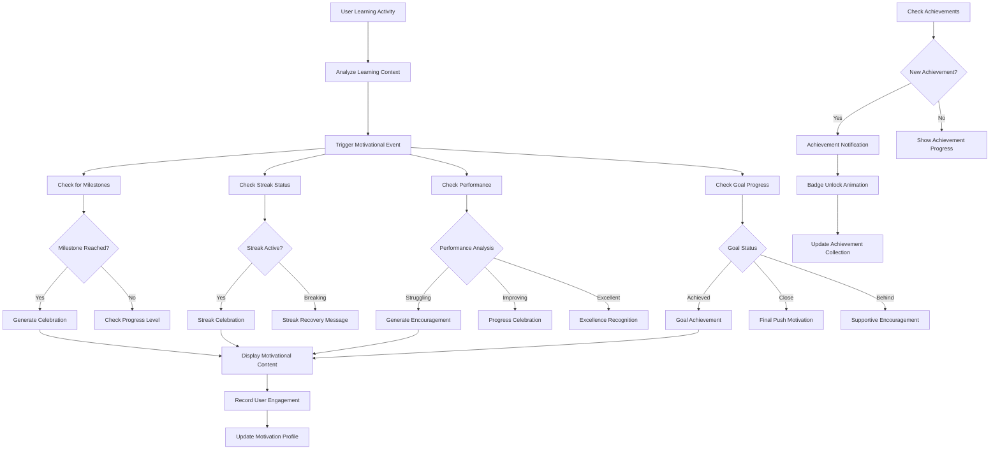

# Feature: Motivation & Gamification System

## Description
The Motivation & Gamification system enhances user engagement through encouraging messages, achievement celebrations, progress milestones, and reward mechanisms. It includes features like motivational quotes, progress encouragement, streak celebrations, achievement badges, and personalized motivational content that adapts to user behavior and learning patterns to maintain long-term engagement and motivation.

## Actors/Roles
- **Student**: Primary user receiving motivational content and earning achievements
- **Motivation Engine**: Backend system generating personalized motivational messages
- **Achievement System**: Service tracking and awarding user achievements
- **Analytics Engine**: System analyzing user behavior to trigger appropriate motivational content

## User Stories / Use Cases

### Motivational Messaging
- As a user, I want to see encouraging messages that celebrate my progress ("Good start! Keep going to master grammar concepts.")
- As a user, I want personalized motivational content based on my learning patterns and challenges
- As a user, I want uplifting messages when I'm struggling to maintain motivation during difficult topics
- As a user, I want celebratory messages when I achieve significant milestones or breakthroughs
- As a user, I want inspirational quotes about learning and growth displayed throughout the interface

### Progress Celebration
- As a user, I want visual celebrations when I complete modules, lessons, or challenging exercises
- As a user, I want acknowledgment of improvement in areas where I previously struggled
- As a user, I want milestone celebrations for reaching progress percentages (25%, 50%, 75%, 100%)
- As a user, I want recognition for consistency in learning (daily streaks, weekly goals)
- As a user, I want special celebrations for overcoming specific grammar challenges

### Achievement & Badge System
- As a user, I want to earn badges for completing modules, maintaining streaks, and achieving high accuracy
- As a user, I want rare achievements for exceptional performance or dedication
- As a user, I want to see my achievement collection and progress toward upcoming badges
- As a user, I want achievement notifications with celebration animations
- As a user, I want to share achievements with friends or study groups

### Streak & Consistency Motivation
- As a user, I want encouragement to maintain my learning streak with daily reminders
- As a user, I want escalating rewards for longer streaks (3 days, 7 days, 30 days, 100 days)
- As a user, I want motivational support when I break a streak to help me restart
- As a user, I want streak recovery assistance with gentle reminders to return to learning
- As a user, I want celebration of streak milestones with special animations and rewards

### Personalized Encouragement
- As a user, I want the system to recognize when I'm struggling and provide extra encouragement
- As a user, I want motivation that acknowledges my learning style and preferences
- As a user, I want encouragement that references my specific goals and progress
- As a user, I want adaptive motivational content that evolves with my learning journey
- As a user, I want the option to customize the type and frequency of motivational messages

### Goal-Based Motivation
- As a user, I want celebration when I reach daily, weekly, or monthly learning goals
- As a user, I want encouragement when I'm close to achieving a goal
- As a user, I want motivation to set and pursue challenging but achievable goals
- As a user, I want recognition for consistency in meeting my learning commitments
- As a user, I want adaptive goal suggestions based on my performance and capacity

## Flow Diagram


## UI Entry Points
- **Dashboard Motivational Messages**: Prominent encouragement messages on main dashboard
- **Progress Celebration Overlays**: Full-screen celebrations for major milestones
- **Achievement Notifications**: Toast notifications and modal celebrations for badges
- **Streak Indicators**: Daily streak flame with motivational messaging
- **AI Guru Integration**: Motivational support within the AI assistant interface

## API Endpoints Used

### Motivational Content
- **GET** `/api/v1/motivation/message`
  - **Headers**: `Authorization: Bearer <token>`
  - **Query Parameters**:
    - `context`: String ("dashboard", "struggle", "celebration", "goal")
    - `user_state`: String ("progressing", "struggling", "achieving")
  - **Response**:
    ```json
    {
      "message": "Good start! Keep going to master grammar concepts.",
      "message_type": "encouragement",
      "context": "dashboard",
      "personalization_factors": ["recent_progress", "learning_streak"],
      "display_duration": 5000,
      "animation": "fade_in_bounce"
    }
    ```

### Achievement System
- **GET** `/api/v1/users/achievements`
  - **Headers**: `Authorization: Bearer <token>`
  - **Response**:
    ```json
    {
      "earned_achievements": [
        {
          "id": "first_lesson_complete",
          "title": "First Steps",
          "description": "Completed your first lesson",
          "badge_icon": "graduation-cap",
          "earned_at": "2024-01-01T10:00:00Z",
          "rarity": "common"
        }
      ],
      "available_achievements": [
        {
          "id": "week_streak",
          "title": "Week Warrior",
          "description": "Study for 7 consecutive days",
          "badge_icon": "fire",
          "progress": 0.57,
          "requirement": "7 day streak",
          "rarity": "uncommon"
        }
      ],
      "total_points": 150,
      "next_milestone": 250
    }
    ```

- **POST** `/api/v1/achievements/check`
  - **Headers**: `Authorization: Bearer <token>`
  - **Body**:
    ```json
    {
      "activity_type": "lesson_completed",
      "module_id": "uuid",
      "lesson_id": "uuid",
      "performance_data": {
        "accuracy": 0.95,
        "time_spent": 1200,
        "attempts": 1
      }
    }
    ```

### Milestone Tracking
- **GET** `/api/v1/users/milestones`
  - **Headers**: `Authorization: Bearer <token>`
  - **Response**:
    ```json
    {
      "upcoming_milestones": [
        {
          "type": "progress_milestone",
          "title": "Half Way There!",
          "description": "Reach 50% overall progress",
          "current_progress": 0.42,
          "target_progress": 0.50,
          "estimated_completion": "2024-01-15T00:00:00Z"
        }
      ],
      "recent_milestones": [
        {
          "type": "streak_milestone",
          "title": "Week Streak!",
          "achieved_at": "2024-01-01T09:00:00Z",
          "celebration_shown": true
        }
      ]
    }
    ```

## Technical Specifications

### Data Structures
```typescript
interface MotivationalMessage {
  message: string;
  message_type: 'encouragement' | 'celebration' | 'milestone' | 'achievement';
  context: 'dashboard' | 'lesson' | 'exercise' | 'streak' | 'goal';
  personalization_factors: string[];
  display_duration: number; // milliseconds
  animation: 'fade_in' | 'bounce' | 'confetti' | 'pulse';
  priority: 'low' | 'medium' | 'high' | 'urgent';
}

interface Achievement {
  id: string;
  title: string;
  description: string;
  badge_icon: string;
  rarity: 'common' | 'uncommon' | 'rare' | 'legendary';
  category: 'progress' | 'streak' | 'accuracy' | 'speed' | 'dedication';
  requirements: AchievementRequirement[];
  reward_points: number;
  earned_at?: string;
  progress?: number; // 0-1 for achievements in progress
}

interface AchievementRequirement {
  type: 'lessons_completed' | 'modules_completed' | 'streak_days' | 'accuracy_average';
  target_value: number;
  current_value: number;
  description: string;
}

interface Milestone {
  type: 'progress_milestone' | 'streak_milestone' | 'accuracy_milestone' | 'time_milestone';
  title: string;
  description: string;
  current_progress: number;
  target_progress: number;
  achieved_at?: string;
  celebration_shown: boolean;
}

interface UserMotivationProfile {
  preferred_message_types: string[];
  motivation_frequency: 'minimal' | 'normal' | 'frequent';
  celebration_preferences: string[];
  goal_orientation: 'achievement' | 'progress' | 'consistency';
  last_motivated: string;
  engagement_score: number; // 0-1
}
```

### Motivation Engine
```typescript
class MotivationEngine {
  static generateContextualMessage(
    userState: UserLearningState,
    context: string
  ): MotivationalMessage {
    const messagePool = this.getMessagePool(context, userState);
    const personalizedMessage = this.personalizeMessage(messagePool, userState);
    
    return {
      message: personalizedMessage.text,
      message_type: personalizedMessage.type,
      context: context,
      personalization_factors: personalizedMessage.factors,
      display_duration: this.calculateDisplayDuration(personalizedMessage),
      animation: this.selectAnimation(personalizedMessage.type),
      priority: this.calculatePriority(userState, context)
    };
  }
  
  static checkForAchievements(
    activity: UserActivity,
    userProgress: UserProgress
  ): Achievement[] {
    const newAchievements: Achievement[] = [];
    
    // Check various achievement conditions
    if (this.checkStreakAchievement(userProgress.current_streak)) {
      newAchievements.push(this.createStreakAchievement(userProgress.current_streak));
    }
    
    if (this.checkAccuracyAchievement(activity.accuracy, userProgress.overall_accuracy)) {
      newAchievements.push(this.createAccuracyAchievement(activity.accuracy));
    }
    
    return newAchievements;
  }
  
  static shouldShowMotivation(
    userProfile: UserMotivationProfile,
    lastShown: Date
  ): boolean {
    const hoursSinceLastMotivation = (Date.now() - lastShown.getTime()) / (1000 * 60 * 60);
    const frequencyThreshold = this.getFrequencyThreshold(userProfile.motivation_frequency);
    
    return hoursSinceLastMotivation >= frequencyThreshold;
  }
}
```

### Achievement Categories
```typescript
const ACHIEVEMENT_DEFINITIONS = {
  // Progress Achievements
  first_lesson: {
    title: "First Steps",
    description: "Completed your first lesson",
    icon: "play-circle",
    rarity: "common"
  },
  module_complete: {
    title: "Module Master",
    description: "Completed an entire module",
    icon: "check-circle",
    rarity: "uncommon"
  },
  halfway_hero: {
    title: "Halfway Hero",
    description: "Reached 50% overall progress",
    icon: "trending-up",
    rarity: "uncommon"
  },
  
  // Streak Achievements
  three_day_streak: {
    title: "Getting Started",
    description: "Studied for 3 consecutive days",
    icon: "flame",
    rarity: "common"
  },
  week_warrior: {
    title: "Week Warrior",
    description: "Studied for 7 consecutive days",
    icon: "fire",
    rarity: "uncommon"
  },
  month_master: {
    title: "Month Master",
    description: "Studied for 30 consecutive days",
    icon: "trophy",
    rarity: "rare"
  },
  
  // Accuracy Achievements
  perfect_lesson: {
    title: "Perfect Performance",
    description: "Completed a lesson with 100% accuracy",
    icon: "star",
    rarity: "uncommon"
  },
  accuracy_ace: {
    title: "Accuracy Ace",
    description: "Maintained 90%+ accuracy for 10 lessons",
    icon: "target",
    rarity: "rare"
  },
  
  // Special Achievements
  night_owl: {
    title: "Night Owl",
    description: "Studied after 10 PM for 5 consecutive days",
    icon: "moon",
    rarity: "rare"
  },
  early_bird: {
    title: "Early Bird",
    description: "Studied before 7 AM for 5 consecutive days",
    icon: "sun",
    rarity: "rare"
  }
};
```

## UI/UX Specifications

### Motivational Message Design
```css
/* Motivational Message Container */
.motivation-message {
  background: linear-gradient(135deg, #667eea 0%, #764ba2 100%);
  color: white;
  padding: 1rem 1.5rem;
  border-radius: 0.75rem;
  margin-bottom: 1.5rem;
  position: relative;
  overflow: hidden;
}

.motivation-message::before {
  content: '';
  position: absolute;
  top: 0;
  left: -100%;
  width: 100%;
  height: 100%;
  background: linear-gradient(90deg, transparent, rgba(255,255,255,0.2), transparent);
  animation: motivational-shine 3s infinite;
}

@keyframes motivational-shine {
  0% { left: -100%; }
  50% { left: 100%; }
  100% { left: 100%; }
}

.motivation-text {
  font-size: 1.125rem;
  font-weight: 500;
  line-height: 1.4;
  position: relative;
  z-index: 1;
}

.motivation-icon {
  display: inline-block;
  margin-right: 0.5rem;
  font-size: 1.25rem;
}

/* Message Type Variants */
.motivation-message--celebration {
  background: linear-gradient(135deg, #f093fb 0%, #f5576c 100%);
  animation: celebration-pulse 2s ease-in-out infinite;
}

.motivation-message--encouragement {
  background: linear-gradient(135deg, #4facfe 0%, #00f2fe 100%);
}

.motivation-message--milestone {
  background: linear-gradient(135deg, #43e97b 0%, #38f9d7 100%);
  animation: milestone-glow 2s ease-in-out infinite;
}

@keyframes celebration-pulse {
  0%, 100% { transform: scale(1); }
  50% { transform: scale(1.02); }
}

@keyframes milestone-glow {
  0%, 100% { box-shadow: 0 0 20px rgba(67, 233, 123, 0.3); }
  50% { box-shadow: 0 0 30px rgba(67, 233, 123, 0.6); }
}
```

### Achievement Badge Design
```css
/* Achievement Notification */
.achievement-notification {
  position: fixed;
  top: 2rem;
  right: 2rem;
  z-index: 1000;
  background: white;
  border-radius: 0.75rem;
  padding: 1.5rem;
  box-shadow: 0 20px 40px rgba(0, 0, 0, 0.15);
  border: 2px solid #f59e0b;
  animation: achievement-slide-in 0.5s ease-out;
}

@keyframes achievement-slide-in {
  0% {
    transform: translateX(100%);
    opacity: 0;
  }
  100% {
    transform: translateX(0);
    opacity: 1;
  }
}

.achievement-header {
  display: flex;
  align-items: center;
  gap: 0.75rem;
  margin-bottom: 0.5rem;
}

.achievement-badge {
  width: 3rem;
  height: 3rem;
  background: linear-gradient(135deg, #f59e0b, #d97706);
  border-radius: 50%;
  display: flex;
  align-items: center;
  justify-content: center;
  color: white;
  font-size: 1.5rem;
  animation: badge-sparkle 2s ease-in-out infinite;
}

@keyframes badge-sparkle {
  0%, 100% { transform: scale(1) rotate(0deg); }
  25% { transform: scale(1.1) rotate(5deg); }
  75% { transform: scale(1.05) rotate(-5deg); }
}

.achievement-title {
  font-size: 1.125rem;
  font-weight: 600;
  color: var(--text-primary);
}

.achievement-description {
  font-size: 0.875rem;
  color: var(--text-secondary);
  line-height: 1.4;
}

/* Badge Rarity Colors */
.achievement-badge--common { background: linear-gradient(135deg, #6b7280, #4b5563); }
.achievement-badge--uncommon { background: linear-gradient(135deg, #10b981, #059669); }
.achievement-badge--rare { background: linear-gradient(135deg, #3b82f6, #1d4ed8); }
.achievement-badge--legendary { background: linear-gradient(135deg, #8b5cf6, #7c3aed); }
```

### Celebration Animations
```css
/* Confetti Animation */
.confetti-container {
  position: fixed;
  top: 0;
  left: 0;
  width: 100%;
  height: 100%;
  pointer-events: none;
  z-index: 9999;
}

.confetti {
  position: absolute;
  width: 10px;
  height: 10px;
  background: #f59e0b;
  animation: confetti-fall 3s linear infinite;
}

.confetti:nth-child(2n) { background: #3b82f6; animation-delay: 0.5s; }
.confetti:nth-child(3n) { background: #10b981; animation-delay: 1s; }
.confetti:nth-child(4n) { background: #8b5cf6; animation-delay: 1.5s; }

@keyframes confetti-fall {
  0% {
    transform: translateY(-100vh) rotate(0deg);
    opacity: 1;
  }
  100% {
    transform: translateY(100vh) rotate(720deg);
    opacity: 0;
  }
}

/* Milestone Celebration Overlay */
.milestone-celebration {
  position: fixed;
  top: 0;
  left: 0;
  width: 100%;
  height: 100%;
  background: rgba(0, 0, 0, 0.8);
  display: flex;
  align-items: center;
  justify-content: center;
  z-index: 10000;
  animation: celebration-fade-in 0.5s ease-out;
}

.milestone-content {
  background: white;
  border-radius: 1rem;
  padding: 3rem 2rem;
  text-align: center;
  max-width: 400px;
  animation: milestone-bounce-in 0.6s ease-out;
}

@keyframes celebration-fade-in {
  0% { opacity: 0; }
  100% { opacity: 1; }
}

@keyframes milestone-bounce-in {
  0% {
    transform: scale(0.3);
    opacity: 0;
  }
  50% {
    transform: scale(1.05);
  }
  70% {
    transform: scale(0.9);
  }
  100% {
    transform: scale(1);
    opacity: 1;
  }
}
```

### Responsive Design
```css
/* Mobile Adaptations */
@media (max-width: 640px) {
  .achievement-notification {
    top: 1rem;
    right: 1rem;
    left: 1rem;
    padding: 1rem;
  }
  
  .motivation-message {
    margin-bottom: 1rem;
    padding: 0.75rem 1rem;
  }
  
  .motivation-text {
    font-size: 1rem;
  }
  
  .milestone-content {
    margin: 1rem;
    padding: 2rem 1.5rem;
  }
}

/* Reduced Motion */
@media (prefers-reduced-motion: reduce) {
  .motivation-message::before,
  .achievement-badge,
  .confetti {
    animation: none;
  }
  
  .motivation-message--celebration {
    animation: none;
  }
  
  .milestone-celebration .milestone-content {
    animation: none;
    transform: none;
  }
}
```

## Acceptance Criteria

### Motivational Messaging
- [ ] **Contextual Messages**: Displays appropriate motivational messages based on user context
- [ ] **Message Variety**: Rotates through different encouraging messages to avoid repetition
- [ ] **Personalization**: Adapts messages based on user progress and learning patterns
- [ ] **Timing**: Shows motivational content at appropriate intervals without overwhelming
- [ ] **Dismissal**: Users can dismiss messages that appear too frequently

### Achievement System
- [ ] **Badge Unlocking**: Awards achievements when requirements are met
- [ ] **Progress Tracking**: Shows progress toward upcoming achievements
- [ ] **Notification Display**: Celebrates achievement unlocks with animations
- [ ] **Collection View**: Displays earned achievements in user profile
- [ ] **Rarity System**: Differentiates achievement value through rarity indicators

### Milestone Celebrations
- [ ] **Progress Milestones**: Celebrates 25%, 50%, 75%, and 100% completion
- [ ] **Streak Milestones**: Recognizes 3, 7, 14, 30, and 100-day streaks
- [ ] **Goal Achievements**: Celebrates when daily/weekly goals are met
- [ ] **Animation Quality**: Smooth, engaging celebration animations
- [ ] **Celebration Control**: Users can skip or disable celebration animations

### Personalization & Adaptation
- [ ] **Learning Style Recognition**: Adapts motivational approach to user preferences
- [ ] **Struggle Detection**: Provides extra encouragement during difficult periods
- [ ] **Success Amplification**: Celebrates improvements and breakthroughs appropriately
- [ ] **Frequency Control**: Respects user preferences for motivation frequency
- [ ] **Context Awareness**: Shows relevant motivation based on current activity

### Performance & Accessibility
- [ ] **Smooth Animations**: All motivational animations run at 60fps
- [ ] **Screen Reader Support**: Achievement notifications accessible to assistive technologies
- [ ] **Keyboard Navigation**: All interactive motivational elements keyboard accessible
- [ ] **Motion Preferences**: Respects reduced motion preferences
- [ ] **Battery Efficiency**: Animations don't significantly impact device battery life

### User Control & Customization
- [ ] **Notification Settings**: Users can customize achievement notification preferences
- [ ] **Message Frequency**: Adjustable frequency for motivational messages
- [ ] **Celebration Preferences**: Options to enable/disable specific celebration types
- [ ] **Achievement Visibility**: Users can choose which achievements to display publicly
- [ ] **Motivation Reset**: Option to reset motivation preferences if needed

## E2E Test Scenarios

### Achievement Unlocking Flow
1. **First Achievement Unlock**
   - New user completes their first lesson
   - "First Steps" achievement unlocks automatically
   - Achievement notification appears with celebration animation
   - Badge appears in user's achievement collection
   - **Expected Result**: Smooth achievement unlock with proper celebration

2. **Streak Achievement Progression**
   - User studies for 3 consecutive days
   - "Getting Started" streak achievement unlocks
   - User continues to 7 days
   - "Week Warrior" achievement unlocks with enhanced celebration
   - **Expected Result**: Progressive achievement unlocking with escalating celebrations

### Motivational Message Adaptation
3. **Struggle Support Messaging**
   - User struggles with exercise accuracy (below 60%)
   - System detects difficulty pattern
   - Encouraging messages appear more frequently
   - Messages specifically address overcoming challenges
   - **Expected Result**: Adaptive motivational support during difficulties

4. **Success Celebration Messaging**
   - User improves accuracy from 60% to 85%
   - System recognizes improvement pattern
   - Celebratory messages acknowledge progress
   - Messages encourage continued excellence
   - **Expected Result**: Appropriate celebration of user improvements

### Milestone Celebration System
5. **Progress Milestone Celebration**
   - User reaches 50% overall course completion
   - "Halfway Hero" milestone celebration triggers
   - Full-screen celebration overlay appears
   - Confetti animation plays
   - Achievement badge unlocks
   - **Expected Result**: Engaging milestone celebration with multiple visual elements

6. **Goal Achievement Celebration**
   - User sets goal of 30 minutes daily study
   - User achieves goal for first time
   - Goal achievement celebration appears
   - Motivational message encourages consistency
   - **Expected Result**: Appropriate goal achievement recognition

### Personalization & Adaptation
7. **Motivation Frequency Adaptation**
   - User indicates preference for minimal motivational messages
   - System reduces message frequency
   - Only major milestones trigger celebrations
   - User experience respects preferences
   - **Expected Result**: Personalized motivation frequency based on user preferences

8. **Learning Pattern Recognition**
   - User consistently studies in evening hours
   - System recognizes pattern
   - Evening study achievements become available
   - "Night Owl" achievement unlocks after pattern confirmation
   - **Expected Result**: Dynamic achievement system that adapts to user behavior

### Cross-device Synchronization
9. **Achievement Sync Across Devices**
   - User unlocks achievement on mobile device
   - User opens application on desktop
   - Achievement appears in desktop collection
   - Notification history syncs properly
   - **Expected Result**: Seamless achievement synchronization across devices

### Accessibility & Performance
10. **Screen Reader Achievement Announcements**
    - Screen reader user unlocks achievement
    - Achievement notification is properly announced
    - Badge description and significance are communicated
    - Navigation to achievement collection works properly
    - **Expected Result**: Full accessibility for achievement system

11. **Reduced Motion Preferences**
    - User enables reduced motion preference
    - Achievement celebrations appear without animations
    - Motivational messages display statically
    - All content remains accessible and functional
    - **Expected Result**: Respectful handling of motion reduction preferences

This comprehensive motivation and gamification system enhances user engagement while maintaining respect for individual preferences and accessibility requirements.