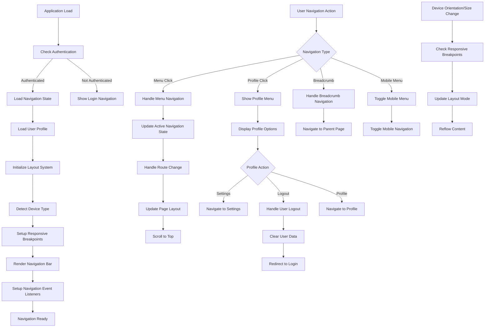

# Feature: Navigation & Layout System

## Description
The Navigation & Layout system provides the structural framework for the application, including the top navigation bar, user profile management, responsive layout behaviors, and consistent navigation patterns. It ensures intuitive navigation between features, maintains user context, and adapts seamlessly across different device sizes and orientations.

## Actors/Roles
- **Student**: Primary user navigating through the application interface
- **System**: Navigation state management and routing services
- **Layout Engine**: Responsive design system managing layout adaptations
- **Authentication Service**: User session and profile management

## User Stories / Use Cases

### Top Navigation Bar
- As a user, I want a persistent navigation bar that remains accessible from all pages
- As a user, I want clear visual indicators showing my current location in the app
- As a user, I want easy access to main sections (Dashboard, Modules, Profile) from anywhere
- As a user, I want the navigation to be responsive and work well on mobile devices
- As a user, I want the navigation to include my profile information and settings access

### User Profile Management
- As a user, I want to see my name and profile information in the navigation
- As a user, I want quick access to account settings and preferences
- As a user, I want a clear logout option that's easily accessible but not accidentally triggered
- As a user, I want to see my current learning streak or progress indicator in the navigation
- As a user, I want profile dropdown menu with organized options

### Responsive Layout Behavior
- As a user on mobile, I want navigation that adapts to small screens without losing functionality
- As a user on tablet, I want an optimized layout that takes advantage of the larger screen
- As a user on desktop, I want a spacious layout that efficiently uses screen real estate
- As a user, I want smooth transitions when rotating my device or resizing the browser
- As a user, I want consistent navigation patterns across all device sizes

### Layout Consistency
- As a user, I want consistent spacing, typography, and visual hierarchy across all pages
- As a user, I want predictable layout patterns that help me navigate efficiently
- As a user, I want the layout to maintain accessibility standards across all screen sizes
- As a user, I want loading states and transitions that maintain layout stability
- As a user, I want the layout to work properly with browser zoom up to 200%

### Navigation State Management
- As a user, I want the navigation to remember my current section and highlight it appropriately
- As a user, I want breadcrumb navigation for deeper pages within modules or lessons
- As a user, I want back/forward navigation that works intuitively
- As a user, I want deep linking that allows sharing specific pages with others
- As a user, I want navigation that preserves my context when switching between sections

### Accessibility & Keyboard Navigation
- As a user with disabilities, I want full keyboard navigation support throughout the interface
- As a screen reader user, I want proper navigation landmarks and skip links
- As a user, I want clear focus indicators for all interactive navigation elements
- As a user, I want navigation that works with voice control and assistive technologies
- As a user, I want consistent and logical tab order throughout the navigation

## Flow Diagram


## UI Entry Points
- **Top Navigation Bar**: Primary navigation accessible from all authenticated pages
- **Mobile Menu Button**: Hamburger menu for mobile navigation access
- **Profile Dropdown**: User profile and account management access
- **Breadcrumb Navigation**: Hierarchical navigation within modules and lessons
- **Quick Access Menu**: Shortcuts to frequently used features

## API Endpoints Used

### User Profile for Navigation
- **GET** `/api/v1/users/profile`
  - **Headers**: `Authorization: Bearer <token>`
  - **Response**:
    ```json
    {
      "id": "uuid",
      "name": "Husam",
      "email": "user@example.com",
      "avatar_url": "https://example.com/avatar.jpg",
      "current_streak": 7,
      "total_progress": 0.42,
      "last_login": "2024-01-01T14:30:00Z",
      "preferences": {
        "theme": "dark",
        "notifications": true
      }
    }
    ```

### Navigation State
- **GET** `/api/v1/users/navigation-state`
  - **Headers**: `Authorization: Bearer <token>`
  - **Response**:
    ```json
    {
      "current_module": "uuid",
      "current_lesson": "uuid",
      "breadcrumb_path": [
        { "title": "Dashboard", "url": "/" },
        { "title": "Nouns & Verbs", "url": "/modules/uuid" },
        { "title": "Action Verbs", "url": "/lessons/uuid" }
      ],
      "recent_pages": [
        { "title": "Dashboard", "url": "/", "visited_at": "2024-01-01T14:00:00Z" },
        { "title": "Modules", "url": "/modules", "visited_at": "2024-01-01T13:30:00Z" }
      ]
    }
    ```

### Logout
- **POST** `/api/v1/auth/logout`
  - **Headers**: `Authorization: Bearer <token>`
  - **Response**:
    ```json
    {
      "success": true,
      "message": "Successfully logged out"
    }
    ```

## Technical Specifications

### Layout Data Structures
```typescript
interface NavigationState {
  currentPage: string;
  activeSection: 'dashboard' | 'modules' | 'settings' | 'profile';
  breadcrumbs: BreadcrumbItem[];
  mobileMenuOpen: boolean;
  profileMenuOpen: boolean;
  isAuthenticated: boolean;
  userProfile?: UserProfile;
}

interface BreadcrumbItem {
  title: string;
  url: string;
  isActive: boolean;
}

interface UserProfile {
  id: string;
  name: string;
  email: string;
  avatar_url?: string;
  current_streak: number;
  total_progress: number;
  preferences: UserPreferences;
}

interface LayoutBreakpoints {
  mobile: number; // 0-640px
  tablet: number; // 641-1024px
  desktop: number; // 1025px+
}

interface ResponsiveLayout {
  currentBreakpoint: 'mobile' | 'tablet' | 'desktop';
  isMobile: boolean;
  isTablet: boolean;
  isDesktop: boolean;
  orientation: 'portrait' | 'landscape';
  screenWidth: number;
  screenHeight: number;
}
```

### Navigation Component Architecture
```typescript
const NavigationBar: React.FC = () => {
  const { user, logout } = useAuth();
  const { pathname } = useLocation();
  const [mobileMenuOpen, setMobileMenuOpen] = useState(false);
  const [profileMenuOpen, setProfileMenuOpen] = useState(false);
  const { isDesktop, isMobile } = useResponsive();
  
  const navigationItems = [
    { title: 'Dashboard', path: '/', icon: 'home' },
    { title: 'Modules', path: '/modules', icon: 'book' },
    { title: 'Progress', path: '/progress', icon: 'chart' },
    { title: 'Settings', path: '/settings', icon: 'cog' }
  ];
  
  return (
    <nav className="navigation-bar">
      <div className="nav-container">
        <div className="nav-brand">
          <Link to="/">Grammar Anatomy Interactive</Link>
        </div>
        
        {isDesktop ? (
          <DesktopNavigation 
            items={navigationItems} 
            currentPath={pathname} 
          />
        ) : (
          <MobileNavigation 
            items={navigationItems}
            isOpen={mobileMenuOpen}
            onToggle={setMobileMenuOpen}
          />
        )}
        
        <UserProfileSection 
          user={user}
          isOpen={profileMenuOpen}
          onToggle={setProfileMenuOpen}
          onLogout={logout}
        />
      </div>
    </nav>
  );
};

const ResponsiveLayout: React.FC<{ children: React.ReactNode }> = ({ children }) => {
  const { currentBreakpoint, isMobile } = useResponsive();
  
  return (
    <div className={`app-layout app-layout--${currentBreakpoint}`}>
      <NavigationBar />
      <main className="main-content">
        {children}
      </main>
      {isMobile && <MobileBottomNavigation />}
    </div>
  );
};
```

### Responsive Hook Implementation
```typescript
const useResponsive = () => {
  const [layout, setLayout] = useState<ResponsiveLayout>({
    currentBreakpoint: 'desktop',
    isMobile: false,
    isTablet: false,
    isDesktop: true,
    orientation: 'landscape',
    screenWidth: window.innerWidth,
    screenHeight: window.innerHeight
  });
  
  useEffect(() => {
    const updateLayout = () => {
      const width = window.innerWidth;
      const height = window.innerHeight;
      
      let currentBreakpoint: 'mobile' | 'tablet' | 'desktop';
      if (width <= 640) {
        currentBreakpoint = 'mobile';
      } else if (width <= 1024) {
        currentBreakpoint = 'tablet';
      } else {
        currentBreakpoint = 'desktop';
      }
      
      setLayout({
        currentBreakpoint,
        isMobile: currentBreakpoint === 'mobile',
        isTablet: currentBreakpoint === 'tablet',
        isDesktop: currentBreakpoint === 'desktop',
        orientation: width > height ? 'landscape' : 'portrait',
        screenWidth: width,
        screenHeight: height
      });
    };
    
    updateLayout();
    window.addEventListener('resize', updateLayout);
    window.addEventListener('orientationchange', updateLayout);
    
    return () => {
      window.removeEventListener('resize', updateLayout);
      window.removeEventListener('orientationchange', updateLayout);
    };
  }, []);
  
  return layout;
};
```

## UI/UX Specifications

### Navigation Bar Styling
```css
/* Navigation Bar Container */
.navigation-bar {
  position: sticky;
  top: 0;
  z-index: 100;
  background: var(--bg-primary);
  border-bottom: 1px solid var(--border-primary);
  backdrop-filter: blur(8px);
  -webkit-backdrop-filter: blur(8px);
}

.nav-container {
  max-width: 1200px;
  margin: 0 auto;
  padding: 0 1rem;
  display: flex;
  align-items: center;
  justify-content: space-between;
  height: 4rem;
}

/* Brand/Logo */
.nav-brand {
  font-size: 1.25rem;
  font-weight: 700;
  color: var(--text-primary);
}

.nav-brand a {
  text-decoration: none;
  color: inherit;
  transition: color 0.2s ease;
}

.nav-brand a:hover {
  color: var(--primary);
}

/* Desktop Navigation */
.desktop-navigation {
  display: flex;
  gap: 2rem;
  list-style: none;
  margin: 0;
  padding: 0;
}

.nav-item {
  position: relative;
}

.nav-link {
  display: flex;
  align-items: center;
  gap: 0.5rem;
  padding: 0.5rem 1rem;
  color: var(--text-secondary);
  text-decoration: none;
  border-radius: 0.375rem;
  transition: all 0.2s ease;
  font-weight: 500;
}

.nav-link:hover {
  color: var(--text-primary);
  background: var(--bg-secondary);
}

.nav-link--active {
  color: var(--primary);
  background: var(--primary-light);
}

.nav-link--active::after {
  content: '';
  position: absolute;
  bottom: -1rem;
  left: 50%;
  transform: translateX(-50%);
  width: 4px;
  height: 4px;
  background: var(--primary);
  border-radius: 50%;
}
```

### Mobile Navigation Styling
```css
/* Mobile Menu Button */
.mobile-menu-button {
  display: none;
  background: none;
  border: none;
  font-size: 1.5rem;
  color: var(--text-primary);
  cursor: pointer;
  padding: 0.5rem;
}

/* Mobile Navigation Overlay */
.mobile-navigation {
  position: fixed;
  top: 4rem;
  left: 0;
  right: 0;
  bottom: 0;
  background: var(--bg-primary);
  transform: translateX(-100%);
  transition: transform 0.3s cubic-bezier(0.4, 0, 0.2, 1);
  z-index: 99;
  overflow-y: auto;
}

.mobile-navigation--open {
  transform: translateX(0);
}

.mobile-nav-list {
  padding: 2rem 1rem;
  list-style: none;
  margin: 0;
}

.mobile-nav-item {
  margin-bottom: 0.5rem;
}

.mobile-nav-link {
  display: flex;
  align-items: center;
  gap: 1rem;
  padding: 1rem;
  color: var(--text-primary);
  text-decoration: none;
  border-radius: 0.5rem;
  font-size: 1.125rem;
  font-weight: 500;
  transition: background-color 0.2s ease;
}

.mobile-nav-link:hover,
.mobile-nav-link--active {
  background: var(--bg-secondary);
  color: var(--primary);
}

/* Mobile Backdrop */
.mobile-nav-backdrop {
  position: fixed;
  top: 4rem;
  left: 0;
  right: 0;
  bottom: 0;
  background: rgba(0, 0, 0, 0.5);
  opacity: 0;
  visibility: hidden;
  transition: all 0.3s ease;
  z-index: 98;
}

.mobile-nav-backdrop--visible {
  opacity: 1;
  visibility: visible;
}
```

### User Profile Section
```css
/* User Profile Container */
.user-profile-section {
  position: relative;
  display: flex;
  align-items: center;
  gap: 1rem;
}

.user-welcome {
  display: none;
  color: var(--text-secondary);
  font-size: 0.875rem;
}

.user-profile-button {
  display: flex;
  align-items: center;
  gap: 0.75rem;
  padding: 0.5rem;
  background: none;
  border: none;
  border-radius: 0.5rem;
  cursor: pointer;
  transition: background-color 0.2s ease;
}

.user-profile-button:hover {
  background: var(--bg-secondary);
}

.user-avatar {
  width: 2rem;
  height: 2rem;
  border-radius: 50%;
  background: var(--primary);
  color: white;
  display: flex;
  align-items: center;
  justify-content: center;
  font-weight: 600;
  font-size: 0.875rem;
}

.user-name {
  font-weight: 500;
  color: var(--text-primary);
}

/* Profile Dropdown */
.profile-dropdown {
  position: absolute;
  top: 100%;
  right: 0;
  margin-top: 0.5rem;
  background: var(--bg-primary);
  border: 1px solid var(--border-primary);
  border-radius: 0.5rem;
  box-shadow: 0 10px 30px rgba(0, 0, 0, 0.1);
  min-width: 200px;
  opacity: 0;
  visibility: hidden;
  transform: translateY(-10px);
  transition: all 0.2s cubic-bezier(0.4, 0, 0.2, 1);
  z-index: 101;
}

.profile-dropdown--open {
  opacity: 1;
  visibility: visible;
  transform: translateY(0);
}

.profile-dropdown-header {
  padding: 1rem;
  border-bottom: 1px solid var(--border-primary);
}

.profile-dropdown-name {
  font-weight: 600;
  color: var(--text-primary);
  margin-bottom: 0.25rem;
}

.profile-dropdown-email {
  font-size: 0.875rem;
  color: var(--text-secondary);
}

.profile-dropdown-menu {
  padding: 0.5rem 0;
}

.profile-dropdown-item {
  display: flex;
  align-items: center;
  gap: 0.75rem;
  width: 100%;
  padding: 0.75rem 1rem;
  background: none;
  border: none;
  text-align: left;
  color: var(--text-primary);
  text-decoration: none;
  transition: background-color 0.2s ease;
  cursor: pointer;
}

.profile-dropdown-item:hover {
  background: var(--bg-secondary);
}

.profile-dropdown-item--logout {
  color: var(--error);
  border-top: 1px solid var(--border-primary);
  margin-top: 0.5rem;
}
```

### Responsive Layout Breakpoints
```css
/* Desktop Layout (1025px+) */
@media (min-width: 1025px) {
  .nav-container {
    padding: 0 2rem;
  }
  
  .user-welcome {
    display: block;
  }
  
  .desktop-navigation {
    display: flex;
  }
  
  .mobile-menu-button {
    display: none;
  }
}

/* Tablet Layout (641px-1024px) */
@media (min-width: 641px) and (max-width: 1024px) {
  .nav-container {
    padding: 0 1.5rem;
  }
  
  .desktop-navigation {
    gap: 1.5rem;
  }
  
  .nav-link {
    padding: 0.5rem 0.75rem;
  }
}

/* Mobile Layout (0-640px) */
@media (max-width: 640px) {
  .nav-container {
    padding: 0 1rem;
    height: 3.5rem;
  }
  
  .nav-brand {
    font-size: 1.125rem;
  }
  
  .desktop-navigation {
    display: none;
  }
  
  .mobile-menu-button {
    display: block;
  }
  
  .user-profile-button {
    padding: 0.25rem;
  }
  
  .user-name {
    display: none;
  }
  
  .user-avatar {
    width: 1.75rem;
    height: 1.75rem;
  }
}
```

### Accessibility Features
```css
/* Skip Link for Screen Readers */
.skip-link {
  position: absolute;
  top: -40px;
  left: 6px;
  background: var(--primary);
  color: white;
  padding: 8px;
  text-decoration: none;
  border-radius: 4px;
  z-index: 1000;
  font-weight: 500;
}

.skip-link:focus {
  top: 6px;
}

/* Focus Indicators */
.nav-link:focus,
.mobile-nav-link:focus,
.user-profile-button:focus,
.profile-dropdown-item:focus {
  outline: 2px solid var(--primary);
  outline-offset: 2px;
}

/* High Contrast Mode Support */
@media (prefers-contrast: high) {
  .navigation-bar {
    border-bottom: 2px solid var(--text-primary);
  }
  
  .nav-link--active::after {
    width: 6px;
    height: 6px;
  }
}

/* Reduced Motion Support */
@media (prefers-reduced-motion: reduce) {
  .nav-link,
  .mobile-navigation,
  .profile-dropdown {
    transition: none;
  }
}
```

## Acceptance Criteria

### Navigation Functionality
- [ ] **Persistent Navigation**: Navigation bar remains accessible from all authenticated pages
- [ ] **Active State Indication**: Current page/section clearly highlighted in navigation
- [ ] **Smooth Transitions**: Navigation changes animate smoothly without jarring effects
- [ ] **Breadcrumb Support**: Hierarchical navigation shows user's current location
- [ ] **Deep Linking**: All navigation states support direct URL access

### Responsive Design
- [ ] **Mobile Adaptation**: Navigation transforms appropriately for mobile devices
- [ ] **Tablet Optimization**: Layout adapts efficiently for tablet screen sizes
- [ ] **Desktop Layout**: Takes full advantage of desktop screen real estate
- [ ] **Orientation Changes**: Handles device rotation smoothly
- [ ] **Zoom Support**: Functions properly up to 200% browser zoom

### User Profile Integration
- [ ] **Profile Display**: User name and avatar visible in navigation
- [ ] **Profile Menu**: Dropdown menu provides access to account options
- [ ] **Logout Functionality**: Secure logout with session cleanup
- [ ] **Settings Access**: Easy navigation to user preferences
- [ ] **Status Indicators**: Shows relevant user status (streak, progress)

### Performance & Accessibility
- [ ] **Fast Navigation**: Page transitions complete within 300ms
- [ ] **Keyboard Support**: Full keyboard navigation with logical tab order
- [ ] **Screen Reader Support**: Proper landmarks and ARIA labels
- [ ] **Focus Management**: Clear focus indicators on all interactive elements
- [ ] **Color Contrast**: Navigation meets WCAG 2.1 AA contrast requirements

### Mobile Experience
- [ ] **Touch Targets**: Minimum 44px touch targets for all interactive elements
- [ ] **Mobile Menu**: Hamburger menu provides full navigation access
- [ ] **Gesture Support**: Appropriate swipe gestures for mobile navigation
- [ ] **Performance**: Smooth scrolling and interaction on mobile devices
- [ ] **Thumb Reach**: Important navigation elements within thumb reach zones

### Error Handling & Edge Cases
- [ ] **Network Issues**: Navigation works with cached data when offline
- [ ] **Authentication Errors**: Proper handling of expired sessions
- [ ] **Route Errors**: Graceful handling of invalid URLs
- [ ] **Profile Load Errors**: Fallback display when profile data unavailable
- [ ] **Memory Management**: Navigation doesn't cause memory leaks

## E2E Test Scenarios

### Basic Navigation Flow
1. **Desktop Navigation Usage**
   - User clicks "Modules" in top navigation
   - Active state updates to highlight "Modules"
   - Page navigates to modules list
   - URL updates to reflect current page
   - Breadcrumb shows correct navigation path
   - **Expected Result**: Smooth navigation with proper state updates

2. **Mobile Navigation Experience**
   - User on mobile device opens hamburger menu
   - Mobile navigation overlay slides in smoothly
   - User taps "Dashboard" option
   - Menu closes and navigates to dashboard
   - Mobile navigation state resets appropriately
   - **Expected Result**: Intuitive mobile navigation experience

### User Profile Management
3. **Profile Menu Interaction**
   - User clicks on profile avatar in navigation
   - Profile dropdown opens with user information
   - User can see name, email, and account options
   - Clicking "Settings" navigates to settings page
   - Profile menu closes after navigation
   - **Expected Result**: Functional profile management interface

4. **Logout Process**
   - User opens profile dropdown
   - User clicks "Logout" option
   - Confirmation dialog appears (if implemented)
   - User confirms logout
   - Session clears and redirects to login page
   - **Expected Result**: Secure logout with proper session cleanup

### Responsive Behavior
5. **Device Rotation Handling**
   - User rotates device from portrait to landscape
   - Navigation layout adapts to new orientation
   - All navigation elements remain accessible
   - No layout breaks or overlapping elements
   - **Expected Result**: Smooth adaptation to orientation changes

6. **Browser Resize Behavior**
   - User resizes browser window across breakpoints
   - Navigation smoothly transitions between desktop and mobile layouts
   - No navigation functionality is lost during transitions
   - Active states and user context preserved
   - **Expected Result**: Responsive navigation without functionality loss

### Accessibility Testing
7. **Keyboard Navigation**
   - User navigates entire navigation using only keyboard
   - Tab order follows logical visual flow
   - All interactive elements receive proper focus
   - Enter and Space keys activate navigation items
   - **Expected Result**: Complete keyboard accessibility

8. **Screen Reader Compatibility**
   - Screen reader user navigates through interface
   - Navigation landmarks are properly announced
   - Current page location is communicated clearly
   - Interactive elements have appropriate labels
   - **Expected Result**: Full screen reader accessibility

### Performance & Error Handling
9. **Network Connectivity Issues**
   - User loses internet connection
   - Navigation continues to function with cached data
   - User regains connection
   - Navigation syncs any pending state changes
   - **Expected Result**: Resilient navigation during connectivity issues

10. **Large Data Set Performance**
    - User with extensive navigation history
    - Navigation loads and performs within targets
    - No memory leaks during extended use
    - Smooth performance with complex navigation state
    - **Expected Result**: Scalable navigation performance

This comprehensive navigation and layout system provides users with intuitive, accessible, and responsive navigation while maintaining high performance across all device types and usage scenarios.