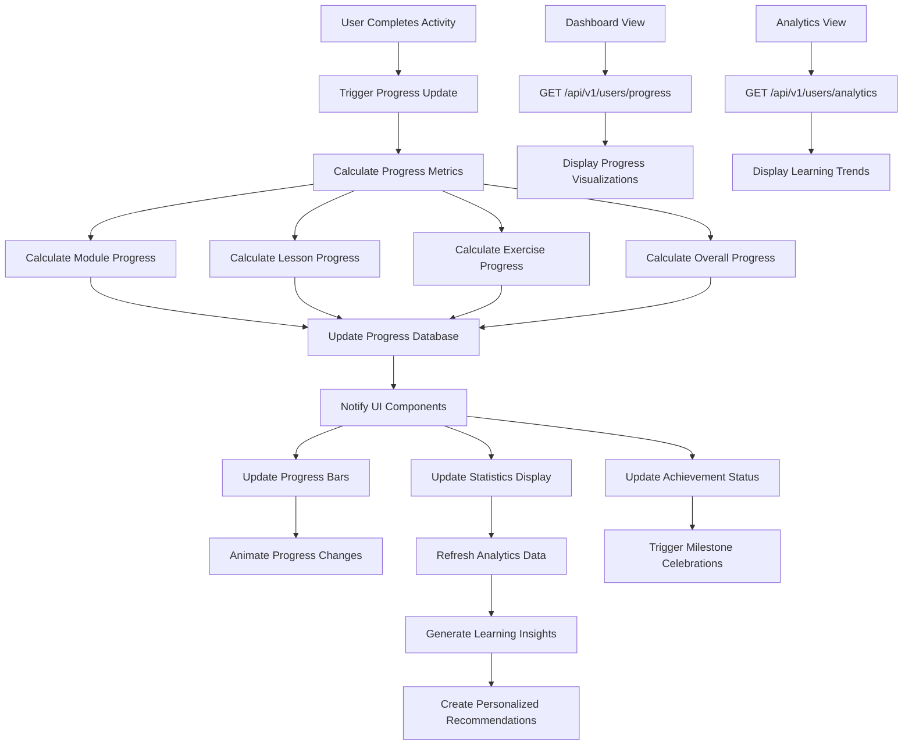

# Feature: Progress Analytics & Visualization

## Description
The Progress Analytics system provides comprehensive tracking and visualization of user learning progress across modules, lessons, and exercises. It calculates completion percentages, tracks learning velocity, maintains achievement records, and presents progress data through intuitive visual components including progress bars, statistical summaries, and trend analysis.

## Actors/Roles
- **Student**: Primary user viewing their personal progress analytics
- **System**: Backend services calculating and storing progress metrics
- **Analytics Engine**: Processes learning data to generate insights and trends
- **Teacher**: Secondary user monitoring student progress (future implementation)

## User Stories / Use Cases

### Core Progress Tracking
- As a user, I want to see my overall course completion percentage prominently displayed
- As a user, I want to view detailed progress for each module with visual progress bars
- As a user, I want to see lesson completion counts (8/20 lessons completed)
- As a user, I want to track exercise completion across all learning activities
- As a user, I want real-time progress updates when I complete learning activities

### Progress Visualization
- As a user, I want animated progress bars that smoothly update when I make progress
- As a user, I want color-coded progress indicators (gray=not started, blue=in progress, green=completed)
- As a user, I want to see progress percentages calculated accurately in real-time
- As a user, I want visual distinction between different types of completion (lessons vs exercises)
- As a user, I want progress charts that show my learning journey over time

### Analytics & Insights
- As a user, I want to see my learning velocity and study patterns
- As a user, I want to track my improvement over time with trend analysis
- As a user, I want to identify my strongest and weakest grammar topics
- As a user, I want to see estimated completion times for remaining content
- As a user, I want comparative analytics showing my progress relative to typical learners

### Progress History
- As a user, I want to see my learning activity history and milestones
- As a user, I want to track streaks and consistency in my learning habits
- As a user, I want to see detailed timestamps of when I completed specific lessons
- As a user, I want to review my performance trends across different time periods
- As a user, I want to export my learning progress data for personal records

### Goal Tracking
- As a user, I want to set learning goals and track progress toward them
- As a user, I want to see projected completion dates based on my current pace
- As a user, I want notifications when I reach significant progress milestones
- As a user, I want to adjust my goals based on my actual learning velocity
- As a user, I want to celebrate achievements when I meet my learning targets

## Flow Diagram


## UI Entry Points
- **Dashboard Progress Section**: Main progress visualization on dashboard
- **Module List**: Individual module progress indicators
- **Progress Overview Panel**: Detailed progress breakdown
- **Analytics Dashboard**: Comprehensive progress analytics and insights
- **Settings Page**: Progress preferences and goal management

## API Endpoints Used

### Core Progress Data
- **GET** `/api/v1/users/progress`
  - **Headers**: `Authorization: Bearer <token>`
  - **Query Parameters**:
    - `detailed`: Boolean (include lesson-level breakdown)
    - `module_id`: UUID (filter by specific module)
  - **Response**:
    ```json
    {
      "overall_progress": 0.40,
      "modules_completed": 2,
      "total_modules": 5,
      "lessons_completed": 8,
      "total_lessons": 20,
      "exercises_completed": 15,
      "total_exercises": 50,
      "last_activity": "2024-01-01T14:30:00Z",
      "modules": [
        {
          "module_id": "uuid",
          "title": "Nouns & Verbs",
          "progress_percentage": 100.0,
          "status": "completed",
          "lessons_completed": 4,
          "total_lessons": 4,
          "exercises_completed": 8,
          "total_exercises": 8,
          "completed_at": "2024-01-01T12:00:00Z"
        }
      ]
    }
    ```

### Progress Analytics
- **GET** `/api/v1/users/analytics`
  - **Headers**: `Authorization: Bearer <token>`
  - **Query Parameters**:
    - `period`: String ("day", "week", "month", "all")
    - `include_trends`: Boolean
  - **Response**:
    ```json
    {
      "learning_velocity": {
        "lessons_per_week": 2.5,
        "avg_session_duration": 25,
        "completion_trend": "improving",
        "projected_completion": "2024-03-15T00:00:00Z"
      },
      "performance_metrics": {
        "average_accuracy": 0.82,
        "improvement_rate": 0.15,
        "strongest_topics": ["nouns", "basic_verbs"],
        "weakest_topics": ["pronouns", "complex_sentences"]
      },
      "activity_patterns": {
        "most_active_time": "evening",
        "most_active_day": "tuesday",
        "current_streak": 5,
        "longest_streak": 12,
        "total_study_time": 1440
      }
    }
    ```

### Progress Updates
- **POST** `/api/v1/progress/update`
  - **Headers**: `Authorization: Bearer <token>`
  - **Body**:
    ```json
    {
      "module_id": "uuid",
      "lesson_id": "uuid",
      "exercise_id": "uuid",
      "completion_type": "lesson_completed",
      "performance_data": {
        "accuracy": 0.85,
        "time_spent": 1200,
        "attempts": 1
      }
    }
    ```

## Technical Specifications

### Data Structures
```typescript
interface ProgressData {
  overall_progress: number; // 0-1
  modules_completed: number;
  total_modules: number;
  lessons_completed: number;
  total_lessons: number;
  exercises_completed: number;
  total_exercises: number;
  last_activity: string; // ISO timestamp
  modules: ModuleProgress[];
}

interface ModuleProgress {
  module_id: string;
  title: string;
  progress_percentage: number; // 0-100
  status: 'not_started' | 'in_progress' | 'completed';
  lessons_completed: number;
  total_lessons: number;
  exercises_completed: number;
  total_exercises: number;
  completed_at?: string;
  last_accessed?: string;
}

interface LearningAnalytics {
  learning_velocity: {
    lessons_per_week: number;
    avg_session_duration: number; // minutes
    completion_trend: 'improving' | 'stable' | 'declining';
    projected_completion: string;
  };
  performance_metrics: {
    average_accuracy: number; // 0-1
    improvement_rate: number; // 0-1
    strongest_topics: string[];
    weakest_topics: string[];
  };
  activity_patterns: {
    most_active_time: string;
    most_active_day: string;
    current_streak: number;
    longest_streak: number;
    total_study_time: number; // minutes
  };
}
```

### Progress Calculation Logic
```typescript
// Progress calculation utilities
class ProgressCalculator {
  static calculateModuleProgress(
    completedLessons: number,
    totalLessons: number,
    completedExercises: number,
    totalExercises: number
  ): number {
    const lessonWeight = 0.6;
    const exerciseWeight = 0.4;
    
    const lessonProgress = totalLessons > 0 ? completedLessons / totalLessons : 0;
    const exerciseProgress = totalExercises > 0 ? completedExercises / totalExercises : 0;
    
    return (lessonProgress * lessonWeight) + (exerciseProgress * exerciseWeight);
  }
  
  static calculateOverallProgress(moduleProgresses: ModuleProgress[]): number {
    if (moduleProgresses.length === 0) return 0;
    
    const totalProgress = moduleProgresses.reduce(
      (sum, module) => sum + (module.progress_percentage / 100),
      0
    );
    
    return totalProgress / moduleProgresses.length;
  }
  
  static determineModuleStatus(progressPercentage: number): ModuleStatus {
    if (progressPercentage === 0) return 'not_started';
    if (progressPercentage < 100) return 'in_progress';
    return 'completed';
  }
}
```

### Component Architecture
```typescript
// Progress visualization components
const ProgressOverview: React.FC<{
  progress: ProgressData;
  analytics: LearningAnalytics;
}> = ({ progress, analytics }) => {
  return (
    <div className="progress-overview">
      <OverallProgressBar progress={progress.overall_progress} />
      <ProgressStatistics progress={progress} />
      <ModuleProgressList modules={progress.modules} />
      <LearningInsights analytics={analytics} />
    </div>
  );
};

const AnimatedProgressBar: React.FC<{
  progress: number; // 0-1
  color?: string;
  animated?: boolean;
}> = ({ progress, color = 'blue', animated = true }) => {
  const [displayProgress, setDisplayProgress] = useState(0);
  
  useEffect(() => {
    if (animated) {
      const timer = setTimeout(() => setDisplayProgress(progress), 100);
      return () => clearTimeout(timer);
    } else {
      setDisplayProgress(progress);
    }
  }, [progress, animated]);
  
  return (
    <div className="progress-bar-container">
      <div 
        className={`progress-bar progress-bar--${color}`}
        style={{ 
          width: `${displayProgress * 100}%`,
          transition: animated ? 'width 1s ease-out' : 'none'
        }}
      />
    </div>
  );
};
```

## UI/UX Specifications

### Progress Bar Design
```css
/* Progress Bar Container */
.progress-bar-container {
  width: 100%;
  height: 12px;
  background-color: var(--gray-200);
  border-radius: 6px;
  overflow: hidden;
  position: relative;
}

/* Progress Bar Fill */
.progress-bar {
  height: 100%;
  border-radius: 6px;
  position: relative;
  transition: width 1s cubic-bezier(0.4, 0, 0.2, 1);
}

/* Progress Bar Colors */
.progress-bar--blue {
  background: linear-gradient(90deg, #3B82F6, #1D4ED8);
}

.progress-bar--green {
  background: linear-gradient(90deg, #10B981, #059669);
}

.progress-bar--orange {
  background: linear-gradient(90deg, #F59E0B, #D97706);
}

/* Progress Bar Animation */
.progress-bar::after {
  content: '';
  position: absolute;
  top: 0;
  left: 0;
  right: 0;
  bottom: 0;
  background: linear-gradient(
    90deg,
    transparent,
    rgba(255, 255, 255, 0.3),
    transparent
  );
  animation: progress-shimmer 2s infinite;
}

@keyframes progress-shimmer {
  0% { transform: translateX(-100%); }
  100% { transform: translateX(100%); }
}

/* Small Progress Bars */
.progress-bar-container--small {
  height: 8px;
}

.progress-bar-container--small .progress-bar {
  border-radius: 4px;
}

/* Large Progress Bars */
.progress-bar-container--large {
  height: 16px;
}

.progress-bar-container--large .progress-bar {
  border-radius: 8px;
}
```

### Progress Statistics Layout
```css
/* Progress Statistics Grid */
.progress-statistics {
  display: grid;
  grid-template-columns: repeat(auto-fit, minmax(200px, 1fr));
  gap: 1.5rem;
  margin: 2rem 0;
}

/* Individual Statistic Card */
.progress-stat-card {
  background: var(--bg-secondary);
  border-radius: 0.5rem;
  padding: 1.5rem;
  border: 1px solid var(--border-color);
  text-align: center;
}

.progress-stat-icon {
  width: 3rem;
  height: 3rem;
  margin: 0 auto 1rem;
  border-radius: 50%;
  display: flex;
  align-items: center;
  justify-content: center;
}

.progress-stat-icon--modules { background: #3B82F6; color: white; }
.progress-stat-icon--lessons { background: #10B981; color: white; }
.progress-stat-icon--exercises { background: #8B5CF6; color: white; }

.progress-stat-value {
  font-size: 2rem;
  font-weight: 700;
  color: var(--text-primary);
  margin-bottom: 0.5rem;
}

.progress-stat-label {
  font-size: 0.875rem;
  color: var(--text-secondary);
  text-transform: uppercase;
  letter-spacing: 0.05em;
}
```

### Responsive Design
```css
/* Mobile Layout */
@media (max-width: 640px) {
  .progress-statistics {
    grid-template-columns: 1fr;
    gap: 1rem;
  }
  
  .progress-stat-card {
    padding: 1rem;
  }
  
  .progress-stat-value {
    font-size: 1.5rem;
  }
}

/* Tablet Layout */
@media (min-width: 641px) and (max-width: 1024px) {
  .progress-statistics {
    grid-template-columns: repeat(2, 1fr);
  }
}
```

### Accessibility Features
```css
/* High Contrast Mode */
@media (prefers-contrast: high) {
  .progress-bar-container {
    border: 2px solid var(--text-primary);
  }
  
  .progress-bar {
    background: var(--text-primary) !important;
  }
}

/* Reduced Motion */
@media (prefers-reduced-motion: reduce) {
  .progress-bar {
    transition: none;
  }
  
  .progress-bar::after {
    animation: none;
  }
}

/* Focus States */
.progress-focusable:focus {
  outline: 2px solid var(--focus-color);
  outline-offset: 2px;
}
```

## Acceptance Criteria

### Core Progress Display
- [ ] **Overall Progress**: Displays accurate overall completion percentage (0-100%)
- [ ] **Module Progress**: Shows individual module progress with visual progress bars
- [ ] **Lesson Tracking**: Displays lesson completion counts (e.g., "8/20 lessons")
- [ ] **Exercise Tracking**: Shows exercise completion statistics across all modules
- [ ] **Real-time Updates**: Progress updates immediately when activities are completed

### Visual Design
- [ ] **Animated Progress Bars**: Smooth animation when progress values change
- [ ] **Color Coding**: Consistent color scheme (gray=not started, blue=in progress, green=completed)
- [ ] **Responsive Layout**: Adapts appropriately to mobile, tablet, and desktop screens
- [ ] **Visual Hierarchy**: Clear information architecture with proper emphasis
- [ ] **Loading States**: Skeleton loading states while progress data loads

### Data Accuracy
- [ ] **Calculation Precision**: Progress percentages calculated accurately to 1 decimal place
- [ ] **Cross-device Sync**: Progress data consistent across all user devices
- [ ] **Real-time Sync**: Changes reflect across tabs/windows within 30 seconds
- [ ] **Data Persistence**: Progress data persists across browser sessions
- [ ] **Conflict Resolution**: Handles concurrent progress updates gracefully

### Performance
- [ ] **Load Time**: Progress data loads and displays within 2 seconds
- [ ] **Animation Performance**: Progress bar animations run smoothly at 60fps
- [ ] **Memory Efficiency**: Component efficiently manages memory without leaks
- [ ] **Update Efficiency**: Only re-renders components when progress actually changes
- [ ] **Caching**: Intelligent caching reduces unnecessary API calls

### Analytics Integration
- [ ] **Trend Analysis**: Displays learning velocity and improvement trends
- [ ] **Goal Tracking**: Shows progress toward user-defined learning goals
- [ ] **Milestone Recognition**: Celebrates significant progress achievements
- [ ] **Predictive Analytics**: Provides estimated completion dates
- [ ] **Comparative Data**: Shows progress relative to typical learning patterns

### Accessibility
- [ ] **Screen Reader Support**: All progress data accessible to assistive technologies
- [ ] **Keyboard Navigation**: Progress elements accessible via keyboard
- [ ] **Color Contrast**: All text meets WCAG 2.1 AA contrast requirements
- [ ] **Motion Preferences**: Respects user's reduced motion settings
- [ ] **Text Scaling**: Functions properly with up to 200% text scaling

## E2E Test Scenarios

### Progress Calculation & Display
1. **Initial Progress Display**
   - New user with no completed activities
   - Progress displays show 0% completion
   - All modules show "Not Started" status
   - Overall statistics show 0/X for all metrics
   - **Expected Result**: Clean zero state with accurate initial values

2. **Real-time Progress Updates**
   - User completes first lesson in a module
   - Progress immediately updates to reflect completion
   - Module progress bar animates to new percentage
   - Overall progress recalculates and displays new value
   - **Expected Result**: Immediate, smooth progress updates

### Cross-device Synchronization
3. **Multi-device Progress Sync**
   - User completes lesson on mobile device
   - User opens application on desktop computer
   - Desktop shows updated progress within 30 seconds
   - All progress indicators reflect latest state
   - **Expected Result**: Consistent progress across devices

### Performance & Reliability
4. **Large Dataset Performance**
   - User with extensive progress history (50+ completed activities)
   - Progress page loads within performance targets
   - All calculations complete accurately
   - UI remains responsive during data processing
   - **Expected Result**: Scalable performance with large datasets

### Analytics & Insights
5. **Learning Analytics Display**
   - User with varied learning patterns over time
   - Analytics show accurate velocity calculations
   - Trend analysis reflects actual learning patterns
   - Weak/strong topic identification is accurate
   - **Expected Result**: Meaningful insights based on learning data

### Error Handling
6. **Network Connectivity Issues**
   - User loses internet connection
   - Cached progress data remains visible
   - Clear indication of offline status
   - Data syncs when connection restored
   - **Expected Result**: Graceful offline handling with data recovery

This comprehensive progress analytics system provides users with detailed insights into their learning journey while maintaining high performance and accessibility standards.