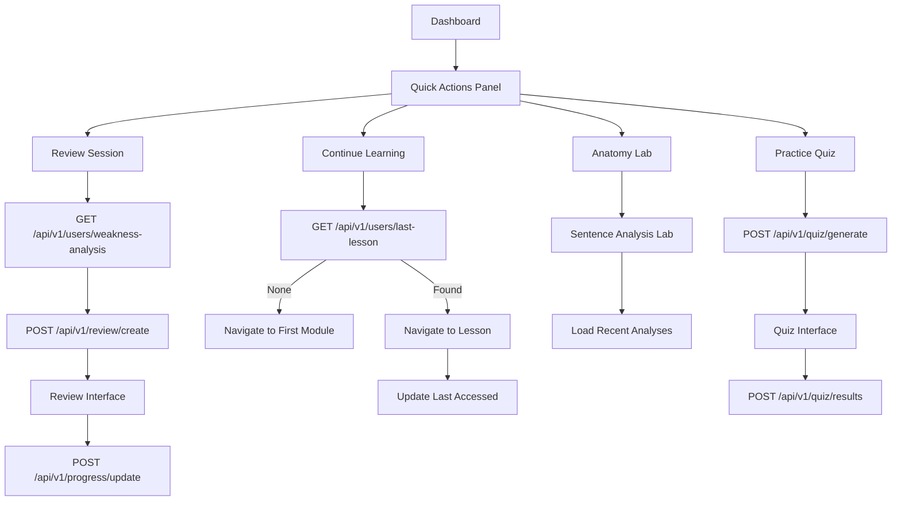

# Feature: Quick Actions Panel

## Description
The Quick Actions panel provides users with immediate access to key learning activities directly from the dashboard. It features four primary action buttons that enable users to continue their learning journey efficiently: Continue Learning, Practice Quiz, Anatomy Lab, and Review Session. The panel is designed for quick task initiation and seamless navigation to core learning experiences.

## Actors/Roles
- **Student**: Primary user utilizing quick actions for immediate learning access
- **System**: Backend services managing user progress and session data
- **Content Management**: Systems providing lesson, quiz, and exercise data

## User Stories / Use Cases

### Continue Learning Action
- As a user, I want to click "Continue Learning" and immediately resume my last incomplete lesson
- As a user, I want the system to remember exactly where I left off in a lesson or exercise
- As a user, I want to see visual feedback (loading state) while the system locates my last position
- As a user, I want to be redirected to the exact lesson/exercise page where I stopped
- As a user, I want context about what I'm continuing (module name, lesson title)

### Practice Quiz Action
- As a user, I want to start a practice quiz to test my knowledge across completed modules
- As a user, I want the quiz to be adaptive based on my current learning progress
- As a user, I want to see a variety of question types from different grammar topics
- As a user, I want immediate feedback on quiz answers with explanations
- As a user, I want quiz results to contribute to my overall progress tracking

### Anatomy Lab Action
- As a user, I want quick access to the sentence analysis tool from the dashboard
- As a user, I want to analyze custom sentences or practice with provided examples
- As a user, I want the lab to remember my recent sentence analyses
- As a user, I want suggested sentences based on my current learning level
- As a user, I want to bookmark interesting sentence structures for later review

### Review Session Action
- As a user, I want to start a targeted review session for concepts I've struggled with
- As a user, I want the system to automatically identify my weak areas for review
- As a user, I want to choose specific topics to review from a list of options
- As a user, I want varied review activities (exercises, quizzes, explanations)
- As a user, I want review sessions to adapt difficulty based on my performance

### Accessibility & Usability
- As a user with motor disabilities, I want large, easy-to-tap action buttons (min 44px)
- As a screen reader user, I want clear descriptions of what each action will do
- As a user, I want keyboard navigation support for all quick actions
- As a user, I want visual feedback when buttons are focused or activated
- As a user, I want consistent action button behavior across all devices

## Flow Diagram


## UI Entry Points
- **Primary Location**: Dashboard main page, positioned prominently in the upper-right section
- **Visual Design**: 2x2 grid layout with color-coded action buttons
- **Mobile Layout**: Responsive grid that adapts to single column on small screens
- **Accessibility**: Keyboard focusable with clear visual focus indicators

## API Endpoints Used

### Continue Learning
- **GET** `/api/v1/users/last-lesson`
  - **Headers**: `Authorization: Bearer <token>`
  - **Response**: 
    ```json
    {
      "lesson_id": "uuid",
      "module_id": "uuid",
      "progress_position": 0.65,
      "last_accessed": "2024-01-01T12:00:00Z",
      "lesson_title": "Action Verbs",
      "module_title": "Nouns & Verbs"
    }
    ```
  - **Error Codes**: 401 (Unauthorized), 404 (No previous lesson)

### Practice Quiz Generation
- **POST** `/api/v1/quiz/generate`
  - **Headers**: `Authorization: Bearer <token>`
  - **Body**: 
    ```json
    {
      "quiz_type": "adaptive",
      "question_count": 10,
      "topics": ["nouns", "verbs", "adjectives"],
      "difficulty": "auto"
    }
    ```
  - **Response**:
    ```json
    {
      "quiz_id": "uuid",
      "questions": [
        {
          "id": "uuid",
          "type": "multiple_choice",
          "question": "Identify the action verb...",
          "options": ["ran", "beautiful", "quickly", "the"],
          "correct_answer": "ran"
        }
      ],
      "estimated_duration": 15
    }
    ```

### Review Session Creation
- **GET** `/api/v1/users/weakness-analysis`
  - **Headers**: `Authorization: Bearer <token>`
  - **Response**:
    ```json
    {
      "weak_topics": [
        {
          "topic": "pronouns",
          "accuracy": 0.45,
          "last_practiced": "2024-01-01T10:00:00Z",
          "exercises_available": 12
        }
      ],
      "recommended_review_time": 20
    }
    ```

- **POST** `/api/v1/review/create`
  - **Headers**: `Authorization: Bearer <token>`
  - **Body**:
    ```json
    {
      "topics": ["pronouns", "adjectives"],
      "session_type": "targeted",
      "duration_minutes": 20
    }
    ```

## Technical Specifications

### Component Architecture
```typescript
interface QuickAction {
  id: string;
  title: string;
  description: string;
  icon: string;
  color: string;
  action: () => Promise<void>;
  isLoading?: boolean;
  isDisabled?: boolean;
}

interface QuickActionsState {
  actions: QuickAction[];
  lastLesson: LastLessonData | null;
  isLoadingLastLesson: boolean;
  error: string | null;
}

const QuickActions: React.FC = () => {
  // Component implementation
};
```

### Action Button Configuration
```typescript
const actionButtons: QuickAction[] = [
  {
    id: 'continue-learning',
    title: 'Continue Learning',
    description: 'Start your first lesson',
    icon: 'play-circle',
    color: 'blue',
    action: handleContinueLearning
  },
  {
    id: 'practice-quiz',
    title: 'Practice Quiz',
    description: 'Test your knowledge',
    icon: 'lightning-bolt',
    color: 'purple',
    action: handlePracticeQuiz
  },
  {
    id: 'anatomy-lab',
    title: 'Anatomy Lab',
    description: 'Analyze sentences',
    icon: 'beaker',
    color: 'green',
    action: handleAnatomyLab
  },
  {
    id: 'review-session',
    title: 'Review Session',
    description: 'Refresh concepts',
    icon: 'refresh',
    color: 'orange',
    action: handleReviewSession
  }
];
```

## UI/UX Specifications

### Visual Design
```css
/* Quick Actions Container */
.quick-actions-panel {
  display: grid;
  grid-template-columns: 1fr 1fr;
  gap: 1rem;
  padding: 1.5rem;
  background: var(--bg-primary);
  border-radius: 0.75rem;
  border: 1px solid var(--border-color);
}

/* Action Button */
.action-button {
  display: flex;
  flex-direction: column;
  align-items: flex-start;
  padding: 1.5rem;
  border-radius: 0.5rem;
  border: none;
  cursor: pointer;
  transition: all 0.2s ease-in-out;
  min-height: 120px;
  position: relative;
  overflow: hidden;
}

/* Color Variants */
.action-button--blue { background: linear-gradient(135deg, #3B82F6, #1D4ED8); }
.action-button--purple { background: linear-gradient(135deg, #8B5CF6, #7C3AED); }
.action-button--green { background: linear-gradient(135deg, #10B981, #059669); }
.action-button--orange { background: linear-gradient(135deg, #F59E0B, #D97706); }

/* Hover States */
.action-button:hover {
  transform: translateY(-2px);
  box-shadow: 0 10px 25px rgba(0, 0, 0, 0.15);
}

/* Loading State */
.action-button--loading {
  opacity: 0.7;
  cursor: not-allowed;
}

.action-button--loading::after {
  content: '';
  position: absolute;
  top: 0;
  left: -100%;
  width: 100%;
  height: 100%;
  background: linear-gradient(90deg, transparent, rgba(255,255,255,0.2), transparent);
  animation: loading-shimmer 1.5s infinite;
}

@keyframes loading-shimmer {
  0% { left: -100%; }
  100% { left: 100%; }
}
```

### Responsive Behavior
```css
/* Mobile Layout */
@media (max-width: 640px) {
  .quick-actions-panel {
    grid-template-columns: 1fr;
    gap: 0.75rem;
    padding: 1rem;
  }
  
  .action-button {
    min-height: 100px;
    padding: 1.25rem;
  }
}

/* Tablet Layout */
@media (min-width: 641px) and (max-width: 1024px) {
  .quick-actions-panel {
    grid-template-columns: 1fr 1fr;
    gap: 1rem;
  }
}
```

### Accessibility Features
```css
/* Focus Indicators */
.action-button:focus-visible {
  outline: 2px solid var(--focus-color);
  outline-offset: 2px;
}

/* Reduced Motion */
@media (prefers-reduced-motion: reduce) {
  .action-button {
    transition: none;
  }
  
  .action-button:hover {
    transform: none;
  }
  
  .action-button--loading::after {
    animation: none;
  }
}

/* High Contrast Mode */
@media (prefers-contrast: high) {
  .action-button {
    border: 2px solid currentColor;
  }
}
```

## Acceptance Criteria

### Core Functionality
- [ ] **Button Display**: Four action buttons display in 2x2 grid layout with correct colors and icons
- [ ] **Continue Learning**: Button accurately determines and navigates to user's last lesson position
- [ ] **Practice Quiz**: Generates adaptive quiz based on user's completed modules and progress
- [ ] **Anatomy Lab**: Provides immediate access to sentence analysis functionality
- [ ] **Review Session**: Creates targeted review based on user's identified weak areas

### User Experience
- [ ] **Loading States**: All buttons show appropriate loading indicators during processing
- [ ] **Error Handling**: Failed actions display helpful error messages with retry options
- [ ] **Responsive Design**: Panel adapts appropriately to mobile, tablet, and desktop layouts
- [ ] **Visual Feedback**: Buttons provide immediate visual feedback on interaction
- [ ] **Performance**: Actions initiate within 500ms of user interaction

### Accessibility
- [ ] **Keyboard Navigation**: All buttons accessible via keyboard with logical tab order
- [ ] **Screen Reader Support**: Buttons have appropriate ARIA labels and descriptions
- [ ] **Touch Targets**: Minimum 44px x 44px touch targets for mobile accessibility
- [ ] **Focus Management**: Clear focus indicators visible for all interactive elements
- [ ] **Motion Preferences**: Respects user's reduced motion preferences

### Integration
- [ ] **Progress Tracking**: Actions properly update user progress and activity data
- [ ] **Navigation**: Seamless navigation to target interfaces without data loss
- [ ] **Session Management**: Maintains user session state across action transitions
- [ ] **Data Synchronization**: Real-time sync of progress across multiple devices
- [ ] **Offline Handling**: Graceful degradation when network connectivity is limited

## E2E Test Scenarios

### Continue Learning Flow
1. **Resume Existing Lesson**
   - User has partially completed lesson in "Nouns & Verbs" module
   - User clicks "Continue Learning" button
   - Button shows loading state immediately
   - System navigates to exact lesson position (65% through lesson)
   - Lesson interface loads with progress indicator showing correct position
   - **Expected Result**: Seamless continuation from exact stopping point

2. **New User First Lesson**
   - New user with no previous lesson progress
   - User clicks "Continue Learning" button
   - System identifies no previous lessons
   - Navigation to first module's first lesson
   - Welcome message explains this is the beginning of learning journey
   - **Expected Result**: Smooth onboarding to first learning content

### Practice Quiz Functionality
3. **Adaptive Quiz Generation**
   - User has completed 2 modules with mixed performance
   - User clicks "Practice Quiz" button
   - System analyzes completed modules and accuracy rates
   - Quiz generates with appropriate mix of topics and difficulty
   - Quiz interface loads with 10 questions from completed material
   - **Expected Result**: Personalized quiz reflecting user's learning progress

4. **Quiz Completion and Results**
   - User completes generated practice quiz
   - Answers are submitted and validated
   - Results show accuracy, areas of strength, and improvement opportunities
   - Progress data updates to reflect quiz performance
   - **Expected Result**: Comprehensive feedback and progress tracking

### Anatomy Lab Access
5. **Lab Interface Loading**
   - User clicks "Anatomy Lab" button
   - Navigation to sentence analysis interface
   - Recent sentence analyses display (if any)
   - Suggested sentences based on current learning level appear
   - All lab tools and features are accessible
   - **Expected Result**: Full-featured sentence analysis environment

### Review Session Creation
6. **Weakness-Based Review**
   - User has varying performance across different grammar topics
   - User clicks "Review Session" button
   - System analyzes performance data to identify weak areas
   - Review session creates with focus on lowest-performing topics
   - Review interface loads with targeted exercises and explanations
   - **Expected Result**: Personalized review targeting specific improvement areas

### Error Handling & Edge Cases
7. **Network Connectivity Issues**
   - User loses internet connection
   - User clicks any quick action button
   - Button shows loading state briefly
   - Error message appears explaining connectivity issue
   - Retry button appears with clear call-to-action
   - **Expected Result**: Clear error communication with recovery options

8. **Session Timeout Handling**
   - User's authentication session expires
   - User clicks quick action button
   - System detects invalid session
   - Redirect to login page with return URL preservation
   - After re-authentication, user returns to intended action
   - **Expected Result**: Seamless re-authentication with preserved intent

### Mobile & Touch Interface
9. **Mobile Touch Interactions**
   - User on mobile device accesses dashboard
   - Quick actions display in single-column layout
   - Touch targets are appropriately sized (44px minimum)
   - Touch feedback is immediate and clear
   - Navigation works smoothly on mobile browser
   - **Expected Result**: Optimized mobile experience with proper touch handling

### Accessibility Testing
10. **Screen Reader Navigation**
    - Screen reader user navigates to quick actions panel
    - Each button is properly announced with title and description
    - Button states (loading, disabled) are communicated clearly
    - Navigation to target interfaces maintains screen reader context
    - **Expected Result**: Full accessibility for assistive technology users

This comprehensive specification ensures the Quick Actions panel provides efficient, accessible, and user-friendly access to core learning activities while maintaining high standards for performance and usability.