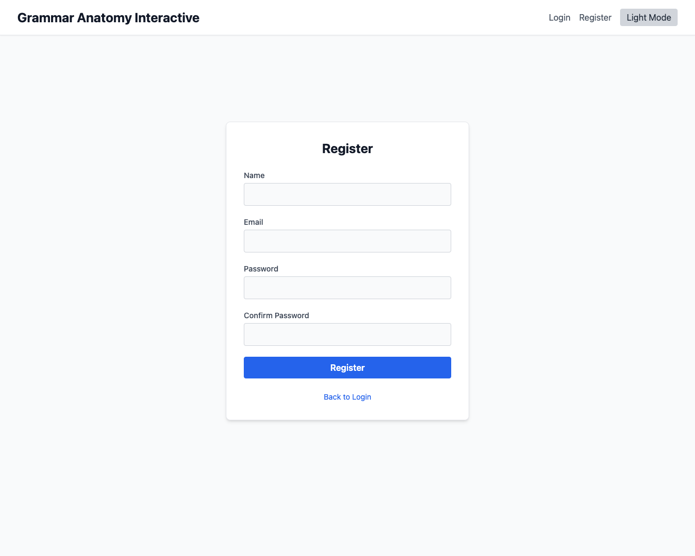
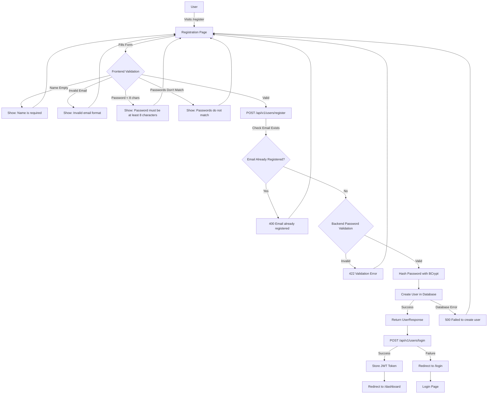

# Feature: Registration

## Description
Allows new users to register for an account using their email, name, and password. This includes comprehensive frontend validation, secure backend processing, password hashing, automatic login, and robust error handling.

## Visual Reference


*Screenshot showing the registration form with name, email, password, and confirm password fields*

## Actors/Roles
- **New User** (potential student registering for the first time)
- **System** (backend validation and user creation)

## User Stories / Use Cases
- As a new user, I want to register with my email and password so I can start using the app.
- As a new user, I want to be automatically logged in after registration for a seamless experience.
- As a system, I want to ensure email uniqueness and secure password storage.
- As a user, I want clear feedback when registration fails due to validation errors.

## Flow Diagram


## Technical Implementation Logic

### Backend Registration Logic

#### Registration Endpoint (`POST /api/v1/users/register`)

1. **Request Validation (Pydantic Schema)**
   ```python
   class UserCreate(UserBase):
       password: str = Field(..., min_length=8)
   ```
   - Validates email format using `EmailStr` type
   - Enforces minimum password length of 8 characters
   - Returns 422 for schema validation failures

2. **Email Uniqueness Check**
   ```python
   db_user = db.query(User).filter(User.email == user.email).first()
   if db_user:
       raise HTTPException(status_code=400, detail="Email already registered")
   ```

3. **Password Security Processing**
   ```python
   hashed_password = get_password_hash(user.password)  # BCrypt hashing
   ```

4. **User Creation**
   ```python
   db_user = User(
       email=user.email,
       name=user.name,
       password_hash=hashed_password,
       is_active=True  # Default active status
   )
   ```

5. **Database Transaction**
   ```python
   try:
       db.add(db_user)
       db.commit()
       db.refresh(db_user)
       return db_user  # UserResponse (excludes password_hash)
   except Exception:
       db.rollback()
       raise HTTPException(status_code=500, detail="Failed to create user")
   ```

#### Security Implementation Details
- **Password Hashing**: BCrypt with configurable salt rounds
- **Email Validation**: Pydantic EmailStr type validation
- **SQL Injection Protection**: SQLAlchemy ORM parameterized queries
- **Transaction Safety**: Automatic rollback on database errors
- **Password Exclusion**: UserResponse schema excludes password_hash

### Frontend Registration Logic

#### Form State Management
```typescript
interface RegistrationForm {
  name: string;
  email: string;
  password: string;
  confirmPassword: string;
}
```

#### Frontend Validation Steps
1. **Real-time Validation**
   - Name: Required field validation
   - Email: HTML5 email format validation + required
   - Password: Minimum 8 characters (client-side check)
   - Confirm Password: Must match password field

2. **Pre-submission Validation**
   ```typescript
   if (form.password !== form.confirmPassword) {
     setError('Passwords do not match');
     return;
   }
   if (form.password.length < 8) {
     setError('Password must be at least 8 characters long');
     return;
   }
   ```

#### API Integration Flow
1. **Registration Request**
   ```typescript
   const response = await fetch('/api/v1/users/register', {
     method: 'POST',
     headers: { 'Content-Type': 'application/json' },
     body: JSON.stringify({ 
       name: form.name, 
       email: form.email, 
       password: form.password 
     })
   });
   ```

2. **Auto-login Implementation**
   ```typescript
   // After successful registration
   const loginRes = await fetch('/api/v1/users/login', {
     method: 'POST',
     headers: { 'Content-Type': 'application/json' },
     body: JSON.stringify({ 
       email: form.email, 
       password: form.password 
     })
   });
   
   if (loginRes.ok) {
     // Store token and redirect to dashboard
     navigate('/dashboard');
   } else {
     // Fallback to login page
     navigate('/login');
   }
   ```

3. **Error Handling**
   - Success (201): Proceed to auto-login
   - Client Error (400): Display specific error message
   - Server Error (500): Display generic "Registration failed" message
   - Network Error: Display "Network error" message

## Required Data Fields & Validation

### Frontend Form Fields
| Field | Type | Validation | Required |
|-------|------|------------|----------|
| **name** | string | Non-empty string | ✅ |
| **email** | string | Valid email format, HTML5 validation | ✅ |
| **password** | string | Minimum 8 characters | ✅ |
| **confirmPassword** | string | Must match password field | ✅ |

### Backend Schema Validation
| Field | Type | Validation | Database Constraint |
|-------|------|------------|-------------------|
| **email** | EmailStr | Pydantic email validation | Unique index |
| **name** | string | Non-empty string | Not null |
| **password** | string | Minimum 8 characters | Stored as hash |

## UI Entry Points
- **Registration page** (`/register`) - Accessible from login page "Register" link
- **Login page redirect** - "Register" link from login form
- **Direct URL access** - Users can navigate directly to `/register`
- **Post-registration redirect** - Automatic redirect to dashboard or login

## API Endpoints Used
- `POST /api/v1/users/register` - Create new user account
- `POST /api/v1/users/login` - Auto-login after successful registration

## Error Handling Matrix

| Scenario | HTTP Status | Frontend Message | Backend Response |
|----------|-------------|------------------|------------------|
| Missing name | Client-side | "Name is required" | N/A |
| Invalid email format | 422 | "Invalid email format" | Pydantic validation error |
| Password too short | Client-side | "Password must be at least 8 characters" | N/A |
| Passwords don't match | Client-side | "Passwords do not match" | N/A |
| Email already exists | 400 | "Email already registered" | "Email already registered" |
| Database error | 500 | "Registration failed" | "Failed to create user" |
| Network error | N/A | "Network error" | N/A |
| Auto-login failure | N/A | Redirect to login | N/A |

## Security Features
- **Password Hashing**: BCrypt with secure salt rounds
- **Email Uniqueness**: Database-level unique constraint
- **Input Validation**: Both frontend and backend validation
- **SQL Injection Protection**: SQLAlchemy ORM parameterized queries
- **XSS Protection**: JSON response format, no HTML injection
- **Password Confirmation**: Frontend validation to prevent typos
- **Secure Auto-login**: Uses same authentication flow as manual login

## Auto-login Implementation
After successful registration, the system automatically attempts to log in the user:
1. **Registration Success**: User creation returns 201 status
2. **Immediate Login**: Frontend calls login endpoint with same credentials
3. **Token Storage**: JWT token is stored for session management
4. **Dashboard Redirect**: User is taken directly to the dashboard
5. **Fallback Handling**: If auto-login fails, user is redirected to login page

## Acceptance Criteria
- [x] New user can register with valid email, name, and password
- [x] Frontend validates password length (minimum 8 characters)
- [x] Frontend validates password confirmation matches
- [x] Backend validates email format and uniqueness
- [x] User sees specific error messages for different failure scenarios
- [x] Password is securely hashed using BCrypt before storage
- [x] User is automatically logged in after successful registration
- [x] User is redirected to dashboard after successful auto-login
- [x] Database transactions are safely handled with rollback on errors
- [ ] Rate limiting prevents registration spam attacks
- [ ] Email verification flow (future enhancement)

## E2E Test Scenarios

1. **Successful Registration Flow**
   - User navigates to registration page
   - Fills in valid name, email, and matching passwords
   - Submits form and gets automatically logged in
   - Is redirected to dashboard with active session

2. **Email Already Registered**
   - User attempts to register with existing email
   - Sees "Email already registered" error message
   - Remains on registration page with form intact

3. **Password Validation Errors**
   - User enters password shorter than 8 characters
   - Sees "Password must be at least 8 characters" error
   - User enters non-matching password confirmation
   - Sees "Passwords do not match" error

4. **Form Field Validation**
   - User submits form with empty name field
   - HTML5 validation prevents submission
   - User enters invalid email format
   - HTML5 validation prevents submission

5. **Auto-login Success Flow**
   - User successfully registers
   - System automatically logs them in
   - User arrives at dashboard without manual login

6. **Auto-login Failure Fallback**
   - User successfully registers
   - Auto-login fails for any reason
   - User is redirected to login page with success message

7. **Network Error Handling**
   - Registration request fails due to network issues
   - User sees "Network error" message
   - Form remains populated for retry

8. **Database Error Handling** (System Test)
   - Database connection fails during user creation
   - User sees "Registration failed" message
   - No partial user data is created (transaction rollback) 