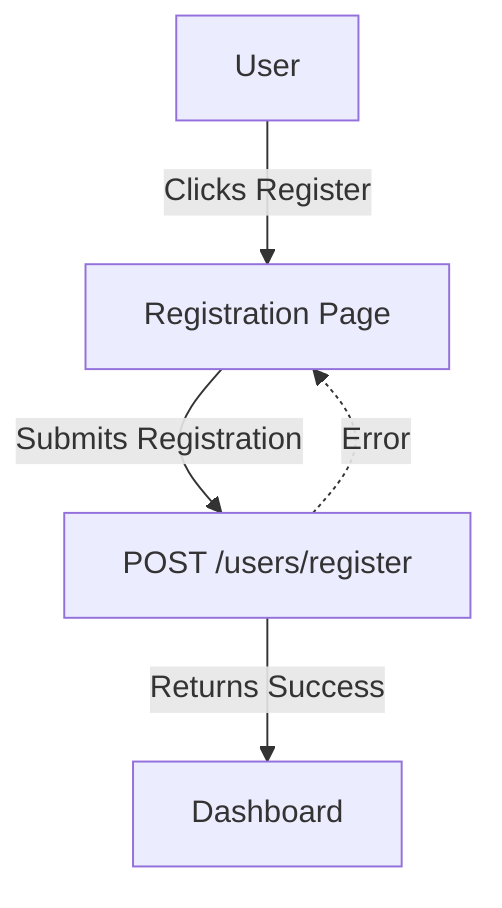

# Feature: Registration

## Description
Allows new users to register for an account using their email and password.

## Actors/Roles
- Student

## User Stories / Use Cases
- As a new user, I want to register so I can start using the app.

## Required Data Fields & Validation
- **email** (string, required): Must be a valid email address and unique (not already registered).
- **name** (string, required): The user's display name.
- **password** (string, required): Must be at least 8 characters long.

## Registration Logic
1. User submits registration form with email, name, and password.
2. The backend checks if the email is already registered. If so, it returns an error.
3. The backend checks that the password is at least 8 characters long. If not, it returns an error.
4. If all checks pass, the password is securely hashed and a new user is created in the database.
5. The new user is returned in the response (without the password).
6. (Optional) The user may be automatically logged in after registration, depending on frontend logic.

## Flow Diagram

## UI Entry Points
- Registration page (link from login)

## API Endpoints Used
- `POST /users/register`

## Acceptance Criteria
- [ ] New user can register with valid email and password
- [ ] User sees error on invalid or duplicate registration
- [ ] User is logged in automatically after successful registration (if supported)

## E2E Test Scenarios
1. New user registers with valid credentials and is redirected to dashboard
2. User tries to register with an already used email and sees an error message
3. User tries to register with an invalid password and sees an error message 