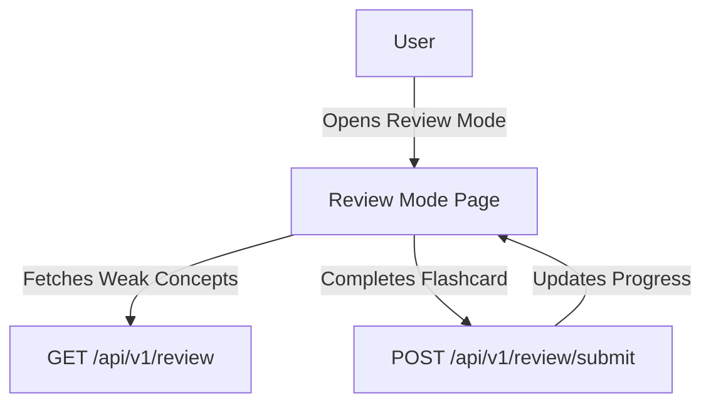

# Feature: Review Mode

## Description
Allows users to review concepts and exercises they struggled with, using flashcards and repeat practice.

## Actors/Roles
- Student

## User Stories / Use Cases
- As a user, I want to review concepts I got wrong in previous exercises.
- As a user, I want to practice again to improve my skills.
- As a user, I want to see my progress in review mode.

## Flow Diagram

## UI Entry Points
- Review mode button on dashboard
- After completing a module or exercise

## API Endpoints Used
- `GET /api/v1/review`
- `POST /api/v1/review/submit`

## Acceptance Criteria
- [ ] User can review weak concepts
- [ ] User can complete flashcard-style exercises
- [ ] User sees progress updates in review mode

## E2E Test Scenarios
1. User opens review mode and sees a list of weak concepts
2. User completes a flashcard and sees feedback
3. User sees progress update after review session 