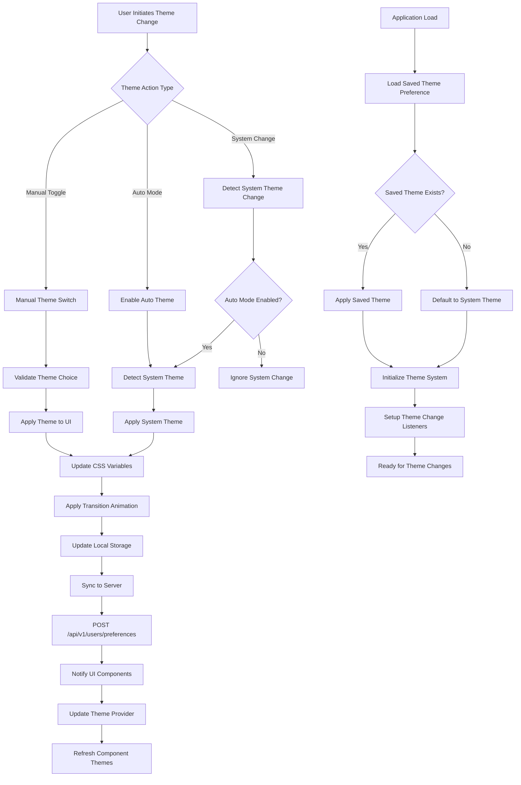

# Feature: Theme Management & Dark Mode

## Description
The Theme Management system provides users with comprehensive control over the application's visual appearance, including dark mode, light mode, and auto theme switching based on system preferences. It includes theme persistence across sessions, smooth transitions between themes, and accessibility considerations for different viewing preferences and lighting conditions.

## Actors/Roles
- **Student**: Primary user selecting and managing theme preferences
- **System**: Backend services storing user theme preferences
- **Theme Engine**: Frontend system managing theme application and transitions
- **Accessibility System**: Services ensuring theme compliance with accessibility standards

## User Stories / Use Cases

### Theme Selection & Switching
- As a user, I want to toggle between light and dark mode using a clearly visible switch
- As a user, I want the theme to automatically match my system preferences when set to "auto"
- As a user, I want smooth, non-jarring transitions when switching between themes
- As a user, I want my theme preference to persist across browser sessions and devices
- As a user, I want to preview theme changes before applying them

### Dark Mode Experience
- As a user, I want a dark mode that reduces eye strain during low-light studying
- As a user, I want all interface elements to properly adapt to dark mode styling
- As a user, I want sufficient contrast in dark mode for comfortable reading
- As a user, I want progress indicators and charts to remain clearly visible in dark mode
- As a user, I want images and content to display appropriately in dark theme

### Light Mode Experience
- As a user, I want a clean, bright light mode for daytime studying
- As a user, I want optimal readability with high contrast text in light mode
- As a user, I want all interactive elements to be clearly distinguishable in light theme
- As a user, I want consistent color coding across all components in light mode
- As a user, I want the light theme to feel modern and visually appealing

### Auto Theme Management
- As a user, I want the app to automatically switch themes based on my device's system settings
- As a user, I want the theme to change smoothly when my system theme changes
- As a user, I want to override auto theme switching when I have a strong preference
- As a user, I want the app to respect my manual theme choice over system preferences
- As a user, I want clear indication of which theme mode is currently active

### Accessibility & Customization
- As a user with visual impairments, I want high contrast theme options
- As a user, I want font size adjustments to work properly across all themes
- As a user with light sensitivity, I want reduced brightness options in both themes
- As a user, I want color customization options for better personal accessibility
- As a user, I want the theme system to work with screen readers and assistive technologies

### Theme Persistence & Sync
- As a user, I want my theme preference to sync across all my devices
- As a user, I want theme changes to apply immediately without page refresh
- As a user, I want my theme choice to persist even after clearing browser data
- As a user, I want theme preferences to be backed up with my account data
- As a user, I want to reset theme preferences to defaults if needed

## Flow Diagram


## UI Entry Points
- **Theme Toggle Button**: Located in the top navigation bar with clear light/dark icons
- **Settings Page**: Detailed theme preferences in user settings
- **Quick Settings Menu**: Dropdown menu with theme options
- **Accessibility Menu**: High contrast and vision-specific theme options
- **System Theme Detection**: Automatic theme switching based on OS preferences

## API Endpoints Used

### Theme Preferences
- **GET** `/api/v1/users/preferences`
  - **Headers**: `Authorization: Bearer <token>`
  - **Response**:
    ```json
    {
      "theme": {
        "mode": "dark",
        "auto_switch": false,
        "high_contrast": false,
        "reduced_brightness": false,
        "custom_colors": {
          "primary": "#3B82F6",
          "accent": "#8B5CF6"
        }
      },
      "accessibility": {
        "font_size": "medium",
        "motion_reduced": false,
        "focus_indicators": "enhanced"
      },
      "last_updated": "2024-01-01T14:30:00Z"
    }
    ```

- **PUT** `/api/v1/users/preferences`
  - **Headers**: `Authorization: Bearer <token>`
  - **Body**:
    ```json
    {
      "theme": {
        "mode": "dark",
        "auto_switch": true,
        "high_contrast": false,
        "reduced_brightness": true
      }
    }
    ```
  - **Response**:
    ```json
    {
      "success": true,
      "preferences": {
        "theme": {
          "mode": "dark",
          "auto_switch": true,
          "high_contrast": false,
          "reduced_brightness": true
        }
      },
      "updated_at": "2024-01-01T14:35:00Z"
    }
    ```

### Theme Synchronization
- **POST** `/api/v1/users/theme-sync`
  - **Headers**: `Authorization: Bearer <token>`
  - **Body**:
    ```json
    {
      "device_id": "unique-device-identifier",
      "theme_state": {
        "current_theme": "dark",
        "auto_enabled": true,
        "system_theme": "dark",
        "manual_override": false
      }
    }
    ```

## Technical Specifications

### Theme Data Structures
```typescript
interface ThemePreferences {
  mode: 'light' | 'dark' | 'auto';
  auto_switch: boolean;
  high_contrast: boolean;
  reduced_brightness: boolean;
  custom_colors?: {
    primary?: string;
    accent?: string;
    success?: string;
    warning?: string;
    error?: string;
  };
  transition_speed: 'fast' | 'normal' | 'slow' | 'disabled';
}

interface ThemeState {
  current_theme: 'light' | 'dark';
  user_preference: 'light' | 'dark' | 'auto';
  system_theme: 'light' | 'dark';
  auto_enabled: boolean;
  manual_override: boolean;
  transition_in_progress: boolean;
  last_changed: Date;
}

interface ThemeColors {
  // Background Colors
  bg_primary: string;
  bg_secondary: string;
  bg_tertiary: string;
  
  // Text Colors
  text_primary: string;
  text_secondary: string;
  text_tertiary: string;
  
  // Border Colors
  border_primary: string;
  border_secondary: string;
  
  // Interactive Colors
  primary: string;
  primary_hover: string;
  primary_active: string;
  
  // Status Colors
  success: string;
  warning: string;
  error: string;
  info: string;
  
  // Component-specific Colors
  progress_bg: string;
  progress_fill: string;
  card_bg: string;
  input_bg: string;
  button_bg: string;
}
```

### Theme Manager Implementation
```typescript
class ThemeManager {
  private static instance: ThemeManager;
  private currentTheme: ThemeState;
  private mediaQuery: MediaQueryList;
  private listeners: Set<(theme: ThemeState) => void> = new Set();
  
  constructor() {
    this.mediaQuery = window.matchMedia('(prefers-color-scheme: dark)');
    this.setupSystemThemeListener();
    this.loadSavedPreferences();
  }
  
  static getInstance(): ThemeManager {
    if (!ThemeManager.instance) {
      ThemeManager.instance = new ThemeManager();
    }
    return ThemeManager.instance;
  }
  
  setTheme(mode: 'light' | 'dark' | 'auto', options?: Partial<ThemePreferences>): void {
    const previousTheme = this.currentTheme.current_theme;
    
    if (mode === 'auto') {
      this.currentTheme.auto_enabled = true;
      this.currentTheme.manual_override = false;
      this.applySystemTheme();
    } else {
      this.currentTheme.auto_enabled = false;
      this.currentTheme.manual_override = true;
      this.currentTheme.current_theme = mode;
    }
    
    this.currentTheme.user_preference = mode;
    this.currentTheme.last_changed = new Date();
    
    if (previousTheme !== this.currentTheme.current_theme) {
      this.applyThemeToDOM();
      this.savePreferences();
      this.notifyListeners();
    }
  }
  
  private applyThemeToDOM(): void {
    const root = document.documentElement;
    const themeColors = this.getThemeColors(this.currentTheme.current_theme);
    
    // Remove existing theme classes
    root.classList.remove('light-theme', 'dark-theme');
    
    // Add new theme class
    root.classList.add(`${this.currentTheme.current_theme}-theme`);
    
    // Apply CSS custom properties
    Object.entries(themeColors).forEach(([property, value]) => {
      root.style.setProperty(`--${property.replace(/_/g, '-')}`, value);
    });
    
    // Apply transition
    if (!this.currentTheme.transition_in_progress) {
      this.applyThemeTransition();
    }
  }
  
  private applyThemeTransition(): void {
    const root = document.documentElement;
    this.currentTheme.transition_in_progress = true;
    
    root.style.setProperty('--theme-transition', 'all 0.3s ease-in-out');
    
    setTimeout(() => {
      root.style.removeProperty('--theme-transition');
      this.currentTheme.transition_in_progress = false;
    }, 300);
  }
  
  private getThemeColors(theme: 'light' | 'dark'): ThemeColors {
    const lightTheme: ThemeColors = {
      bg_primary: '#ffffff',
      bg_secondary: '#f9fafb',
      bg_tertiary: '#f3f4f6',
      text_primary: '#111827',
      text_secondary: '#6b7280',
      text_tertiary: '#9ca3af',
      border_primary: '#e5e7eb',
      border_secondary: '#d1d5db',
      primary: '#3b82f6',
      primary_hover: '#2563eb',
      primary_active: '#1d4ed8',
      success: '#10b981',
      warning: '#f59e0b',
      error: '#ef4444',
      info: '#06b6d4',
      progress_bg: '#e5e7eb',
      progress_fill: '#3b82f6',
      card_bg: '#ffffff',
      input_bg: '#ffffff',
      button_bg: '#f9fafb'
    };
    
    const darkTheme: ThemeColors = {
      bg_primary: '#1f2937',
      bg_secondary: '#111827',
      bg_tertiary: '#0f172a',
      text_primary: '#f9fafb',
      text_secondary: '#d1d5db',
      text_tertiary: '#9ca3af',
      border_primary: '#374151',
      border_secondary: '#4b5563',
      primary: '#3b82f6',
      primary_hover: '#60a5fa',
      primary_active: '#93c5fd',
      success: '#10b981',
      warning: '#f59e0b',
      error: '#ef4444',
      info: '#06b6d4',
      progress_bg: '#374151',
      progress_fill: '#3b82f6',
      card_bg: '#1f2937',
      input_bg: '#1f2937',
      button_bg: '#374151'
    };
    
    return theme === 'light' ? lightTheme : darkTheme;
  }
  
  private setupSystemThemeListener(): void {
    this.mediaQuery.addEventListener('change', (e) => {
      if (this.currentTheme.auto_enabled && !this.currentTheme.manual_override) {
        this.currentTheme.system_theme = e.matches ? 'dark' : 'light';
        this.applySystemTheme();
      }
    });
  }
  
  private applySystemTheme(): void {
    const systemTheme = this.mediaQuery.matches ? 'dark' : 'light';
    this.currentTheme.system_theme = systemTheme;
    this.currentTheme.current_theme = systemTheme;
    this.applyThemeToDOM();
    this.notifyListeners();
  }
}
```

### React Theme Provider
```typescript
const ThemeContext = React.createContext<{
  theme: ThemeState;
  setTheme: (mode: 'light' | 'dark' | 'auto') => void;
  toggleTheme: () => void;
}>({
  theme: null!,
  setTheme: () => {},
  toggleTheme: () => {}
});

export const ThemeProvider: React.FC<{ children: React.ReactNode }> = ({ children }) => {
  const [theme, setThemeState] = useState<ThemeState>(ThemeManager.getInstance().getCurrentTheme());
  const themeManager = ThemeManager.getInstance();
  
  useEffect(() => {
    const unsubscribe = themeManager.subscribe((newTheme) => {
      setThemeState(newTheme);
    });
    
    return unsubscribe;
  }, []);
  
  const setTheme = useCallback((mode: 'light' | 'dark' | 'auto') => {
    themeManager.setTheme(mode);
  }, []);
  
  const toggleTheme = useCallback(() => {
    const currentMode = theme.current_theme;
    const newMode = currentMode === 'light' ? 'dark' : 'light';
    themeManager.setTheme(newMode);
  }, [theme.current_theme]);
  
  return (
    <ThemeContext.Provider value={{ theme, setTheme, toggleTheme }}>
      {children}
    </ThemeContext.Provider>
  );
};

export const useTheme = () => {
  const context = useContext(ThemeContext);
  if (!context) {
    throw new Error('useTheme must be used within a ThemeProvider');
  }
  return context;
};
```

## UI/UX Specifications

### Theme Toggle Component
```css
/* Theme Toggle Button */
.theme-toggle {
  position: relative;
  width: 3rem;
  height: 1.5rem;
  background: var(--border-primary);
  border-radius: 0.75rem;
  border: none;
  cursor: pointer;
  transition: background-color 0.3s ease;
  overflow: hidden;
}

.theme-toggle:focus {
  outline: 2px solid var(--primary);
  outline-offset: 2px;
}

.theme-toggle::before {
  content: '';
  position: absolute;
  top: 0.125rem;
  left: 0.125rem;
  width: 1.25rem;
  height: 1.25rem;
  background: var(--bg-primary);
  border-radius: 50%;
  transition: transform 0.3s cubic-bezier(0.4, 0, 0.2, 1);
  box-shadow: 0 2px 4px rgba(0, 0, 0, 0.1);
}

.theme-toggle--dark::before {
  transform: translateX(1.5rem);
}

/* Theme Toggle Icons */
.theme-toggle-icon {
  position: absolute;
  top: 50%;
  transform: translateY(-50%);
  font-size: 0.75rem;
  transition: opacity 0.3s ease;
}

.theme-toggle-icon--sun {
  left: 0.375rem;
  color: #f59e0b;
}

.theme-toggle-icon--moon {
  right: 0.375rem;
  color: #6366f1;
}

.theme-toggle--light .theme-toggle-icon--moon,
.theme-toggle--dark .theme-toggle-icon--sun {
  opacity: 0.3;
}

.theme-toggle--light .theme-toggle-icon--sun,
.theme-toggle--dark .theme-toggle-icon--moon {
  opacity: 1;
}
```

### Theme Transition Effects
```css
/* Global Theme Transition */
:root {
  --theme-transition-duration: 300ms;
  --theme-transition-timing: cubic-bezier(0.4, 0, 0.2, 1);
}

* {
  transition: 
    background-color var(--theme-transition-duration) var(--theme-transition-timing),
    border-color var(--theme-transition-duration) var(--theme-transition-timing),
    color var(--theme-transition-duration) var(--theme-transition-timing),
    box-shadow var(--theme-transition-duration) var(--theme-transition-timing);
}

/* Disable transitions for images and complex components */
img, video, iframe, svg,
.progress-bar, .chart-container {
  transition: none;
}

/* Theme-specific Overrides */
.light-theme {
  --bg-primary: #ffffff;
  --bg-secondary: #f9fafb;
  --text-primary: #111827;
  --text-secondary: #6b7280;
  --border-primary: #e5e7eb;
}

.dark-theme {
  --bg-primary: #1f2937;
  --bg-secondary: #111827;
  --text-primary: #f9fafb;
  --text-secondary: #d1d5db;
  --border-primary: #374151;
}
```

### High Contrast Theme Support
```css
/* High Contrast Modifications */
.high-contrast.light-theme {
  --bg-primary: #ffffff;
  --bg-secondary: #f0f0f0;
  --text-primary: #000000;
  --text-secondary: #333333;
  --border-primary: #000000;
  --primary: #0000ff;
}

.high-contrast.dark-theme {
  --bg-primary: #000000;
  --bg-secondary: #1a1a1a;
  --text-primary: #ffffff;
  --text-secondary: #cccccc;
  --border-primary: #ffffff;
  --primary: #00ffff;
}

/* Enhanced Focus Indicators for High Contrast */
.high-contrast *:focus {
  outline: 3px solid var(--primary);
  outline-offset: 2px;
}
```

### Mobile Theme Considerations
```css
/* Mobile Theme Optimizations */
@media (max-width: 640px) {
  .theme-toggle {
    width: 2.5rem;
    height: 1.25rem;
  }
  
  .theme-toggle::before {
    width: 1rem;
    height: 1rem;
  }
  
  .theme-toggle--dark::before {
    transform: translateX(1.25rem);
  }
  
  .theme-toggle-icon {
    font-size: 0.625rem;
  }
}

/* Touch-friendly Theme Controls */
.mobile-theme-selector {
  display: flex;
  gap: 0.5rem;
  padding: 1rem;
}

.theme-option {
  flex: 1;
  padding: 0.75rem;
  border: 2px solid var(--border-primary);
  border-radius: 0.5rem;
  text-align: center;
  background: var(--bg-secondary);
  transition: all 0.2s ease;
}

.theme-option--active {
  border-color: var(--primary);
  background: var(--primary);
  color: white;
}
```

## Acceptance Criteria

### Core Theme Functionality
- [ ] **Theme Switching**: Users can toggle between light, dark, and auto modes
- [ ] **Smooth Transitions**: Theme changes animate smoothly without jarring flashes
- [ ] **Immediate Application**: Theme changes apply instantly across all UI components
- [ ] **Auto Mode**: Automatically switches theme based on system preferences
- [ ] **Override Capability**: Manual theme selection overrides auto mode until changed

### Theme Persistence
- [ ] **Session Persistence**: Theme preference persists across browser sessions
- [ ] **Cross-device Sync**: Theme preference syncs across user's devices
- [ ] **Local Storage Backup**: Theme works even when server sync is unavailable
- [ ] **Account Integration**: Theme preference included in user account data
- [ ] **Reset Functionality**: Users can reset theme preferences to defaults

### Visual Quality & Consistency
- [ ] **Complete Coverage**: All UI components properly support both themes
- [ ] **Contrast Compliance**: Both themes meet WCAG 2.1 AA contrast requirements
- [ ] **Brand Consistency**: Theme colors maintain brand identity and recognition
- [ ] **Component Harmony**: All components visually harmonize within each theme
- [ ] **Image Adaptation**: Images and media display appropriately in both themes

### Accessibility Features
- [ ] **High Contrast Mode**: Enhanced contrast options for users with visual impairments
- [ ] **Screen Reader Support**: Theme changes announced to assistive technologies
- [ ] **Keyboard Navigation**: Theme controls fully accessible via keyboard
- [ ] **Focus Indicators**: Clear focus states visible in both themes
- [ ] **Motion Preferences**: Respects reduced motion preferences for theme transitions

### Performance & Technical
- [ ] **Fast Switching**: Theme changes complete within 300ms
- [ ] **Memory Efficiency**: Theme system doesn't cause memory leaks
- [ ] **CSS Optimization**: Efficient CSS custom property usage
- [ ] **Bundle Size**: Theme system adds minimal overhead to application bundle
- [ ] **Error Handling**: Graceful fallback when theme preferences are corrupted

### User Experience
- [ ] **Intuitive Controls**: Theme toggle is easily discoverable and understandable
- [ ] **Preview Capability**: Users can preview themes before applying them
- [ ] **Status Indication**: Clear indication of current theme mode (light/dark/auto)
- [ ] **Settings Integration**: Theme preferences accessible in settings page
- [ ] **Mobile Optimization**: Theme controls work well on touch devices

## E2E Test Scenarios

### Basic Theme Switching
1. **Manual Theme Toggle**
   - User clicks theme toggle button in navigation
   - Interface smoothly transitions from light to dark theme
   - All components properly update to dark theme styling
   - Theme toggle button reflects new state
   - **Expected Result**: Complete theme change with smooth transition

2. **Auto Theme Mode**
   - User sets theme to "auto" mode
   - System detects current OS theme preference
   - App theme matches system theme automatically
   - User changes system theme
   - App theme updates to match new system preference
   - **Expected Result**: Seamless automatic theme synchronization

### Theme Persistence & Synchronization
3. **Cross-session Persistence**
   - User selects dark theme
   - User closes browser and reopens application
   - Dark theme is still active upon return
   - All interface elements maintain dark theme styling
   - **Expected Result**: Reliable theme persistence across sessions

4. **Cross-device Synchronization**
   - User changes theme on mobile device
   - User opens application on desktop computer
   - Desktop application loads with matching theme
   - Theme preference syncs within 30 seconds
   - **Expected Result**: Consistent theme across user's devices

### Accessibility & Special Modes
5. **High Contrast Mode**
   - User enables high contrast in accessibility settings
   - All text displays with enhanced contrast ratios
   - Interactive elements have distinct visual borders
   - Focus indicators are clearly visible
   - **Expected Result**: Enhanced accessibility with high contrast styling

6. **Reduced Motion Preference**
   - User enables reduced motion in system settings
   - Theme changes apply instantly without transitions
   - All animations are disabled during theme switching
   - Functionality remains intact without motion
   - **Expected Result**: Respectful handling of motion reduction preferences

### Error Handling & Edge Cases
7. **Network Connectivity Issues**
   - User changes theme while offline
   - Theme applies immediately using local storage
   - Theme preference queued for server sync
   - When online, preference syncs to server
   - **Expected Result**: Functional theme system during connectivity issues

8. **Corrupted Preferences Recovery**
   - User's theme preferences become corrupted
   - System detects invalid preferences
   - App falls back to system theme preference
   - User can set new theme preference normally
   - **Expected Result**: Graceful recovery from corrupted theme data

### Performance & User Experience
9. **Theme Change Performance**
   - User rapidly toggles between themes multiple times
   - Each transition completes smoothly within 300ms
   - No visual glitches or incomplete style updates
   - System remains responsive throughout
   - **Expected Result**: Consistent performance during rapid theme changes

10. **Mobile Touch Interface**
    - User on mobile device accesses theme controls
    - Theme toggle button has appropriate touch target size
    - Theme changes apply smoothly on mobile browser
    - Touch feedback is immediate and clear
    - **Expected Result**: Optimized mobile theme control experience

This comprehensive theme management system provides users with flexible, accessible, and reliable control over their visual experience while maintaining high performance and cross-platform compatibility.