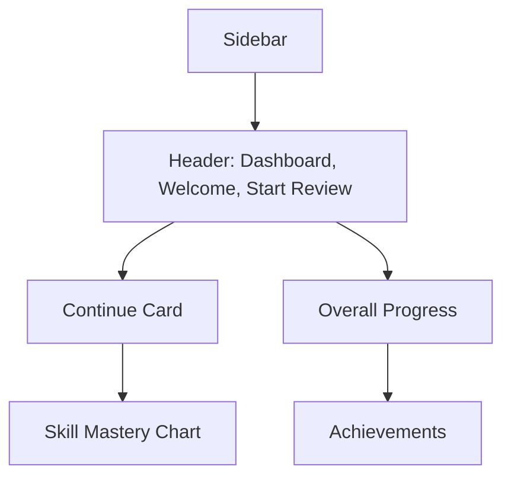

# UI Wireframes — Grammar Anatomy Interactive

## 1. Dashboard

## 2. Modules List
- List of all modules/chapters
- Status indicators (Not Started, In Progress, Completed)

## 3. Module/Lesson Page
- Lesson content (cards/sections)
- Interactive examples
- Navigation to exercises

## 4. Exercise Page
- Exercise prompt
- Interactive input (tap, drag, MCQ, etc.)
- Immediate feedback

## 5. Anatomy Lab
- Sentence input box
- Visual diagram area
- Interactive breakdown of sentence structure

## 6. AI Guru
- Chat interface
- Input box for questions
- Display of AI answers and links to lessons

## 7. Glossary
- Search bar
- List of terms
- Tap to view definition and related lessons

## 8. Review Mode
- Flashcard stack
- Show concept/question, flip for answer
- Track progress through review session 